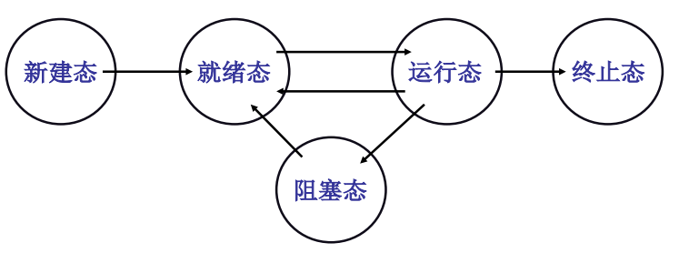

# 多进程图像

**多进程图像**：为了充分利用CPU，操作系统启动多个程序并交替执行。操作系统只需要把这些进程记录好、按照合理的次序推进（*分配资源、进行调度*）。各个进程的PCB构成了多进程图像。


**main中的fork()创建了1号进程**

```c++
if (!fork()) {
    init(); //init执行了shell(Windows桌面)
}
int main(int argc, char *argv[])
{
    while(1) {
        scanf("%s",  cmd);
        if (!fork()) { //一个命令启动一个进程，返回shell再启动其他进程
            exec(cmd);
        }
        wait(); 
    }
}
```


**如何组织多进程？队列**




阻塞态进程需要等到事件才能进入就绪态。


**进程的交替**

```
启动磁盘读写；
pCur.state = 'W';
将pCur放到DiskWaitQueue;
schedule(); //切换

schedue()
{
	pNew = getNext(ReadyQueue); //调度
	switch_to(pCur, pNew); //切换，参数都是PCB
}
```


**交替三部分：队列操作 + 调度 + 切换**

调度：FIFO，Priority

切换：保存当前CPU的状态至pCur，根据pNew修改CPU的状态

```
switch_to(pCur, pNew)
{
	pCur.ax = CPU.ax;
	pCur.bx = CPU.bx;
	...
	pCur.cx = CPU.cx;
	pCur.retpc= CPU.pc;
	
	CPU.ax = pNew.ax;
	CPU.bx = pNew.bx;
	...
	CPU.cx = pNew.cx;
	CPU.retpc= pNew.pc;
}
```


**如何防止进程1修改了进程2的内存？ ---- 地址空间分离**

不同进程的代码中，相同的地址根据映射表映射到不同的物理地址。每一个进程都有一个映射表。（*内存管理*）

所有说，*进程管理连带内存管理形成多进程图像*。


**进程如何合作？核心是进程同步**

进程同步的要义是合理的推进顺序。如生产者-消费者示例中的锁


**总结**

- 读写PCB，贯穿OS最重要的结构
- 寄存器切换
- 调度程序
- 进程同步与合作
- 地址映射