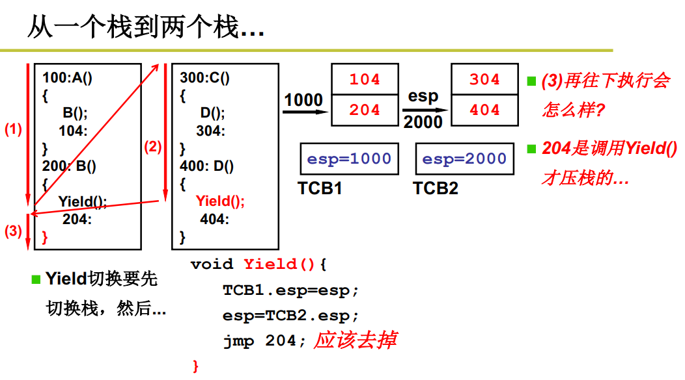
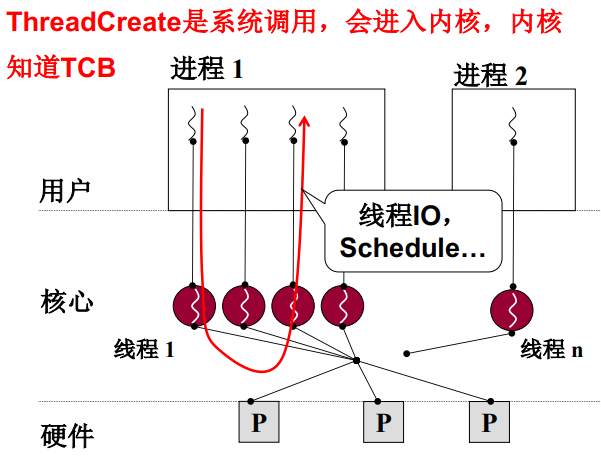

**多个进程如何切换？**

包括*指令的切换*和*映射表的切换*两部分。映射表即进程的资源。

进程 = 资源 + 指令执行序列

一个进程内的指令执行序列对应一个线程，一个进程内可有多个指令执行序列，即可有多个线程。

*线程：保留了并发的优点，避免了进程切换代价（只切换指令执行序列，不需要切换映射表）。实质就是映射表不变而PC指针变。*

**两个执行序列与一个栈**

序列1时，A()中执行B()前，104压栈，跳转到B()，B()中执行yield()前204压栈，yield()执行后，跳转到了序列2，同理，304和404依次入栈。序列2中的yield()执行后，跳转到了序列1的204处，执行完204处的指令后，B()执行完毕，*本该104出栈回到A()中继续执行104处的指令，但是此时栈中出栈的确是404，所以出现了问题*

**两个执行序列与两个栈**

现在为每个执行序列分配一个栈。TCB是一个全局的记录各个线程栈的数据结构。

从序列1依次执行到序列2的D()时，执行yield()切换栈。yield()执行完后，204出栈（yield切换后，此时已经是序列1的栈）,204执行完后B()结束，继续出栈，此时出栈的是104，回到了A()中。

yield()只做看简单的栈切换，内部并没有跳转指令。

简单来讲，序列1的yield()执行前，序列1中下一条需要被执行的指令104会先压到序列1的栈中，yield()执行后，切换到了序列2的栈，此时再从栈中取出下一条要被执行的指令（这条指令已经是序列2的了）。**一句话，线程切换的本质是切换了线程的栈，每个线程的栈记录了该线程的下一条指令，如此即完成了线程的切换**。

*yield()中为什么jmp 204应该去掉？*

线程1执行到yield时，104和204已经入栈；切换到线程2执行后，线程2中yield内完成了对栈的切换（切换到了线程1的栈），执行完yiled(指遇到‘}’)，就会弹栈，刚好弹出204，就是线程1需要执行的指令地址。如果调用了jmp 204这个跳转指令，则始终执行不到yield的‘}’，就弹不出204。注意204是调用yield才压栈的，也应该由yield执行结束时弹出204并执行204。

*也就是说，跳转函数内实现栈的切换即可，跳转函数执行完就会从栈（已是切换后的栈）中弹出指令地址，继续执行。因此，创建一个线程时就需要将其设置成能够被切换的样子，即创建线程的栈，栈内设置线程指令序列的起始地址。切换函数内将栈切换到这个线程对应的栈，切换函数执行结束后弹栈弹出线程的指令地址。*

**两个线程的样子**

两个TCB、两个栈、切换的PC在栈中

esp保存栈指针

**用户级线程**

因为Yield()是用户程序，所以是用户级线程。如果某个线程进入内核并阻塞，则会导致进程阻塞，操作系统会切换到其他进程执行。

**核心级线程**

核心级线程阻塞，会切换到其他可执行的线程。与用户级线程会切换到其他进程，是存在差异的。