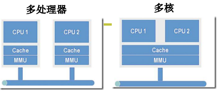
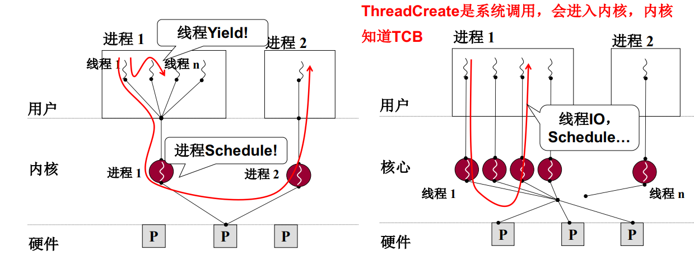
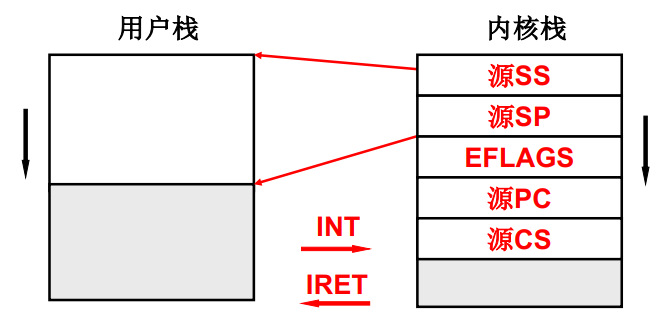
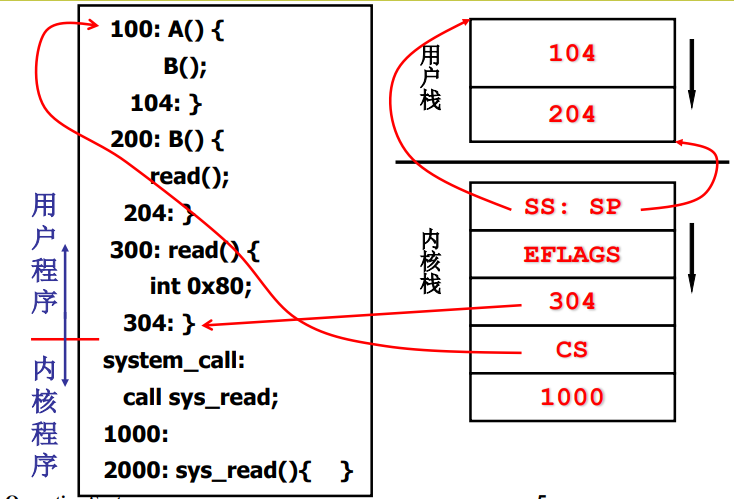
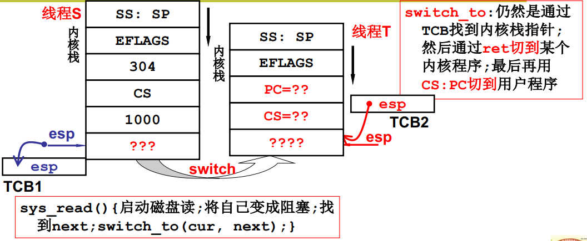
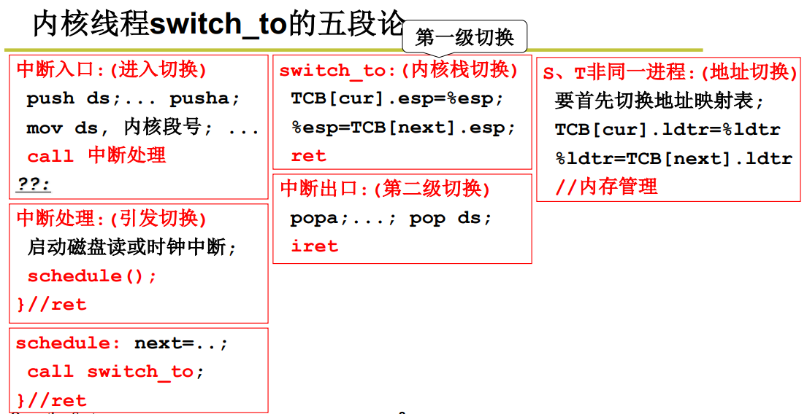
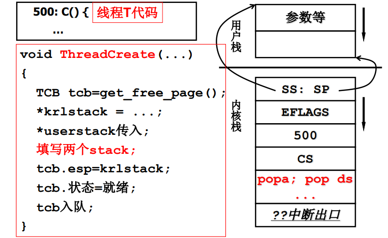

*并发*：交替执行（单核）

*并行*：同时执行（多核）

**多处理器与多核**

多处理器：每一个CPU各自有各自的内存映射（内存空间）

多核：每一个CPU共用一个内存映射

**问**：为什么用户级线程与多进程无法发挥多核的优势？

**答**：内核不知道用户级线程，无法将多个用户级线程分配给不同的核执行；多个进程本就是不同的内存映射，所以切换时会切换相应的TCB。所以无法发挥多核的优势。

**核心级线程与用户级线程对比**

用户级线程中ThreadCreate不是系统调用，线程切换的Yield是用户程序，内核不知道TCB。核心级线程中，ThreadCreate是系统调用，会进入内核，内核管理TCB，内核负责切换线程。

**线程的内核态与用户态**

线程，一段指令序列。在没有触发系统调用时，执行的都是用户的代码（称该线程处于用户态），如果线程中指令进行了系统调用，则会执行内核中的代码（称进入了内核，该线程处于内核态）。（虽然说用户程序运行于操作系统之上，但不是每一条用户程序指令都使用系统调用）。

基于此，用户态下有用户栈，内核态下有内核态（不管哪种状态，总会有函数调用，就需要使用栈）。

核心级线程下，一个线程一个TCB，该TCB关联同时关联用户栈和内核栈，该TCB由内核管理。切换线程就是切换TCB，切换TCB就要同时切换用户栈和内核栈（这是一套栈）。

**用户栈和内核栈之间的关联**

一个线程拥有用户栈和内核栈。一旦触发中断，就会启用内核栈。启用内核栈时，首先SS和SP压入栈内（SS和SP就是用户栈），还压PC和CS（即用户态代码当前执行的位置），相当于将用户栈和内核栈连线进行了关联。

**线程中断进入内核态**

用户程序执行到read时，int指令会触发中断进入内核，此时内核栈对用户栈（SS,SP)、用户程序返回地址（304，CS,即中断返回时用户程序开始执行的指令地址）压栈。然后执行内核态的1000处指令。

**进入内核态遇到磁盘读写后进行线程切换**

*esp是物理寄存器，保存栈顶指针，决定弹出的内容*。

切换时，通过tcb找到内核栈指针。通过ret切换到某个内核程序，最后再利用CS：PC切换到用户程序。

**内核切换的五个步骤**

**创建线程时就要将其做成能切换的样子**

