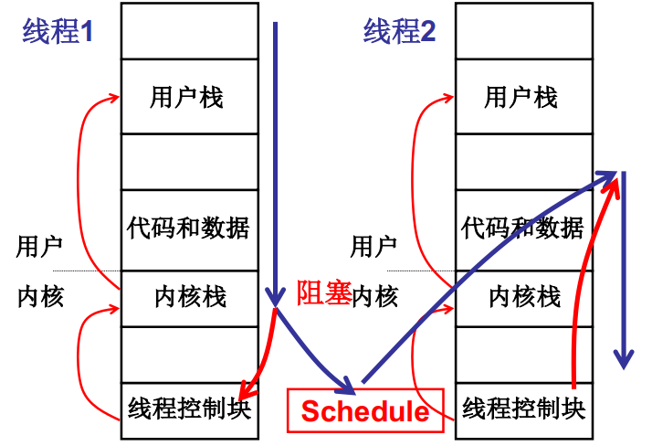
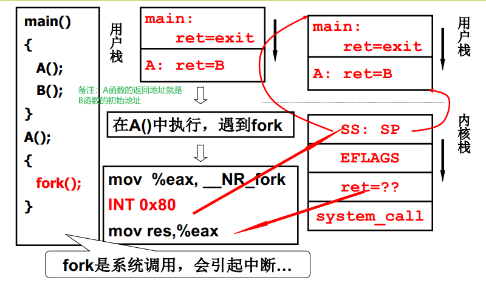
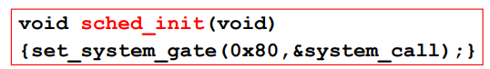
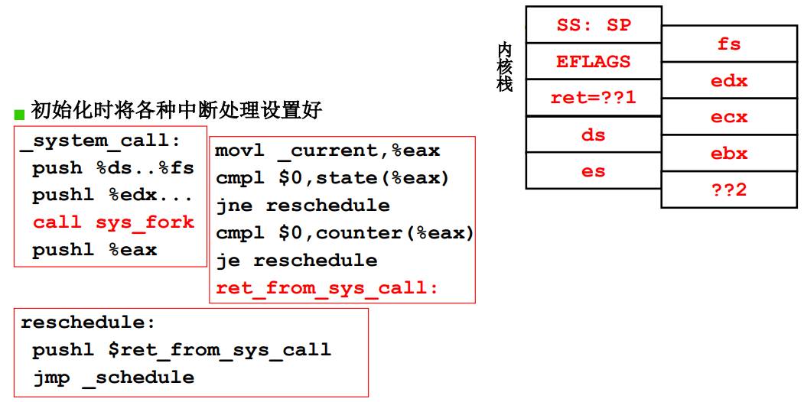

由TCB引发的栈的切换来完成线程的切换。


**核心级线程的实现**

核心级线程的实现关键在于两套栈之间的切换，线程1一旦进入到内核就会使用内核栈，内核栈和用户栈是自动通过INT指令的CPU解释关联在一起的，形成一套栈。在内核执行的时候，如遇到读磁盘等指令，就需要调度到另外一个线程进行执行。调度到另外一个线程，首先TCB进行切换，线程控制块进行切换，切换好之后，线程控制块就有内核栈的指针。在内核栈运行一段，处理一些收尾工作之后，通过iret指令，完成用户栈的切换。




**五段论：进入切换**



*注意：执行一个函数时，首先会将该函数执行完后需要执行的指令入栈，再执行函数内的具体指令。函数执行完（即遇到函数的‘}’)，会将先前压入的地址出栈，然后执行此地址处的指令）*

执行main时，首先exit入栈（main的返回地址），进入main内执行A()。执行A()也是B函数地址入栈（作为A的返回地址），然后进入A执行。A内执行了fork()系统调用。for()是一段汇编，将系统调用号设置给了eax，然后执行INT 0x80指令。执行完INT指令后（注意不是前），则进入了内核。执行INT指令过程中，CPU找到当前的内核栈，并将用户线程的的SS:SP、CS:IP（PC指针，即INT 0x80后的move res，%eax）压入内核栈。INT 0x80的中断处理函数是system_call。



**五段论：中断入口、中断出口**



*中断入口：_system_call*中对各种寄存器进行了压入内核栈的操作（因为此时这些寄存器还是用户态，需要保护现场）。然后在内核中执行*sys_fork*这个中断。

*中断出口：_current*以及*state*表示状态，如果*state*非0，表示阻塞必须等待。cmpl是一个判断语句，如果*state*s是0，则执行*jne reschedule*进行线程切换（即调度）。*ret_from_sys_call*是从中断返回，即中断出口。


**ThreadCreate线程创建**

线程通过系统调用sys_fork实现。sys_fork会调用copy_process进行线程拷贝，父进程与子进程的映像（指寄存器状态、指令序列）是一样的，唯一区别是tss.eax的值在子进程被置为0。而这个eax就是fork()执行完时（即中断出口iret指令的执行）的返回结果（就是INI 0x80后的mov res,%eax)，所以通过是否为0能够区分父子进程。父进程与子进程的指令序列一致不会产生问题的原有是两者在系统内的映射表是不相同的。

copy_process的细节包括为新进程申请内存空间、创建内核栈、创建用户栈（和父进程共用栈，指的是逻辑地址和父进程相同）。


**如何在新建的进程执行我们想执行的代码？**

仔细体会以下fork()的执行细节。

```c++
int main(int argc, char *argv[])
{
    while(1) {
        scanf("%s", cmd);
        if (!fork()) {
            exec(cmd);
        }
        wait(0);
    }
}
```

这个main函数是操作系统启动后shell进程的指令序列，执行完fork()后，系统内存有两个几乎完全一样的进程，具有相同的指令序列（这个main)，两个进程都分别从fork()返回。shell进程中的指令序列中，fork()返回的是非0，所以不会进入if执行exec。子进程中的指令序列中，fork返回的是0，所以子进程进入if执行exec。exec是一个系统调用，再次进入内核，根据cmd参数修改进程的栈（填充指令序列入口，编译时已经确定了该入口），再切换栈，实现在新进程中执行我们想执行的cmd。


