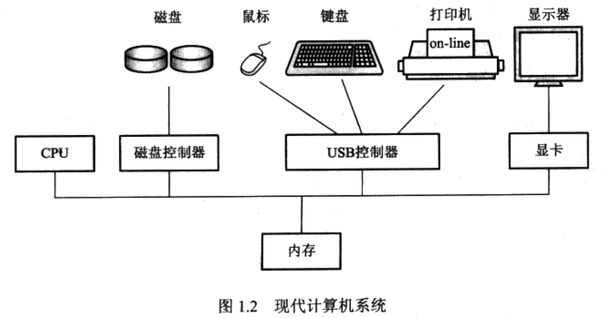
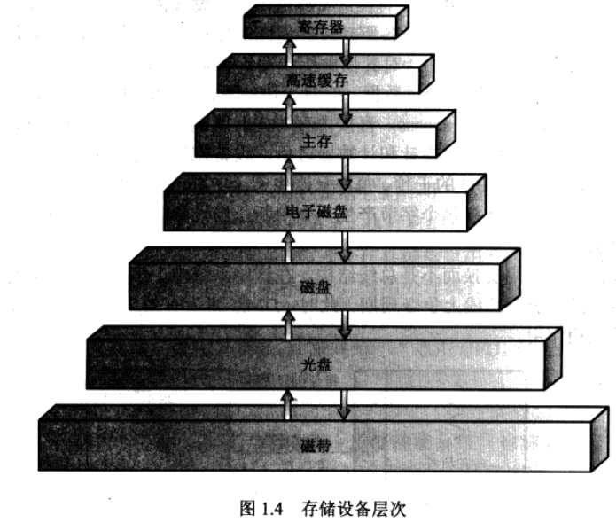
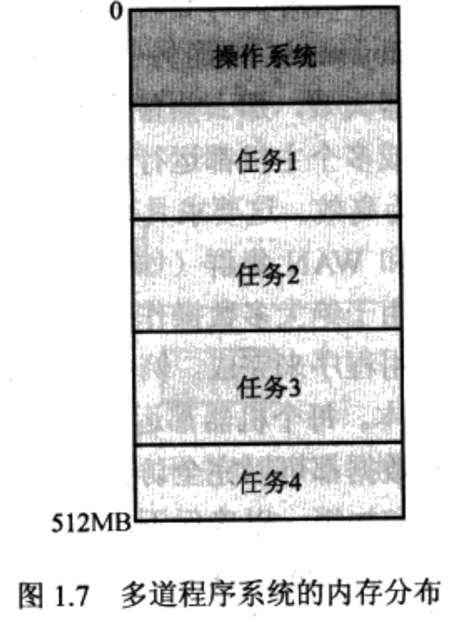
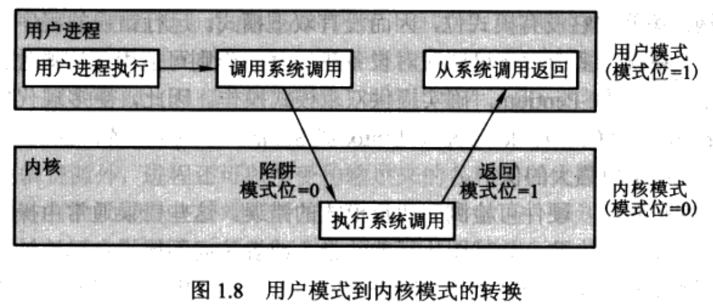

# 第1章 导论

**概述**

操作系统是硬件与用户之间的中介程序，**目的**是为用户提供方便且有效地执行程序的环境。

操作系统每一部分都是构造好的系统的一部分，并严格定义了**输入、输出和功能**。

## 1.1 操作系统做什么

计算机系统分为硬件和软件，软件包括操作系统、系统程序、应用程序。

操作系统本身并不能实现任何有用的功能，**只不过**提供了一个方便其他程序做有用工作的环境。

### 1.1.1 用户视角

不同的使用情况强调不同的用户观点。

### 1.1.2 系统视角

操作系统是控制程序，控制程序管理用户程序的执行以防止计算机资源的错误或不当使用。特别关注I/O设备的操作和控制。

### 1.1.3 定义操作系统

计算机系统的基本目的是执行用户程序并能更容易地解决用户问题（图灵机模型）。

不同的应用程序，共同的控制和分配I/O设备资源的功能集合组成了一个软件模块----操作系统。

操作系统是一直运行在计算机上的程序（通常称为**内核**），其他程序则称为系统程序和应用程序。

## 1.2 计算机系统组织

### 1.2.1 计算机系统操作

现代计算机系统如图：

**启动**

首先运行**引导程序**（booststrap program, 位于ROM中）。引导程序是计算机硬件中的固件，用于初始化系统的所有部分，包括CPU寄存器、设备控制器和内存内容。

然后，引导程序定位操作系统内核并将其装入内存，开始执行系统。

最后，操作系统开始执行第一个进程如init，并等待事件的发生。

**中断**

硬件和软件都能触发中断，用于表示事件的发生。

CPU中断发生时，CPU暂停正在做的事并转移到**中断服务程序**的首地址开始执行中断服务程序。

### 1.2.2 存储结构

设备存储层次如下图：

一个典型指令执行周期首先从内存中获取指令，并保存到**指令寄存器**，然后对指令解码，并可能导致从内存中获取操作数或将操作数保存在内部寄存器中。在指令完成对操作数的执行后，其结果可以存回到内存。

### 1.2.3 I/O结构

存储器只是众多I/O设备的一种。

通用计算机系统由一个CPU和多个**设备控制器**组成，他们通过共同的总线连接起来。每个设备控制器负责特定类型的设备，可有多个设备与其相连。

**设备控制器**

设备控制器维护一定量的**本地缓冲存储**和一组**特定用途的寄存器**。设备控制器控制其其负责的外部设备与本次缓冲存储之间的数据传递。操作系统为每个设备控制器提供一个设备驱动程序。

**设备驱动层序**

设备驱动层序理解设备控制器，并提供设备与操作系统的统一接口。

为了开始I/O操作，设备驱动程序在设备控制器中装载适当的寄存器，设备控制器检查这些寄存器的内容以决定采取什么操作。然后控制器开始从所管理的设备向本地缓冲区传输数据，完成后通过中断通知设备驱动程序其已完成操作。然后设备驱动程序返回对操作系统的控制，如返回数据或数据指针，或状态信息。

I/O中断驱动适合移动少量数据。DMA（直接内存访问）适合大块数据移动。DMA中，设备控制器能在本地缓冲和内存之间传送一整块数据而无需CPU的干预。

## 1.3 计算机体系结构

计算机可以通过许多不同的途径组织，例如可以大致通过处理器数量来分类。

### 1.3.1 单处理器系统

单处理器系统中，有**一个主CPU**能够执行一个通用指令集，包括来自于用户进程的指令。绝大多数系统还包括其他特定目的的处理器，以**专用设备处理器**（如磁盘、键盘、图形控制器）的形式出现。专用处理器运行一个受限的指令集，并不允许用户进程，由操作系统管理。

如果只有一个通用CPU，系统则为单处理系统。

### 1.3.2 多处理器系统

多处理器系统（也称并行系统或紧耦合系统）有多个紧密通信的CPU，他们共享计算机总线，有时还包括时钟、内存、外设等。

优点：增加吞吐量，规模经济，增加可靠性。

CPU的设计趋势是将多个计算机**内核（core)**设计到单个芯片上，他们实际上是多处理器芯片。

### 1.3.3 集群系统

## 1.4 操作系统结构

**操作系统最重要的一点**

多道程序处理能力

多道程序的设计使CPU总有一个作业可执行。只要有一个任务可以执行，CPU就决不会空闲，从而提高了CPU的利用率。

操作系统将多个任务（称为**作业集**）保存在内存中。作业集是作业池的子集。

**分时系统（或多任务）**是多道程序设计的延伸。虽然CPU还是通过作业之间的切换来执行作业，但是由于切换频率很高，用户可以在程序运行期间与之交互。

分时操作系统允许许多用户同时共享计算机。

装入到内存中的程序通常称为**进程（process)**。

**作业池**：由于主存较小，作业开始都被存放在磁盘上，该存储位置称为作业池。

**作业调度**：多个作业需要调入内存但没有足够的内存，系统必须在这些作业中做选择的决策称为作业调度。

**CPU调度**：多个任务同时需要进行，系统如何做出选择，称为cpu调度。

分时操作系统可通过**交换**保证合理的响应时间。交换时进程被换入内存或由内存换出到磁盘。

## 1.5 操作系统操作

现代操作系统由中断驱动。事件总是由中断或陷阱引起。**陷阱**或**异常**是一种软件中断，源于出错（如除数为0或无效的内存访问），或源于用户程序的特别请求（完成操作系统服务）。

**中断服务程序**是系统的一部分，用于处理中断。

操作系统的合理设计必须确保错误程序（或恶意程序）不会造成其他程序执行错误。

### 1.5.1 双重模式操作

通过硬件支持，使用**内核模式**和**用户模式**区分系统程序和用户程序，以确保操作系统的正常执行。

计算机硬件中的**模式位**表示当前模式。用户程序执行时，系统处于用户模式；系统程序执行时，系统处于内核模式。当用户程序通过**系统调用**的方式需要操作系统的服务时，也会先从用户模式切换到内核模式来执行相关请求。

用户模式下，一旦出现陷阱或中断，硬件会从用户模式切换到内核模式，操作系统获得对计算机的控制。

双重模式操作提供了一种手段，该手段对操作系统和其他正常进行的用户程序提供了保护，免于受错误用户程序的影响。

**特权指令（privileged instruction）**是能够引起损害的机器指令。如果用户模式下试图执行特权指令，硬件会认为该指令非法且不执行，并通过陷阱通知操作系统。

**系统调用**是一种进程请求操作系统执行动作的方法。执行系统调用时，硬件会将其作为软件中断，控制权会通过中断向量转交到操作系统的中断处理程序。操作系统分析并执行请求后，将控制权返回系统调用之后的指令。

只要一个程序出现错误，操作系统就必须对它进行异常终止。

### 1.5.2 定时器

**定时器**用于防止用户程序陷入死循环或不调用系统服务，并且不讲控制权返回到操作系统。到达定时器指定的时间，则触发中断，操作系统可将中断作为致命错误来处理，也可以给予用户更多的时间。修改定时器的操作属于特权指令。

## 1.6 进程管理

**进程**：处于执行中的程序。

进程需要一定的资源（包括CPU时间、内存、文件、I/O设备），在创建或执行过程中进行分配。进程结束时操作系统将收回所有可再用的资源。

**程序计数器**：每一个线程都具有一个程序计数器，程序计数器用来明确下一个执行的指令。多线程进程具有多个计数器。

**进程管理**包括：

- 创建和删除进程
- 挂起和重启进程
- 进程同步
- 进程通信
- 死锁处理

## 1.7 内存管理

为改善CPU的利用率和计算机对用户的响应速度，计算机必须在内存中保留多个程序，从而产生对**内存管理**的需要。

内存管理包括：

- 记录内存的哪部分正在被使用及被谁使用
- 当有内存空间时，决定哪些进程可以装入内存
- 根据需要分配和释放内存空间。

## 1.8 存储管理

操作系统提供了统一的逻辑信息存储观点，定义了逻辑存储单元，即**文件**。

### 1.8.1 文件系统管理

**文件管理**是操作系统最常见的组成部分（前面将了中断处理程序也是）。文件是由其创建者定义的一组相关信息的集合。

操作系统通过管理大容量存储器来实现文件这一抽象概念。

文件管理包括：

- 创建和删除文件
- 创建和删除目录来组织文件
- 提供操作文件和目录的原语
- 将文件映射到二级存储上
- 在稳定存储介质上备份文件

### 1.8.2 大容量存储器管理

因内存小且掉电数据易失，计算机系统使用**二级存储器**来备份内存（主要是硬盘）。很多程序存储在硬盘上，执行时才调入内存。执行时硬盘作为处理的来源地和目的地。

硬盘管理包括：

- 空闲空间管理
- 存储空间分配
- 硬盘调度

比二级存储更慢、价格更低的三级存储（如磁带、光盘）也会被使用。

### 1.8.3 高速缓存

**高速缓存**比内存更快。当需要特定信息时，首先检查它是否在高速缓存中。如果是，可直接使用高速缓存中的信息，否则使用位于内存中的信息，同时将其复制到高速缓存中以便下次使用。

高速缓存到CPU和寄存器之间的数据传递通常为硬件功能，无需操作系统的干预。

### 1.8.4 I/O系统

I/O子系统包括：

- 一个包括缓冲、高速缓存和假脱机的内存管理部分
- 通用设备驱动器接口
- 特定硬件设备的驱动程序

## 1.9 保护和安全

系统采用了各种机制确保只有从操作系统中获得了恰当授权的进程才可以操作相应的文件、内存段、CPU和其他的资源。

**保护**是一种控制进程或用户对计算机系统资源访问的机制。

**安全**的主要工作是防止系统不受外部或内部攻击。

保护和安全需要系统能够区分它的所有用户。

绝大多数操作系统维护一个用户和用户标识（user id, UID）的链表。用户登录到系统，鉴别步骤会确定用户的合适ID，该用户ID与所有该用户的进程和线程相关联。可通过链表将ID转换为用户名。

有些环境需要区分**用户集**而不是单个用户。如UNIX中一个文件的拥有者能对文件进行所有操作，而有些用户只能读文件。因此要定义一个**组**以及属于该组的用户集。用户的**组ID**也包含在每一个相关的进程和线程中。

## 1.10 分布式系统

**分布式系统**是将一组物理上分开来的、各种可能异构的计算机系统通过网络连接在一起，遵循一定的协议，为用户提供系统所维护的各种资源的计算机的集合。（分布式系统不是操作系统，属于计算机系统）

**网络**是两个或多个系统之间的通信路径。不同的操作系统对网络协议的支持也可能存在不同。

网络可根据节点间距离划分。**局域网**位于一个房间、一个楼层或一栋楼内。**广域网**通常位于楼群之间、城市之间或国家之间。

## 1.11 专用系统

专用系统相对于通用计算机系统，功能有限，目的在于处理有限的计算领域。

### 1.11.1 实时嵌入式系统

嵌入式计算机运行的系统是**嵌入式系统**。嵌入式计算机都具有特定任务，因此嵌入式系统只具有有限的功能，甚至没有用户接口，而将时间花费在监视和管理硬件设备上。

嵌入式系统都是**实时操作系统**，对处理器操作或数据流动具有严格的时间要求。实时系统有明确而固定的时间约束，处理必须在固定时间内约束完成。区别于实时系统的有**分时系统**（只是需要响应快，而不是必须）或**批处理系统**（没有任何时间约束）。

### 1.11.2 多媒体系统

区别于传统数据（如文本文件，程序，字处理文档或电子表格），**多媒体数据**包括声音和图像数据，必须根据确定的时间限制（如每秒30帧）来传输（流）。

考虑了多媒体数据特性的操作系统是**多媒体系统**。

### 1.11.3 手持系统

**手持系统**包括个人数字助理（PDA)，如手机，属于计算机系统的范畴，许多都使用专门的嵌入式操作系统。

手持设备的特点是内存小，处理速度慢，屏幕小。

PDA的功能限制被其方便性与便携性所抵消。

## 1.12 计算环境

### 1.12.1 传统计算

**网络计算机**是可以实现Web计算的终端。

### 1.12.2 客户机-服务器计算

服务器系统可大致分为计算服务器和文件服务器。

**计算服务器**：提供了一个接口，以接收用户所发送的执行操作的请求（如读数据），执行操作，并将操作结果返回给客户机。运行响应客户机数据请求的数据库的服务器就是这样一个例子。

**文件服务器**：提供文件系统接口，以便客户机能创建、更新、访问和删除文件。Web服务器就是该系统的一个例子 ，它将文件传送到正在运行Web浏览器的客户机。

### 1.12.3 对等计算

对等（P2P）系统模式下，客户机和服务器彼此并不区别，而是系统中的所有节点都是对等的，每一个都可作为客户机或服务器，这取决于它是请求还是提供服务。

### 1.12.4 基于Web的计算

Web几乎无处不在，能为多种设备所访问。Web计算增加了网络的重要性。

Web是全球广域网。

