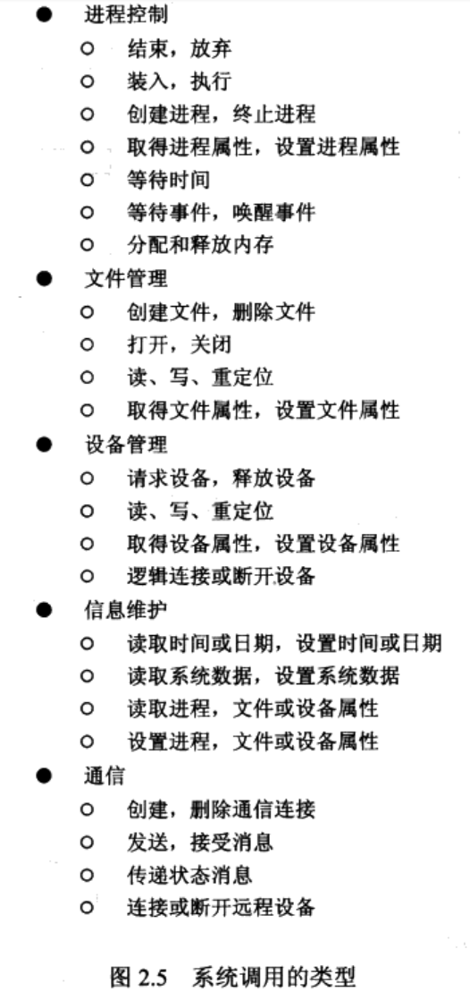
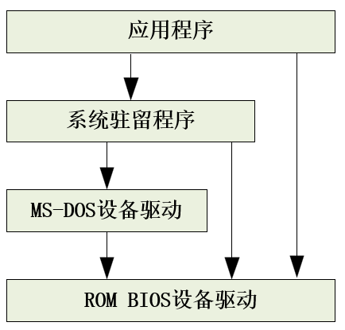
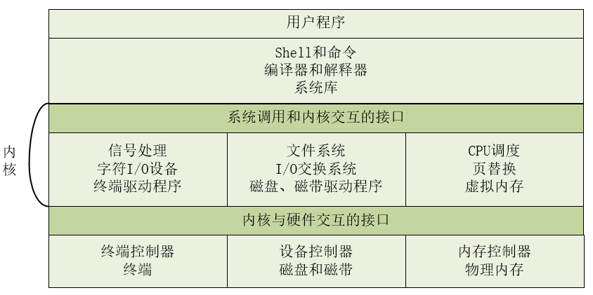

# 第2章 操作系统结构

操作系统可以有很多种组织方式。设计系统时，系统的类型决定了如何选择算法和策略。

研究操作系统的角度：

- 操作系统提供的服务
- 操作系统为用户和程序员提供的接口
- 系统的各个组成部分及其相互关系

## 2.1 操作系统服务

**操作系统服务**方便了程序员，使得编程更加容易。

操作系统服务对用户提供很有用的函数：

- **用户界面**：所有的操作系统都有**用户界面**（UI）。用户界面的形式有：（1）**命令行界面**CLI，采用文本命令 （2）**批界面**：如图形用户界面（graphical user interface, GUI）
- **程序执行**：将程序装入内存并运行程序。
- **I/O操作**：提供I/O操作的方法，可能设计文件或设备。
- **文件系统操作**：读写文件和目录。创建、删除、搜索文件，或显示文件信息等。
- **通信**：一个进程与另一个进程交换信息。形式包括：第一种同一台计算机的两个进程之间；第二章由网络连接起来的不同的计算机上的进程之间。
- **错误检测**：对于各种可能的硬件以及程序上的错误，操作系统应该采取适当的动作以确保正确和一致的计算。
- **资源分配**：有的资源（如CPU周期、内存和文件存储）需要特别的分配代码，其他资源（如I/O设备）可能只需要通用的请求和释放代码）
- **统计**：哪些用户使用了多少和什么类型的资源。
- **保护和安全**：多个进程并发执行时相互不受影响；不受外界侵犯。

## 2.2 操作系统的用户界面

### 2.2.1 命令解释程序

有的操作系统内核部分包含**命令解释程序**。在具有多个命令解释程序的系统中，解释程序被称为**外壳Shell**，例如Linux系统中，有多种不同夫人shell可供用户选择。许多用户对shell的选择只是基于个人偏好。

**Shell的主要作用**：获取并执行用户指定的程序。

**Shell执行命令的两种常用方法**：

- 命令解释程序本身包含代码以执行这些命令：所能提供的命令的数量决定了解释程序的大小，因为每个程序需要自己实现。
- 由系统程序实现绝大多数命令：只要用命令来识别文件以装入内存并执行，如rm file.txt，会搜索名为rm的文件，并用参数file.txt来执行

### 2.2.2 图形用户界面

GUI允许提供基于鼠标的窗口和菜单系统作为接口。根据鼠标的位置，按一下鼠标按钮就可以调用程序、选择文件目录、文件、目录和系统功能。

## 2.3 系统调用

**系统调用（system call)**提供了操作系统操作系统的有效服务界面。这些调用通常用C或C++编写，对底层的任务可能以汇编指令的形式提供。（是不是可以理解系统调用就是程序接口？）

**操作系统如何使其系统调用可用？**

文件创建、读写、复制、删除等等都是系统调用，一般系统每秒钟会执行数千个系统调用。

一般应用程序开发人员根据**应用程序接口（API）**设计程序。API是一系列适用于应用程序员的函数，包括传递给每个函数的参数及返回的程序员想得到的值。

三种应用程序员常用的API，分别是适用于Windows系统的Win32 API，适用于POSIX系统的POSIX API(包括所有UNIX、Linux和Mac OS X系统)，用于设计运行于Java虚拟机程序的Java API.

**API**通常为应用程序员调用实际的系统调用。如：CreateProcess()实际调用Windows内核中的NTCreateProcess()系统调用。

**为什么程序员使用API编程，不调用实际的系统调用？**

使用API的可移植性好，且系统调用更为注意细节，使用更困难。

（系统调用是内核提供的接口？）

## 2.4 系统调用类型

系统调用大致分为5类

- **进程控制**
- **文件管理**
- **设备管理**
- **信息维护**
- **通信**

### 2.4.1 进程控制

程序需要能够正常中断（end)或非正常中断（abort)。

的C库函数处理.png)

### 2.4.2 文件管理

文件创建、删除、打开、关闭、读写、重定位、属性获取与设置等。

### 2.4.3 设备管理

程序向系统申请资源，如果资源满足，系统会将对资源的控制返回到用户程序；否则程序必须等待足够多的资源。

不同的资源指的是不同的设备，包括物理设备，以及抽象或虚拟的设备（如文件）。

使用完设备，用户需要释放，类似文件的打开与关闭（open和close)的系统调用。

**I/O设备和文件非常相似**，可以对设备进行读、写或重定位，以至于许多操作系统如unix将两者合并为文件-设备结构。

### 2.4.4 信息维护

许多系统调用用于用户程序与操作系统之间传递信息，即进行信息维护。如有系统调用用于返回当前的时间和日期，当前用户数，操作系统的版本，空闲内存，磁盘的多少，所有的进程信息等。

### 2.4.5 通信

两种通信模型

- **消息传递模型**  通信进程之间通过交换消息进行通信。每个进程都有进程名，通常转换成标识符一边操作系统引用。通信源被称为**客户机**，接收方被称为**服务器**。
- **共享内存模型**  进程使用shared memory create和shared memory attach系统调用来获取其他进程所拥有的内存区域的访问权。**线程**是进程模型的变形，一般他们共享内存。**共享内存允许最大速度通信且十分方便，但在保护和同步方面，进程共享内存存在一些问题。**

## 2.5 系统程序

**计算机的逻辑层次**

硬件 --- 操作系统 --- 系统程序 --- 应用程序。

系统程序提供了一个方便的环境，辅助开发程序以及执行程序。

小部分系统程序是系统调用的简单接口，其他可能非常复杂。

**系统程序分类**：

- **文件管理**  与文件管理相关的系统程序用于创建、删除、复制、重新命名、打印、转储、列出操作文件和目录。
- **状态信息**  与状态信息有关的程序从操作系统获得日期、时间、可用内存、磁盘空间数量、用户数或类似状态信息，除此之外还包括纤细的性能、登录和调试信息。有的系统支持**注册表**，用于存储和检索配置信息。
- **文件修改**  如编辑器可以创建和修改文件内容。特殊的命令被用于查找文件内容或完成文本的转换。
- **程序语言支持**  与程序语言支持相关的系统程序，包括编译程序、汇编程序、调试程序和解释程序通常与操作系统一起提供给用户。
- **程序装入和执行**  系统可能提供系统程序，如绝对加载程序、重定位加载程序、连接编辑器、覆盖式加载程序等，用于将程序装入内存并执行。还包括高级语言或机器语言的调试程序。
- **通信**  与通信有关的系统程序提供了在进程、用户和计算机系统之间创建虚拟连接的机制。

**系统工具或应用程序**

除系统程序外，操作系统还提供**系统工具或应用程序**以解决一般问题和执行一般操作，如网页浏览器、字处理器、文本格式化器、电子制表软件、数据库系统、编译器、打印和统计分析包，以及游戏等。

**绝大多数用户看到的操作系统是由应用程序和系统程序而不是系统调用所决定的。**

## 2.6 操作系统设计和实现

### 2.6.1 设计目标

系统的类型：批处理、分时、单用户、多用户、分布式、实时或通用目标。

系统的设计受到硬件选择和系统类型的影响。

如何定义操作系统的要求，没有唯一的解决方案。现实中存在许多类型的系统说明了不同要求能形成对不同环境的解决方案。

### 2.6.2 机制与策略

**机制（mechanism)**决定如何做，**策略（policy）**决定做什么。

系统更需要通用机制，这样策略的改变只需要重定义一些系统参数。

### 2.6.3 实现

传统的操作系统是用汇编语言编写的，现在的操作系统都是用高级语言如C或C++来编写的。

Linux和Windows XP主要是用C语言编写的，有少数主要用于设备驱动程序与保存和恢复寄存器状态的代码是用汇编语言来编写的。

高级语言编写的操作系统更容易移植到不同的平台上（同样的代码，用不同平台的编译器编译即可）。

操作系统的重要性能的改善很可能是由于更好的数据结构和算法，而不是由于优秀的汇编语言代码。对于少部分性能瓶颈子程序，可用相应的汇编语言子程序来替代。

## 2.7 操作系统结构

操作系统由各功能模块组成，每个功能模块具有明确的输入、输出和功能。这些模块连接起来组成了内核。

### 2.7.1 简单结构

**MS-DOS系统**

特点：是受限结构的系统，没有仔细地划分模块，没有很好地区分接口和功能层次，应用程序能够访问基本地I/O程序。这种任意性使MS-DOS易受错误（或恶意）程序的伤害。

**早期UNIX系统**

特点：是受限结构的系统。由**内核**和**系统程序**两个独立部分组成。内核进一步分成一系列接口和驱动程序。物理硬件之上和系统调用接口之下的所有部分作为**内核**。内核通过系统调用以提供文件系统、CPU调度、内存管理和其他操作系统的功能。

### 2.7.2 分层方法

**分层法**是系统模块化的一种方法，即操作系统被分成若干层级，最底层（层0），最高层（层N)为用户接口。

一个典型的操作系统的某一层次由**数据结构**和**可为上层所调用的子程序集合所组成**。

分层法的**优点**在于构造和调试的简单化。每层只能利用较低层的功能和服务，而不必知道这些功能和服务是如何实现的。每层为较高层隐藏了一定的数据结构、操作和硬件和存在。

### 2.7.3 微内核

**微内核**（microkernel)是一种模块化的内核。将内核的非基本部分移走并实现为系统程序或用户程序，得到更小的内核，即微内核。

微内核的主要功能是使客户程序与各种服务之间进行通信，通信以消息传递形式提供（效率不高）。

微内核方法的好处之一在于便于扩充操作系统。所有新服务可以在用户空间增加，而不需要修改内核。即使需要修改，改动也会很小。由于绝大多数服务是作为用户而不是作为内核进程来运行的，因此微内核也就提供了更好的安全性和可靠性。

### 2.7.4 模块

最新的操作系统设计方法是**面向对象编程技术**来生成**模块化的内核**。模块化的内核有一组核心部件，以及在启动或运行时动态链接的附加服务。这种方法能够动态加载模块。

这样的设计允许内核提供核心服务，也能动态地实现特定地功能。类似于分层系统，每个内核部分都有被定义和保护的接口，但比分层灵活，任意模块都能调用其他模块。类似于微内核方法，核心模块只有核心功能以及其他模块加载和通信的相关信息，但比微内核更高效，模块不需要调用消息来进行通信。	

## 2.8 虚拟机

通过利用**CPU调度**和**虚拟内存技术**，可以让进程认为有自己地处理器和自己的内存。虚拟机方法除了提供基本硬件相同的接口之外，并不提供额外的功能。

**创建虚拟机的根本原因**

在并行运行几个不同的执行环境（即不同的操作系统）时能够共享相同的硬件。

### 2.8.1 实现

底层机器有两种模式分别是用户模式和内核模式。虚拟机本身只能运行在用户模式，但虚拟机模拟的系统可以运行在内核模式。所以虚拟机必须有虚拟用户模式和虚拟内核模式。这两种模式都运行在用户模式。

**虚拟机上从虚拟用户模式到虚拟内核模式的转换实现**

当一个以虚拟用户模式在虚拟机上运行的程序执行系统调用时，它会在真实机器上引起一个到虚拟机监视器的转换。当虚拟机监视器获得控制，它能够改变虚拟机的寄存器内容和程序计数器以模拟系统调用的结果。

### 2.8.2 优点

虚拟机时用于研究和开发操作系统的好工具。

### 2.8.3 实例

- VMware系统
- Java虚拟机（JVM)

## 2.9 系统生成

## 2.10 系统启动

