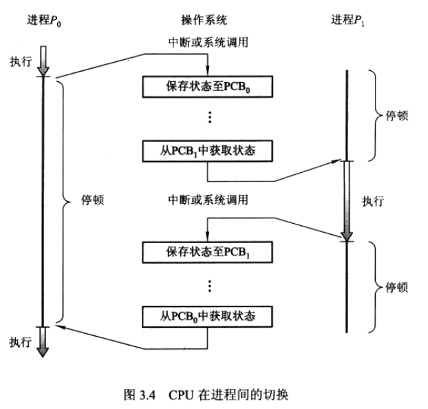
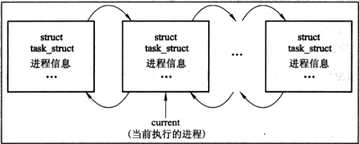
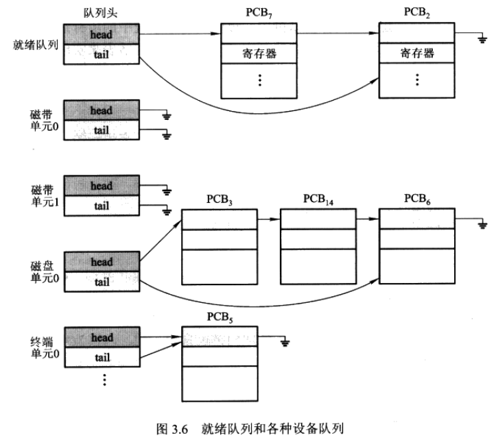
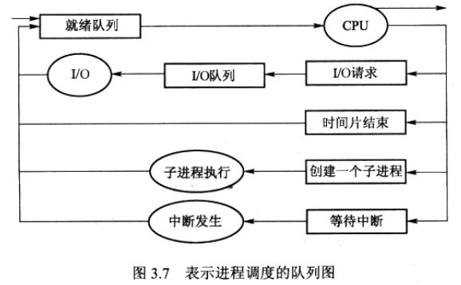

# 第3章 进程

**进程**是现代分时系统的工作单元。

系统由一组进程组成：操作系统进程执行系统代码，用户进程执行用户代码。通过CPU多路复用，所有这些进程可以并发执行。通过进程之间的切换，操作系统能使计算机更为高效。

## 3.1 进程概念

**作业**和**进程**是同一概念，在此不做区分。

### 3.1.1 进程

进程区别于程序代码，进程还包括当前活动，如程序计数器的值和寄存器的内容，还有进程**堆栈段**（包括临时数据，如函数参数、返回地址和局部变量）和**数据段**（包括全局变量），还可能包括**堆**（heap，进程运行期间动态分配的内存）。

**内存中的进程**

包括**文本段**、**数据段**、**堆**、**栈**。文本段即代码段（二进制）。一个可执行文件同时运行两次，虽然文本段相同，但数据段、堆、栈段不同。

### 3.1.2 进程状态

**进程的多种状态**

- **新建**：进程正在被创建
- **运行**：指令正在被运行
- **等待**：进程等待某个事件的发生
- **就绪**：进程等待分配处理器
- **终止**：进程完成执行

一次只能有一个进程可以在一个处理器上运行，但是多个进程可处于就绪或等待状态。


### 3.1.3 进程控制块

**进程控制块**（process control block，PCB，又称任务控制块)是进程在操作系统内的表示。

进程控制块是特定进程信息的集合。包括信息：

- **进程状态** 状态可包括新建、就绪、运行、等待、停止等。
- **程序计数器** 计数器表示进程要执行的下个指令的地址
- **CPU寄存器** 包括累加器、索引寄存器、堆栈指针、通用寄存器和其他条件码信息寄存器的状态信息等。
- **CPU调度信息** 包括进程的优先级、调度队列的指针和其他调度参数。
- **内存管理信息** 包括基址和界限寄存器的值、页表或段表等
- **记账信息** 包括CPU的时间、实际使用时间、时间界限、记账数据、作业或进程数量等。
- **I/O状态信息** 包括分配给进程的I/O设备列表、打开的文件列表等。




### 3.1.4 线程

线程是进程概念的扩展，是程序具有执行并发任务的能力。


## 3.2 进程调度

**进程调度**指从可用进程集合中选择一个可用进程到CPU上执行。单处理器系统从来不会有超过一个进程在运行。如果有多个进程，余下的则需要等待cpu空闲并重新调度。

### 3.2.1 调度队列

**作业队列**：包括系统中的所有进程。

**就绪队列**：保存内存中就绪的、等待运行的进程。


**Linux中的进程表示**

Linux操作系统的PCB是通过C结构task_struct表示的，该结构包含了表示一个进程所需要的所有信息，包括进程的状态、调度和内存管理信息、打开文件列表和指向父进程和所有子线程的指针。

```c
struct task_struct {
    pid_t pid; //process identifier
    long state; //state of the process
    unsigned int time_slice; //scheduling information
    struct files_struct *files; //list of open files
    struct mm_struct *mm; //address space of this process
};
```

linux内核中，所有活动的进程是通过一个名为task_struct的双向链表表示的。




**设备队列**

等待特定I/O设备的进程列表称为设备队列。每个设备都有自己的设备队列。




**进程调度的表示方法：队列图**

新进程开始处于就绪队列，等待被选中执行。当进程分配到CPU并执行时，可能进行如下活动：

- 进程可能发出一个I/O请求，并被放到I/O队列中
- 进程可能创建一个新的子进程，并等待其结束
- 进程可能会由于中断而强制释放CPU，并被放回到就绪队列中



进程不断进行队列图中的循环直至终止，终止时它将从所有队列中删除，其PCB和资源将得到释放。


### 3.2.2 调度程序

**调度程序**（scheduler）：按某种方式执行进程调度（即进程选择）的程序。


### 3.2.3 上下文切换

中断使CPU从当前任务改变为运行内核子程序。

**上下文切换**（context switch)：CPU切换进程时，保存当前进程的状态并恢复另一个人进程的状态称为上下文切换。


## 3.3 进程操作

### 3.3.1 进程创建

**父子进程**

进程在其执行过程中，能通过创建进程系统调用（create-process system call)创建多个新进程。创建进程称为父进程，新进程称为子进程。每个新进程可以再创建其他进程，形成进程树。


**进程标识符**

大对数操作系统（包括UNIX和Windows)使用进程标识符（pid，整数值)识别进程。

例如ls或cat命令等，是shell调用不同的子进程的命令行接口。


**父子进程执行的两种可能**

- 父进程与子进程并发执行
- 父进程等待，直到某个或全部子进程执行完


**新进程地址空间的两种可能**

- 子进程是父进程的复制品
- 子进程装入另一个新程序


**UNIX系统进程的创建**

fork()系统调用可创建新进程。


**Windows系统进程的创建**

Win32 API使用CreateProcess()创建进程，将特殊程序装入子进程的地址空间。


### 3.3.2 进程终止

当进程完成执行最后的语句并使用系统调用exit()请求操作系统删除自身时，进程终止。

其他情况如进程通过适当的系统调用（如Win32中的TerminateProcess()能终止另一个进程。


## 3.4 进程间通信

操作系统内并发执行的进程可以是独立进程或协作进程。

**独立进程**、**协作进程**

独立进程不影响其他进程，也不受其他进程影响。否则就是协作进程。


**协作进程**

协作进程需要一种进程间通信机制（interprocess communication,IPC)来允许进程相互交换数据与信息。进程间通信有两种基本模式：

- 共享内存
- 消息传递


### 3.4.1 共享内存系统

**共享内存**

通常操作系统试图阻止一个进程访问另一个进程的内存，共享内存需要两个或更多的进程取消这个限制。

协作进程类似生产者-消费者问题。


### 3.4.2 消息传递系统

通信必须要有**通信线路**（communication link)。

通信的两个线程必须要有相互发送消息和接收消息。（send\recieve)


## 3.5 IPC系统的实例

- POSIX 共享内存 消息传递
- Windows XP 共享内存
- Mach 消息传递

### 3.5.1 实例：POSIX共享内存

**系统调用shmget()**

该系统调用创建共享内存段。

```c
segment id = shmget(IPC_PRIVATE, size, S_IRUSR | S_IWUSR);
//param 1:标识符
//param 2:大小（按字节数）
//param 3:明确如何使用共享内存段，读、写或二者组合
//return 共享内存段整数标识值，供其他进程使用
```


### 3.5.2 实例：Mach

Mach的绝大多数通信（包括绝大多数系统调用和所有任务间信息）是通过**消息**实现的。消息通过邮箱（即端口）来发送或接收。


### 3.5.3 实例：Windows XP

Windows XP的消息传递工具称为**本地过程调用（LPC）**工具。LPC在位于同一机器的两进程之间通信。

Windows XP系统使用两种类型的端口：连接端口和通信端口。连接端口允许应用程序建立通信频道。通信工作如下：

- 客户机打开系统的连接端口对象的句柄
- 客户机发送连接请求
- 服务器创建两个私有通信端口，并返回其中之一的句柄给客户机
- 客户机和服务器使用相应端口句柄以发送消息或回调，并等待回答

Windows XP中LPC工具并不是Win32 API的一部分，故不能被应用程序所见。

## 3.6 客户机-服务器系统通信

共享内存与消息传递之外，另外三种客户机-服务器系统通信方法：

- Socket
- 远程过程调用（RPC)
- Java的远程方法调用（RMI）

### 3.6.1 Socket

socket由IP地址与一个端口号组成。

客户机端口由主机分配，端口号是大于1024的任意数。

**例子**

如果IP地址为146.85.5.20的主机X的客户端程序希望与地址为161.25.19.8的Web服务器（监听端口80）建立连接，它可能被分配端口1625。该连接由一对Socket组成：主机X上的（146.86.5.20：1625），Web服务器上的（161.25.19.8：80）。根据目的端口，在主机间传输的数据包可分送给合适的进程。


Socket通信虽然常用和高效，但它属于较为低级的分布式进程通信，原因在于只允许在通信线程之间交换无结构的字节流，客户机或服务器程序需要加上数据结构。

### 3.6.2 远程过程调用(RPC)

RPC设计成抽象过程调用机制，用于通过网络连接的系统上。进程在不同的系统上执行，必须提供基于消息的通信方案提供远程服务。与IPC工具不同，用于RPC交换的消息有很好的结构，不仅仅是数据包。每个消息传递给远程系统上监听端口号的RPC服务器，每个都包含要执行的函数的名称和传递给函数的参数，该函数根据请求而执行，任何结果通过另一个消息送回给请求者。

RPC语义允许客户机调用位于远程主机上的过程，就如同调用本地过程一样。


### 3.6.3 远程方法调用

远程方法调用（remote method invocation,RMI)是一个类似于RPC的Java特性。RMI允许线程调用远程对象的方法。

RMI是基于对象的，支持调用远程对象的方法。