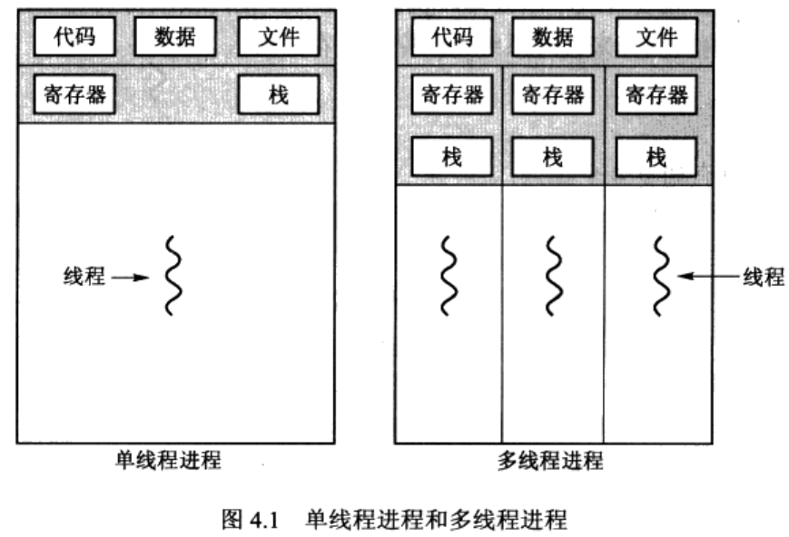

# 第4章 线程


## 4.1 概述

**线程组成**

线程是CPU使用的基本单元。由线程ID、程序计数器、寄存器集合和栈组成。

**线程特点**

与同属于同一进程的其他线程共享代码段、数据段和其他操作系统资源。




操作系统都是多线程的。


**多线程优点**

- 响应度高
- 资源共享
- 经济
- 多处理器体系结构的利用


## 4.2 多线程模型

线程支持包括**用户线程**和**内核线程**。用户线程受内核支持，无需内核管理；内核线程由操作系统直接支持和管理。

**用户线程和内核线程之间的关系**

- 多对一模型
- 一对一模型（如Linux和Windows操作系统家族）
- 多对多模型


## 4.3 线程库

**线程库(thread library)**是为程序员提供创建和管理线程的API。

**主要的三种线程库**

- POSIX Pthread
- Win32
- Java


### 4.3.1 Pthread

```c
#include <pthread.h>
#include <stdio.h>

int sum;
void *runner(void *param);

int main(int argc, char *argv[])
{
    pthread_t tid;
    pthread_atr_t attr;
    
    if (argc != 2) return -1;
    if (atoi(argv[1] < 0))return -1;
    
    pthread_attr_init(&attr);
    pthread_create(&tid, &attr, runner, argv[1]);
    pthread_join(tid, NULL);
    printf("sum=%d\n", sum);
}

void *runner(void *param) {
    int i, upper = atoi(param);
    sum = 0;
    for (int i = 0; i < upper; ++i) {
        sum += i;
    }
    pthread_exit(0);
}
```


### 4.3.2 Win32线程

Win32线程库是内核级线程库。使用Win32API时必须包含windows.h头文件。

```c++
#include <windows.h>
#include <stdio.h>

DWORD Sum;

DWORD WINAPI Summation(LPVOID Param) {
    DWORD Upper = *(DWORD*)Param;
    for (DWORD i = 0; i <= Upper; ++i) {
        Sum += i;
    }
    return 0;
}

int main(int argc, char *argv[]) {
    DWORD ThreadId;
    HANDLE ThreadHandle;
    int Param;
    
    if (argc != 2) return;
    Param = atoi(argv[1]);
    if (Param < 0) return;
    
    ThreadHandle = CreateThread(
    	NULL, //default security attributes
        0, //default stack size
        Summation, //thread functon
        &Param, //parameter to thread function
        0, //default creation flags
        &ThreadId //returns the thread identifier
    );
    
    if (ThreadHandle != NULL) {
        WaitForSingleObject(ThreadHandle, INFINITE);
        CloseHandle(ThreadHandle);
        printf("sum = %d\n", Sum);
    }
}
```


### 4.3.3 Java


## 4.4 多线程问题

**系统调用fork()和exec()**

fork()用于创建独立的、复制的进程。

exec()用于使用其指定的程序替换整个进程，包括所有进程。


**线程的取消**

线程取消是指线程完成之前终止线程的任务。要取消的线程被成为目标线程。

取消方式：

- 异步取消：一个线程立即终止目标线程。（如果目标线程已被分配资源或正在更新与其他线程的共享数据，取消会有困难，系统不能做到回收所有的资源）
- 延迟取消：目标线程不断地检查它是否应被终止，这允许目标线程有机会以有序地方式来终止自己。（这样允许一个线程检查它是否是在安全的节点被取消，Pthread称这些点为**取消点**


**信号处理**

信号发送给进程中的哪个或哪几个线程。


**线程池**

线程池（thread pool)的主要思想是是在进程开始时创建一定数量的线程，并放入到池中等待工作。当服务器接收到请求时，它会唤醒池中的一个可用的线程，并将要处理的请求传递给它。一旦线程完成了服务，它会返回到池中再等待工作。如果池中没有可用的线程，那么服务器会一直等到有空线程为止。

优点：

- 通过用现有线程处理请求要比等待创建新的线程要快
- 线程池限制了在任何时候可用的线程的数量，这对那些不能支持大量并发线程的系统非常重要。


**Win32 线程池API**

```c++
QUeueUserWorkIem(
    LPTHREAD_START_ROUTINE Function, //指向作为独立线程允许的函数的指针
    PVOID Param, //传递给Function的参数
    ULONG Flags //显示线程池如何创建和管理线程的执行的标志
);
```


## 4.5 操作系统实例

**Windows XP**

线程通常包括：

- 一个线程ID，以唯一表示线程
- 一组寄存器集合，以表示处理器的状态
- 一个用户栈，以供线程在用户模式下运行；一个内核堆栈，以供线程在内核模式下运行
- 一个私有存储区域，为各自运行时库和动态链接库dll所用。

寄存器集合、栈和私有存储区域称为线程的**上下文**


**Linux线程**

Linux不区分进程和线程，通常称之为任务。

Linux下fork()是进程复制功能的系统调用，clone()是创建线程的系统调用。