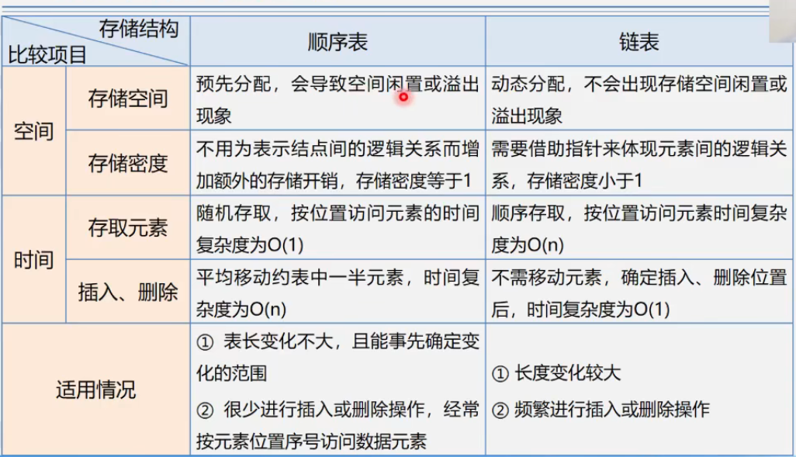

# 第2章 线性表

## 2.1 线性表的定义和特点

**线性表**是具有相同特性的数据元素的一个有限序列。

(a~1~, a~2~, ... ... , a~i-1~, a~i~, a~i+1~, ... ... , a~n~)

n = 0时为空表，n称为表长。

**特点**：相同特性，线性关系


## 2.2 案例引入


## 2.3 线性表的类型定义

线性表的抽象数据类型：

ADT List {

​	数据对象：D={a~i~ | a~i~属于Element, i = 1, 2, ...n}

​	数据关系：R={<a~i-1~, a~i~>| a~i-1~, a~i~属于D}  //表示序偶关系

​	基本操作:

​	initList(&L);  DestroyList(&L); ......等等

} ADT List

```c
ADT List {
    数据对象：D={a~i~ | a~i~属于Element, i = 1, 2, ...n}
    数据关系：R={<a~i-1~, a~i~>| a~i-1~, a~i~属于D}  //表示序偶关系
    基本操作：
    InitList(&L); //构造一个空的线性表L
    DestroyList(&L);  //销毁线性表
    ClearList(&L); //将线性表重置为空表
    ListEmpty(L); //判断是否为空
    ListLength(L); //返回元素个数
    GetElem(L, i, &e); //用e返回线性表L中第i个数据元素的值
    LocateElem(L, e, compare()); //返回满足条件的位序，不存在则返回0
    PriorElem(L, cur_e, &pre_e); //用pre_e返回前驱，否则操作失败
    NextElem(L, cur_e, &next_t); //用next_e返回前驱，否则操作失败
    ListInsert(&L, i, e); // 1<=i<=ListLength(L)+1,在第i个位置前插入新元素e，L长度加1
    ListDelete(&L, i, &e); // 1 <= i <= ListLength(L)
    ListTraverse(&L, visited()); //依次对每个元素调用visited()
}
```


## 2.4 线性表的顺序表示和实现

线性表的顺序表示又称为顺序存储结构或顺序映像。

**顺序存储定义**：把逻辑上相邻的数据元素存储在物理上相邻的存储单元中的存储结构。

LOC(a~i+1~) = LOC(a~i~) + m

LOC(a~i~) = LOC(a~1~) + (i-1) *m

**顺序表特点**

- 以物理位置相邻表示逻辑关系
- 任意元素均可随机存取（优点）
- 逻辑位序与物理位序相差1，逻辑位序起始1，物理位序起始0

顺序表优点：

- 存储密度大
- 可以随机存取表中任一元素

顺序表缺点：

- 在插入、删除某一元素时需要移动大量元素
- 浪费存储空间
- 属于静态存储方式，元素的个数不能自由扩充

```c
#define LIST_INIT_SIZE 100
typedef struct {
    ElemType elem[LIST_INIT_SIZE];
    int length; //当前长度
}SqList;
```

```c
//预定义
#define TRUE 1
#define FALSE 0
#define OK 1
#define ERROR 0
#define INFEASIBLE -1
#define OVERFLOW -2
typedef int Status;
typedef char ElemType;
```


**初始化**

```c
Status init_list_sq(SqList &L){
    L.elem = new ElemType[MAXSIZE];
    if (!L.elem) exit(OVERFLOW);
    L.length = 0;
    return OK;
}
```

**销毁线性表**

```c
void destroy_list(SqList &L){
    if (L.elem) delete L.elem;
}
```

**清空线性表**

```c
void clear_list(SqList &L) {
    L.length = 0;
}
```

**求线性表的长度**

```c
int get_length(SqList &L) {
    return L.length;
}
```

**判断线性表L是否为空**

```c
int is_empty(SqList &L){
    return (L.length == 0) 1 : 0;
}
```

**顺序表取值**

```c
int get_elem(SqList &L, int i, ElemType &e) {
	//i逻辑位置，起始为1
	if(i < 1 || i > L.length) return ERROR;
    e = L.elem[i - 1];
	return OK;
}
```

**顺序表按值查找**

```c
int locate_elem(SqList, ElemType e) {
    for (int i = 0; i < L.length; ++i) {
        if (L.elem[i] == e) return i + 1; //逻辑位置
    }
    return 0;//查找失败，返回0
}
//ASL = (n+1)/2
```

*平均查找长度ASL*，即期望值，也叫平均查找长度
$$
ASL = \sum_{i=1}^{n}{P_iC_i}
$$
P~i~是第i个元素被查找的概率，C~i~是第i个记录需要比较的次数。

**顺序表插入元素**

```c
Status insert(SqList&L, int i, ElemType e) {
    if (i < 1 || i > (L,length + 1)) return ERROR;
    if (L.length == MAXSIZE) return ERROR;
    for (int k = L.length; k >= i; k--) {
        L.elem[k] = L.elem[k-1];
    }
    L.elem[i - 1] = e;
    L.length++;
    return OK;
}
```

**顺序表删除元素**

```c
Status remove(SqList &L, int i) {
    if ((i<1) || (i > L.length)) return ERROR;
    for (int k = i; k <= L.length-1;++k) {
        L.elem[k-1] = L.elem[k];
    }
    L.length--;
    return OK;
}
```


## 2.5 线性表的链式表示和实现

**链式存储结构**

结点在存储器中的位置是任意的，即逻辑上相邻的数据元素在物理上不一定相邻。

结点包括数据域和指针域。

**单链表**

单链表是由头指针唯一确定，因此单链表可以用头指针的名字来命名。

**链式存储相关术语**

- **结点**：数据元素的存储映像。由数据域和指针域两部分组成。
- **链表**：n个结点由指针链组成的链表。
- **单链表**：结点只有一个指针域的链表称为单链表或线性链表
- **双链表**：结点有两个指针域的链表
- **循环链表**：首尾相接的链表称为循环链表（属于单链表）
- **头指针**：指向链表中第一个结点的指针
- **首元结点**：链表中存储第一个数据元素a~1~的结点
- **头节点**：链表的首元结点之前附设的一个结点。

**空表**：

无头结点时，头指针为空表示空表。

有头结点时，头结点指针域为空时表示空表。

（原则：指向首元结点的指针为空，则为空表）

**链表（链式存储结构）特点**

- 结点在存储器中的位置是任意的，即逻辑上相邻的数据袁术物理上不一定相邻
- 访问时只能通过头指针进入链表，并通过每个结点的指针域依次向后顺序扫描其余结点。所以寻找第一个结点和最后一个结点所花费的时间不等（顺序存取法）

```c
typedef struct Lnode{
    ElemType data;
    struct Lnode *next;
}Lnode, *LinkList;

//定义链表
LinkList L;
//定义结点指针p
LNode *p; --> LinkList p;
```


**单链表初始化**

初始化即构造一个空表。

```c
Status init_list(LinkList &L) {
    L = new LNode;
    L->next = NULL;
    return OK;
}
```

**判断单链表是否为空**

```c
int is_empty(LinkList L) {
    return L->next ? 0 : 1; //非空 return 0；
}
```

**销毁单链表**

```c
Status destroy_list(LinkList &L) {
    LinkList p;
    while (L) {
        p = L;
    	L = L->next; //头结点往后移
    	delete p;
    }
    return OK;
}
```

**清空单链表**

```c
Status clear_list(LinkList &L) {
    destroy_list(L->next);
    L->next = NULL;
}
Status clear_list(LinkList &L) {
    LinkList p, q;
    p = L->next;
    while (p) {
        /*q = p;
        p = p->next;
        delete p;*/ //错误，p是下一结点
        q = p;
        p = p->next;
        delete q;
        /*
        q = p->next;
        delete p;
        p = q;*/
    }
    L->next = NULL;
    return OK;
}
```

**求单链表表长**

```c
int length(LinkList &L) {
    int len = 0;
    LinkList p = L->next;
    while (p) {
        len++;
        p = p->next;
    }
    return len;  
}
```

**取单链表中第i个元素**

```c
Status get_elem(LinnkList &L, int i, ElemType &e) {
    LinkList p = L->next;
    int index = 1;
    while (p && (index < i)) {
        p = p->next;
        ++index;
    }
    if (!p || index > i) return ERROR;
    e = p->data;
    return OK;
}
```

**按值查找--根据指定数据获取搞数据所在的位置**

```c
LinkList locate(LinkList &L, ElemType e) {
    LinkList p = L->next;
    while (p && p->data != e) {
        p = p->next;
    }
    return p;
}

int locate(LinkList L, ElemType e) {
    LinkList p = L->next; 
    int index = 1;
    while (p && p->data != e) {
        p = p->next;
        index++;
    }
    return p ? j : 0;
}
//复杂度O(n)
```

**插入--在第i个结点前插入值为e的新结点**

```c
Status insert(LinkList &L, int i, ElemType e) {
    LinkList p = L;
    int index = 0;
    LinkList node = NULL;
    
    while (p && index < i - 1) {
        p = p->next; 
        ++index;
    }
    if(!p || index > i-1) return ERROR;
    node = new LNode;
    node->data = e;
    //
    node->next = p->next;
    p->next = node;
    return OK;
}
//复杂度O(1)
```

**删除--删除第i个结点**

```c
Satus remove(LinkList &L, int i, ElemType &e) {
    LinkList p = L;
    int index = 0;
    LinkList node = NULL;
    
    while (!p && index < i - 1) {
        p = p->next;
        ++index;
        if (!p || index > i - 1) return ERROR;
    }
    node = p->next;
    p->next = p->next->next;
    e = node->data;
    delete node;
    return OK;
}
//复杂度O(n)
```

**头插法-建立单链表**

```c
void create_list(LinkList &L, int n) {
    L = new LNode;
    L->next = null;
    for (int i = n; i > 0; --i) {
        p = new LNode;
        cin >> p->data;
        p->next = L->next;
        L->next = p;
        //每一次循环都将新结点插在头部
    }
}
//复杂度O(n)
```

**尾插法-建立单链表**

```c
void create_list(LinkList &L, int n) {
    L = new LNode;
    L->next = NULL;
    LinkList p, r;
    r = L;
    for (int i = 0;) {
        p = new LNode;
        cin >> p->data;
        p->next = NULL;
        r->next = p;
        r = p;
    }
}
//复杂度：O(n)
```

### 2.5.3 循环链表

**循环链表**：是一种头尾相接的链表，即最后一个结点的指针域指向头结点，整个链路形成一个环。

**优点**：从表中任意结点触发均可找到表中其他结点。

**空表**：头结点指针域指向自己

循环条件：p!=L, p->next!=L

尾指针表示单循环链表：

- a~1~的存储位置：R->next->next
- a~n~的存储位置：R

**带尾指针循环链表的合并（将Tb合并在Ta之后）**

- p存表Ta头结点  p = Ta->next
- Tb表头连接到Ta表尾 Ta->next = Tb->next->next
- 释放Tb表头结点  delete Tb->next
- 修改指针 Tb->next = p;

```c
LinkList connect(LinkList Ta, LinkList Tb) {
    p = Ta->next;
    Ta->next = Tb->next->next;
    delete Tb->next;
    Tb->next = p;
    return Tb;
}
```


### 2.5.4 双向链表

单链表的结点有指示后继的指针域，找后继结点方便，但无指示前驱的指针域，找前驱结点难。

**双向链表**在单链表的每个结点再增加一个指向其直接前驱的指针域prior，这样链表就形成了两个方向不同的链，故称双向链表。

```c
//双向链表结构定义
typedef struct DulNode {
    ElemType data;
    struct DulNode *prior, *next;
}DulNode, *DuLinkList;
```

**空表**：两个指针域都为空


**双向循环链表**

- 让头结点的前驱指针指向链表的最后一个结点
- 让最后一个结点的后继指针指向头结点。


**双向链表结构的对称性**

```c
p->prior->next == p == p->next->prior
```

**双向链表的插入**

- s->prior = p->prior  //s的prior指向p的前驱
- p->prior->next = s //p的前驱的next指向s
- s->next = p; //s的next指向p
- p->prior = s; //p的prior指向s

```c
void ListInsert_Dul(DuLinkList &L, int i, ElemType e) {
    DuLinkList p = GetElemP_DuL(L, i);
    if (!p) return ERROR;
    DuLinkList s = new DuLNode;
    s->data = e;
    
    s->prior = p->prior;
    p->prior->next = s;
    s->next = p;
    p->prior = s;
    return OK;
}
```

**双向链表的删除**

- p->prior->next = p->next;
- p->next->prior = p->prior;
- free(p)

```c
void ListDelete_DuL(DuLink &L，int i, ElemType &e) {
    DuLinkList p = GetElemP_DuL(L, i);
    if (!p) return ERROR;
    e = p->data;
    p->prior->next = p->next;
    p->next->prior = p->prior;
    free(p);
    return OK;
}
```


## 2.6 线性表的应用

**链式存储结构的优点**

- 结点空间可以动态申请和释放
- 数据元素的逻辑次序靠节点的指针来表示，插入和删除时不需要移动数据元素

**链式存储结构的缺点**

- **存储密度**小，每个结点的指针域需要额外占用存储空间。当每个结点的数据域占字节不多时，指针域所占存储空间的比重显得很大。

$$
存储密度 = \frac{结点数据本身所占用的空间}{结点占用的空间总量}
$$


**顺序表与链表的比较**




**线性表的合并**

- 问题描述

  假设利用两个线性表La和Lb分别表示两个集合A和B，现要求一个新的集合为A=A∪B

  La=(7,5,3,11) Lb=(2,6,3) ---> La=(7,5,3,11,2,6)

- **算法步骤**

  依次取出Lb中的每个元素，执行以下操作：

  1. 在La中找该元素
  2. 如果找不到则将其插入La的最后

```c
void union(List &La, List Lb) {
    La_len = ListLength(La);
    Lb_len = ListLength(Lb);
    for (int i = 1; i < Lb_len; ++i) {
        GetELem(Lb, i, e);
        if (!locateElem(La, e)) {
            ListInsert(&La, ++La_len, e);
        }
    }
}
```


**有序表的合并**

- 问题描述

  已知线性表La和Lb中的数据元素按值非递减有序排列，现要求将La和Lb归并为一个新的线性表Lc，且Lc中的数据元素仍按值非递减有序排列。

  La=(1,7,8) Lb=(2,4,6,8,10,11) --->  Lc=(1,2,4,6,7,8,8,10,11)
  
- **算法步骤**

  - 创建一个空表
  - 依次从La或Lb中摘取元素值较小的结点插入到Lc表的最后，直至器中一个表变为空为止
  - 继续将La或Lb其中一个表的剩余结点插入到Lc表的最后

```c
void MergeList_Sq(SqList La, SqList Lb, SqList &c) {
    //指针pa和pb初值分别指向表中第一个元素
    pa = La.elem;
    pb = Lb.elem;
    //为新表分配内存空间
    Lc.length = La.length + Lb.length;
    Lc.elem = new ElemType[Lc.length];
    //指针pc指向新表的第一个元素
    pc = Lc.elem;
    //分别指向两个表的最后一个元素
    pa_last = La.elem + La.length - 1;
    pb_last = Lb.elem + Lb.length - 1;
    
    while (pa <= pa_last && pb <= pb_last) {
        //取较小值给c赋值，pc和对应取值的表指针后移一位
        if (*pa <= *pb) *pc++ = *pa++;
        else *pc++ = *pb++;
    }
    while (pa <= pa_last) *pc++ = *pa++;
    while (pb <= pb_last) *pc++ = *pb++;
}


void MergeList(LinkList &La, LinkList &Lb, LinkList &Lc) {
    pa = La->next;
    pb = Lb->next;
    pc = Lc = La;
    while (pa && pb) {
        if (pa->data <= pb->data) {
            pc->next = pa;
            pc = pa;
            pa = pa->next;
        } else {
            pc->next = pb;
            pc = pb;
            pb = pb->next;
        }
    }
    pc->next = pa ? pa : pb;
    delete Lb;
}
```


## 2.7 案例分析与实现

### 2.7.1 案例1

实现两个多项式相加运算
$$
Pa(x) = 10 + 5x - 4x^2 + 3x^3 + 2x^4
$$

$$
Pb(x) = -3 + 8x + 4x^2 -5x^4 + 7x^5 -2x^6
$$

以顺序表存储多项式，下标表示幂次数


### 2.7.2 案例2

稀疏多项式的相加运算
$$
A(x) = 7 + 3x + 9x^8 + 5x^{17}
$$

$$
B(x) = 8x + 22x^7 - 9x^8
$$

顺序表，每个元素存储系数和下标

A = [(7,0),  (3,1),  (9,8),  (5,17)]

B = [(8,1),  (22,7),  (-9,8)]

步骤：

- 创建一个新数组c

- 分别从头遍历比较a和b的每一项

  **指数相同**，对应系数相加，若和不为0，则在c中增加新项

  **指数不相同**，则将指数较小的项复制到c中

- 一个多项式遍历完毕时，将另一个剩余项依次复制到c中即可。


**案例1和案例2体现了顺序结构的问题**

- 存储空间分配不灵活，

- 运算的空间复杂度高

**链式结构解决系数多项式的问题**

```c
typedef struct PNode {
    float coef; //系数
    int expn; //指数
    struct PNode *next;
}PNode, *Polynomial;
```

- **多项式创建**

  - 创建一个只有头结点的空链表
  - 根据多项式的项的个数n，循环n次执行以下操作：
    - 生成一个新结点*s；
    - 输入多项式当前项系数和指数，赋给新结点*s的数据域
    - 设置一前驱指针pre,用于指向待找到的第一个大于输入项指数的结点的前驱，pre初值指向头结点
    - 指针q初始化，指向首元结点
    - 循链向下逐个比较链表中当前结点与输入项指数，找到第一个大于输入项指数的结点*q
    - 将输入项结点\*s插入到结点\*q之前

  ```c
  void CreatePolyn(Polynomial &P, int n) {
      P = new PNode;
      P->next = NULL;
      for (int i = 0; i <= n; ++i) {
          s = new PNode;
          cin >> s->coef >> s->expn;
          pre = P;
          q = P->next;
          while (q && q->expn < s->expn) {
              pre = q; q = q->next;
          }
          s->next = q;
          pre->next = s;
      }
  }
  ```

- **多项式相加**

  - 指针p1和p2初始化，分别指向Pa和Pb的首元结点
  - p3指向和多项式的当前结点，初值为Pa的头结点
  - 当p1和p2均未达到相应表尾时，则循环比较p1和p2所指结点对应的指数值（p1->expn与p2-<expn)，有以下3种情况
    - 当p1->expn == p2->expn时，则将两个结点中的系数相加
      - 若和不为0，则修改p1所指结点的系数值，同时删除p2所指结点
      - 若和为0，则删除p1和p2所指结点。
    - 当p1->expn < p2->expn时，则摘取p1所指结点插入到“和多项式”链表中去
    - 当p1->expn > p2->expn时，则摘取p2所指结点插入到“和多项式”链表中去
  - 将非空多项式剩余段插入到p3所指结点之后


### 2.7.3 案例3

图书信息管理系统

```c
struct Book{
    char id[20];  //ISBN
    char name[50];//书名
    int price;	  //定价
};

typedef struct {  //顺序表
    Book *elem;
    int length;
}SqList;

typedef struct LNode {
    Book data;
    struct LNode *next;
}LNode, *LinkList;
```

增删查改

