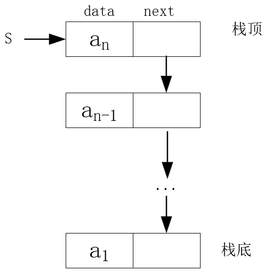

# 第3章 栈与队列

## 3.1 栈和队列的定义和特点

**定义**

栈和队列是限定插入和删除只能在表的“端点”进行的线性表

**特点**

- **栈**：后进先出
- **队列**：先进先出

**栈的应用场景**

- 数制转换
- 括号匹配的检验
- 行编辑程序
- 迷宫求解
- 表达式求值
- 八皇后问题
- 函数调用
- 递归调用的实现

**队列的应用场景**

- 脱机打印输出
- 多用户系统中，多个用户排队，分时地循环使用CPU和主存
- 按用户地优先级排成多个队，每个优先级一个队列
- 实时控制系统中信号按接收地先后顺序依次处理
- 网络电文传输，按到达地时间先后顺序依次进行

### 3.1.1 栈的定义和特点

**栈**（Stack）是一种特殊的线性表，是限定仅在一端（通常是表尾）进行插入和删除操作的线性表

又称**后进先出（Last In First Out)**的线性表，进程LIFO结构。

**概念**

- **栈**是仅在表尾进行插入、删除操作的线性表
- 表尾称为**栈顶**Top，表头称为**栈底**Base
- **入栈** = **压栈** = **Push**
- **出栈** = **弹出** = **Pop**


### 3.1.2 队列的定义和特点

**队列**(Queue)是一种先进先出（First In First Out, FIFO)的线性表。在表的一端插入（表尾），在另一端（表头）删除。（头删尾插）


## 3.2 案例引入

**案例1：进制转换**

十进制整数N向其他进制数d(二、八、十六)的转换是计算机实现计算的基本问题。

转换法则：除以d倒去余

n = (n div d) * d + n mod d

其中：div为整除运算，mod为求余运算


**案例2：括号匹配的检验**

- 假设表达式中允许包含两种括号：圆括号和方括号
- 其嵌套的顺序随意，即：
  - （ [ ] ( ) ）或[ ( [ ] [ ] ) ]为正确格式
  - [ ( ] )为错误格式
  - ( [ ( ) ) 或 ( ( ) ] )为错误格式

思路：从左到右依次入栈，如果是左括号，入栈，如果是右括号，与栈顶匹配，匹配成功则出栈，并继续。如果匹配不成功，则为错误格式。


**案例3：表达式求值**

由运算符优先级确定运算顺序的对表达式求值算法 -- **算符优先算法**

- **操作数**（operand) 常数、变量
- **运算符**（operator) 算数运算符、关系运算符、逻辑运算符
- **界限符**（delimiter) 左右括弧和表达式结束符

任何一个**算术表达式**都由操作数、算术运算符和界限符（括号、表达式结束符#、虚设的表达式起始符#）组成。后两者统称为算符。

例如：# 3 * （7 - 2） #


**案例4：舞伴问题**

- 首先构造两个队列
- 依次从头元素出队配对舞伴
- 某队为空，则另一队等待着则是下一舞曲第一个可获得舞伴的人


## 3.3 栈的表示和操作的实现

### 3.3.1 栈的抽象数据类型

```c
ADT Stack {
    数据对象：
        D = {ai | ai ∈ ElemSet, i = 1,2,...,n}
    数据关系：
        R1 = {<ai-1, ai> | ai-1,ai∈D,i = 1,2,...}
    基本操作：
        初始化、进展、出栈、取栈顶元素等
} ADT Stack
```


- **InitStack(&S) 初始化操作**

- **DestroyStack(&S) 销毁栈操作**
- **StackEmpty(S) 判定S是否为空栈**
- **StackLength(S) 求栈的长度**

- **GetTop(S, &e) 取栈顶元素**
- **ClearStack(&S) 栈置空操作**
- **Push(&S, e) 入栈操作**
- **Pop(&S, &e) 出栈操作**


### 3.3.2 顺序栈的表示与实现

- 栈的顺序存储 --- **顺序栈**
- 栈的链式存储 --- **链栈**

**top指针**

为了方便操作，指示真正的栈顶元素之上的下标地址

**base指针**

指示栈底元素在顺序栈中的位置

**最大容量**

用stacksize表示栈可使用的最大容量

**空栈**

base == top是栈空标志

**栈满**

top - base == stacksize


**使用数组作为顺序栈存储方式特点**

- 简单方便，但易产生溢出（数组大小固定）
- **上溢**（overflow) 栈已经满，又要压入元素（一种错误）
- **下溢**（underflow) 栈已经空，还要弹出元素（一种结束条件）


```c
#define MAXSIZE 100
typedef struct {
    SElemType *base;
    SElemType *top;
    int stacksize;
}SqStack;
```

**顺序栈初始化**

```c
Status init_stack(SqStack &S)
{
    S.base = new SElemType[MAXSIZE];
    if (!s.base) exit (OVERFLOW);
    s.top = s.base;
    s.stacksize = MAXSIZE;
    return OK;
}
```

**判断顺序栈是否为空**

```c
Status is_empty(SqStack s) {
    if (s.top == s.base) {
        return true;
    } else {
        return false;
    }
}
```

**求顺序栈的长度**

```c
int get_length(SqStack s) {
    return s.top - s.base;
}
```

**清空顺序栈**

```c
int clear(SqStack s) {
    if (s.base) {
        s.top = s.base;
    }
    return OK;
}
```

**销毁顺序栈**

```c
Status destroy(SqStack &s)
{
    if (s.base) {
        delete s.base;
        s.stacksize = 0;
        s.base.s.top = NULL;
    }
    return OK;
}
```

**顺序栈的入栈**

```c
Status push(SqStack &s, SElemType e) {
    if (s.top -s.base == s.stacksize) {
        return ERROR;
    }
    *s.top = e;  //合写 *s.top++ = e;
    s.top += 1;
    return OK;
}
```

**顺序栈的出栈**

```c
Status pop (SqStack &s, SElemType &e)
{
    if (s.base == s.base) {
        return ERROR;
    }
    e = *--s.top; //--s.top; e = *s.top
    return OK;
}
```


### 3.3.3 链栈的表示和实现

链栈是**运算受限**的单链表，只能在**链表头部**进行操作。

```c++
typedef struct StackNode {
    SElemType data;
    struct StackNode *next;
} StackNode, *LinkStack;
LinkStack S;
```



**为运算方便，链栈中指针方向与单链表相反**

- 链表的头指针就是栈顶
- 不需要头结点
- 基本不存在栈满的情况
- 空栈相当于头指针指向空
- 插入和删除仅在栈顶处执行

**链栈初始化**

```c
Status init_stack(LinkStack &S) {
    S = NULL;
    return OK;
}
```

**链栈判空**

```c
Status is_empty(LinkStack S) {
    if (S == NULL) return TRUE;
    else return FALSE;
}
```

**链栈的入栈**

```c
Status push(LinkStack &S, ElemType e) {
    p = new StackNode;
    p->data = e;
    p->next = S;
    S = p;
    return OK;
}
```

**链栈的出栈**

```c
Status pop(LinkStack &S, ElemType &e) {
    if (S == NULL) return ERROR;
    e = S->data;
    p = S;
    S = S->next;
    delete p;
    return OK;
}
```

**取栈顶元素**

```c
Status get_top(LinkStack &S,  ElemType &e) {
    if (S != NULL) {
        e = S->data;
        return OK;
    }
    return ERROR;
}
```


## 3.4 栈与递归

**递归**

- 若一个对象部分地包含自己，或用它自己给自己定义，则称这个对象是递归地

- 若一个过程直接或间接地调用自己，则称这个过程是递归的过程。例如求n的阶乘：

   ```c
   long Fact(long n) {
       if (n == 0) return 1;
       else return n * Fact(n -1);
   }
   ```

**递归的应用场景**

- 递归定义的数学函数

   - 阶乘函数
      $$
      Fact(n) = \begin{cases}1，若n=0\\n * Fact(n-1),若n>0 \end{cases}
      $$

   - 2阶Fibonaci数列
      $$
      Fib(n)=\begin{cases}1,若n=1或2\\Fib(n-1)+Fib(n-2),其它\end{cases}
      $$

- 具有递归特性的数据结构

   - 二叉树
   - 广义表

- 可递归求解的问题

   - 迷宫问题
   - Hanoi塔问题

   

**递归问题--用分治法求解**

**分治法**:对于一个较为复杂的问题，能够分解成几个相对简单的且解法相同或类似的子问题求解。

**必备的三个条件**：

- 能将一个问题转变为一个新的问题，而新问题与原问题的解法相同或类同，不同的仅是处理的对象，且这些处理对象是变化有规律的。
- 可以通过上述转化而使问题简化。
- 必须有一个明确的递归出口，或称递归的边界。


**递归的一般形式**

```c
void p(参数表) {
    if (递归结束的条件) 可直接求解步骤;  ---基本项
    else p(较小的参数);   --归纳项
}
```

**函数调用过程**

- 调用前，系统完成：
   1. 将实参、返回地址等传递给被调用函数
   2. 为被调用函数的局部变量分配存储区
   3. 将控制转移到被调用函数的入口
- 调用后，系统完成：
   1. 保存被调用函数的计算结果
   2. 释放被调用函数的数据区
   3. 依照被调用函数保存的返回地址将控制转移到调用函数

**递归的优缺点**

- 优点

   结构清晰，程序易读

- 缺点

   每次调用要生成工作记录，保存状态信息，入栈；返回时要出栈，恢复状态信息。时间开销大。

**递归**转化为**非递归**


## 3.5 队列的表示和操作的实现

**队列**（Queue）:表尾a~n~插入，表头a~1~删除

**存储方式**：顺序队列、链式队列

### 3.5.1 队列的抽象数据类型定义

```c
ADT Queue {
    数据对象：D = {ai | ai∈ElemSet,i=1,2,...n,n>=0}
    数据关系：R = {<ai-1, ai> | ai-1,ai∈D,i=1,2,...,n} 约定a1为队列头，an为队列尾
    基本操作:
    InitQueue(&Q); //构造空队列Q
    DestroyQueue(&Q);
    ClearQueue(&Q);
    QueueLength(Q);
    GetHead(Q, &e);
    EnQueue(&Q, e); //插入元素e到Q的队尾
    DeQueue(&Q, e); //删除Q的对头元素
    ...
}ADT Queue;
```


### 3.5.2 队列的顺序表示与实现

```c
#define MAXQSIZE 100
typedef struct {
    QElemType *base; //初始化的动态分配存储空间
    int front;  //头元素下标
    int rear; //尾元素下标
}SqQueue;

//初始化
front = near = 0;
//入队
base[rear] = x;
rear = (rear+1) % MAXQSIZE;  //取余
//出队
x = base[front];
front = (front + 1) % MAXQSIZE;
//空队标志
front == rear;
```

**循环队列解决队满时的判断方法** --- 少用一个元素空间

队空：front == rear;

队满：（rear + 1）% MAXQSIZE == front


**初始化**

```c
Status init(SqQyeye &Q) {
    Q.base = new QElemType[MAXQSIZE];
    if (!Q.base) exit(QVERFLOW);
    Q.front = Q.rear = 0;
    return OK;
}
```

**求队列长度**

```c
int length(SqQueue Q) {
    return (Q.rear - Q.front + MAXQSIZE) % MAXQSIZE;
}
```

**入队**

```c
Status EnQueue(SqQueue &Q, QElemType e) {
    if ((Q.rear + 1) % MAXQSIZE == Q.front) return ERROR; //队满
    Q.base[Q.rear]= e;
    Q.rear = (Q.rear + 1) % MAXQSIZE;
    return QK;
}
```

**出队**

```c
Status DeQueue(SqQueue &Q, QElemType &e) {
    if (Q.front == Q.rear) return ERROR;  //队空
    e = Q.base[Q.front];
    Q.front = (Q.front + 1) % MAXQSIZE;
    return OK;
}
```

**取队头元素**

```c
Status GetHead(SqQueue Q, QElemType &e) {
    if (Q.front == Q.rear) return ERROR; //队空
    e = Q.base[Q.front];
    return OK;
}
```


### 3.5.3 队列的链式表示和实现

```c
typedef struct QNode {
    QElemType data;
    struct QNode *next;
}QNode, *QunenPtr;

typedef struct {
    QueuePtr front;
    QueuePtr rear;
}LinkQueue;
```

**初始化**

```c
Status Init(LinkQueue &Q) {
    Q.front = Q.rear = (QueuePtr) malloc(sizeof(QNode));
    if (!Q.front) exit(OVERFLOW);
    Q.front->next = NULL;
    return OK;
}
```

**销毁**

```c
Status destroy(LinkQueue &Q){
    while (Q.front) {
        p = Q.front->next;
        free(Q.front);
        Q.front = p;
    }
    return OK;
}
```

**入队**

```c
Status EnQueue(LinkQueue &Q, QElemType e) {
    p = (QueuePtr)malloc(sizeof(QNode));
    if (!p) exit(OVERROW);
    p->data = e;
    p->next = NULL;
    Q.rear->next = p;
    Q.rear = p;
    return OK;
}
```

**出队**

```c
Status DeQueue(LinkQueue &Q, QElemType &e) {
    if (Q.front == Q.rear) return ERROR;
    p = Q.front->next;
    e = p->data;
    Q.front->next = p->next;
    if (Q.rear == p) Q.rear = Q.front;
    delete p;
    return OK;
}
```

**求对头元素**

```c
Status getHead（LinkQueue Q, QElemType &e) {
    if (Q.front == Q.rear) return ERROR;
    e = Q.front->next->data;
    return OK;
}
```


