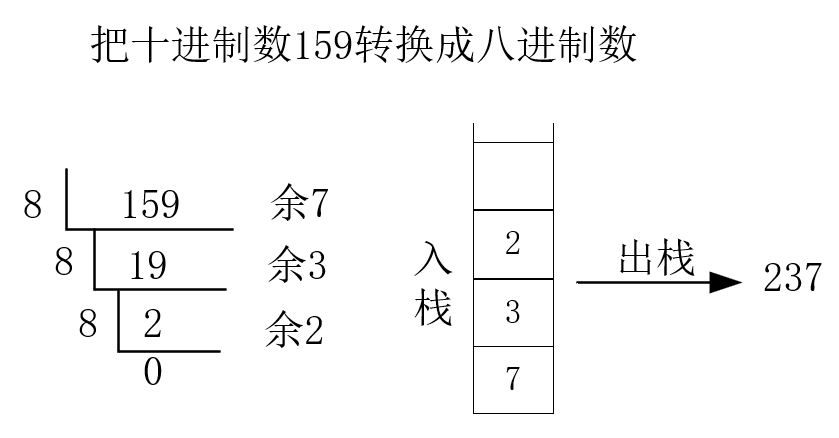

# 第3章 栈与队列

## 3.1 栈和队列的定义和特点

**定义**

栈和队列是限定插入和删除只能在表的“端点”进行的线性表

**特点**

- **栈**：后进先出
- **队列**：先进先出

**栈的应用场景**

- 数制转换
- 括号匹配的检验
- 行编辑程序
- 迷宫求解
- 表达式求值
- 八皇后问题
- 函数调用
- 递归调用的实现

**队列的应用场景**

- 脱机打印输出
- 多用户系统中，多个用户排队，分时地循环使用CPU和主存
- 按用户地优先级排成多个队，每个优先级一个队列
- 实时控制系统中信号按接收地先后顺序依次处理
- 网络电文传输，按到达地时间先后顺序依次进行

### 3.1.1 栈的定义和特点

**栈**（Stack）是一种特殊的线性表，是限定仅在一端（通常是表尾）进行插入和删除操作的线性表

又称**后进先出（Last In First Out)**的线性表，进程LIFO结构。

**概念**

- **栈**是仅在表尾进行插入、删除操作的线性表
- 表尾称为**栈顶**Top，表头称为**栈底**Base
- **入栈** = **压栈** = **Push**
- **出栈** = **弹出** = **Pop**

### 3.1.2 队列的定义和特点

**队列**(Queue)是一种先进先出（First In First Out, FIFO)的线性表。在表的一端插入（表尾），在另一端（表头）删除。（头删尾插）

## 3.2 案例引入

**案例1：进制转换**

十进制整数N向其他进制数d(二、八、十六)的转换是计算机实现计算的基本问题。

转换法则：除以d倒去余

n = (n div d) * d + n mod d

其中：div为整除运算，mod为求余运算

**案例2：括号匹配的检验**

- 假设表达式中允许包含两种括号：圆括号和方括号
- 其嵌套的顺序随意，即：
  - （ [ ] ( ) ）或[ ( [ ] [ ] ) ]为正确格式
  - [ ( ] )为错误格式
  - ( [ ( ) ) 或 ( ( ) ] )为错误格式

思路：从左到右依次入栈，如果是左括号，入栈，如果是右括号，与栈顶匹配，匹配成功则出栈，并继续。如果匹配不成功，则为错误格式。

**案例3：表达式求值**

由运算符优先级确定运算顺序的对表达式求值算法 -- **算符优先算法**

- **操作数**（operand) 常数、变量
- **运算符**（operator) 算数运算符、关系运算符、逻辑运算符
- **界限符**（delimiter) 左右括弧和表达式结束符

任何一个**算术表达式**都由操作数、算术运算符和界限符（括号、表达式结束符#、虚设的表达式起始符#）组成。后两者统称为算符。

例如：# 3 * （7 - 2） #

**案例4：舞伴问题**

- 首先构造两个队列
- 依次从头元素出队配对舞伴
- 某队为空，则另一队等待着则是下一舞曲第一个可获得舞伴的人

## 3.3 栈的表示和操作的实现

## 3.4 栈与递归

## 3.5 队列的表示和操作的实现

## 3.6 案例分析与实现

