# 第5章 树和二叉树

## 5.1 树和二叉树的定义

树是n个结点的有限集合。有一个root。树是一个递归的定义。

**基本术语**

- 根节点
- 结点的度：结点拥有的子树数（后继结点数）
- 树的度：树内各结点的度的最大值
- 叶子：没有后继的结点，度为0的结点，终端结点
- 分支结点：非终端结点
- 内部节点：根结点以外的分支结点
- 双亲：结点的前驱
- 孩子：结点的后继
- 兄弟结点：有共同双亲的结点
- 堂兄弟：双亲在同一层的结点
- 结点的祖先：从根到该结点所经分支上的所有结点
- 结点的子孙：以结点为根的子树中的任一结点
- 树的深度：树中结点的最大层次（也叫高度）
- 有序树
- 无序树
- 森林：m棵树互不相交的树的结合。把根节点删除树就成了森林


**二叉树的定义**

为何要重点研究每结点最多只有两个“叉”的树？

- 二叉树的结构最简单，规律性最强
- 可以证明，所有树都能转为唯一对应的二叉树，不失去一般性。

普通树若不转化为二叉树，则运算很难实现。

二叉树在树结构的应用中起着非常重要的作用，因为对二叉的许多操作算法简单，而任何树都可以与二叉树相互转换，这样就解决了树的存储结构及其运算中存在的复杂性。


**二叉树**是n个结点的有限集，它或者是空集（n=0)，或者由一个根结点及两棵互不相交的分别称作这个根的左子树和右子树的二叉树组成。

**特点**：

- 每个结点最多有两个孩子（不存在度大于2的结点）
- 子树有左右之分，其次序不能颠倒
- 二叉树可以是空集合，根可以有空的左子树或空的右子树

**注意**

二叉树不是树的特殊情况，是两个概念。

二叉树结点的子树要区分左子树和右子树，即使只有一颗子树也要进行区分，说明是左子树还是右子树

树当根结点只有一个孩子时，就无需区分它是左还是右的次序。

因此二叉树和树是不同的，这是二叉树和树的最主要的差别。


## 5.2 案例引入

**数据压缩问题**

**利用二叉树求解表达式的值**


## 5.3 树和二叉树的抽象数据类型定义

- 创建
- 遍历（前序，中序，倒序）


## 5.4 二叉树的性质和存储结构

**性质1**

在二叉树的第i层上至多有2^(i - 1)个结点。

**性质2**

深度为k的二叉树至多有2^k - 1个结点

**性质3**

对任何一棵二叉树，如果叶子数为n~0~，度为2的结点数为n~2~，则n~0~ = n~2~ + 1


### 5.4.1 两种特殊形式的二叉树

**满二叉树**

一棵深度为k且有2^k - 1个结点的二叉树称为满二叉树。

特点：

- 每一层上的结点数都是最大结点数（即每层都满）
- 叶子结点全部在最底层


**完全二叉树**

深度为k的具有n各节点的二叉树，当且仅当每一个结点都与深度为k的满二叉树中编号1~n的结点一一对应时，称之为完全二叉树

（在满二叉树中，从最后一个结点开始，连续去掉任意个结点，即是一棵完全二叉树）

特点：

- 叶子只可能分布在层次最大的两层上
- 对任一结点，如果其右子树的最大层次为i，则其左子树的最大层次必为i或i+1

**性质4**

具有n个结点的完全二叉树的深度为floor(log~2~n) + 1

**性质5**

如果对一棵有n个结点的完全二叉树编号，则对任意节点有：

- 如果i=1，则结点i是二叉树的根，无双亲；如果i > 1，则其双亲是结点floor(i / 2)
- 如果2i > n，则结点i为叶子结点，无左孩子；否则，其左孩子是结点2i
- 如果2i + 1 > n，则结点i无右孩子；否则，其右孩子是结点2i + 1

性质5表明了完全二叉树中双亲结点编号与孩子结点编号之间的关系。


### 5.4.2 二叉树的存储

**二叉树的顺序存储**

按满二叉树的结点层次编号，依次存放二叉树中的数据元素。

```c
//二叉树顺序存储表示
#define MAXSIZE 100
typedef TElemType SqBiTree[MAXSIZE];
SqBiTree bt;
```

**二叉树的链式存储**

```c
typedef struct BiNode
{
    TElemType data;
    struct BiNode *lchild, *rchild; //左右孩子指针
}BiNode, *BiTree;
```

**三叉链表**

```c
typedef struct TriNode
{
    TElemType data;
    struct TriNode *lchild, *parent, *rchild; //左右孩子指针,父指针
}TriNode, *TriTree;
```


## 5.5 遍历二叉树和线索二叉树

### 5.5.1 遍历二叉树

**遍历方法**

依次遍历二叉树中的三个组成部分：根结点、左子树、右子树

假设：L:遍历左子树  D:访问根结点  R:遍历右子树

则遍历整个二叉树方案公有：

**DLR**、**LDR**、**LRD**、DRL、RDL、RLD六种

若规定**先左后右**，则只有三种情况：

- DLR  先（根）序遍历
- LDR  中（根）序遍历
- LRD  后（根）序遍历


**线索二叉树**

根据中序序列和先序序列或者中序序列和后序序列，能够推导出二叉树的结构


**二叉树先序遍历算法**

```c
Status PreOrderTraverse(BiTree T)
{
    if (T == NULL) return OK;
    else {
        visit(T); //访问根结点
        PreOrderTraverse(T->lchild);  //递归遍历左子树
        PreOrderTraverse(T->rchild); //递归遍历右子树
    }
}
```

**二叉树中序遍历**

```c
Status InOrderTraverse(BiTree T)
{
    if (T == NULL) return OK;
    else {
        InOrderTraverse(T->lchild);  //递归遍历左子树
        visit(T);  //访问根结点
        InOrderTraverse(T->rchild);  //递归访问右子树
    }
}
```

**二叉树后序遍历**

```c
Status PostOrderTraverse(BiTree T)
{
    if (T == NULL) return OK;
    else {
        PostOrderTraverse(T->lchild);  //递归遍历左子树
        PostOrderTraverse(T->rchild);  //递归访问右子树
        visit(T);  //访问根结点
    }
}
```

**复杂度**

O(n)  时间、空间


**中序遍历非递归算法**

```c
Status InOrderTraverse(BiTree T)
{
    BiTree p;
    InitStack(S);
    p = T;
    while (p || !StackEmpty(S)) {
        if (p) {
            Push(S, p);
            p = p->lchild;
        } else {
            Pop(S, q);
            printf("%c", q->data);
            p = q->rchild;
        }
    }
    return OK;
}
```

**二叉树层次遍历算法**

```c
typedef struct {
    BTNode data[MaxSize]; //存放队中元素
    int front, rear;   //队头和队尾指针
} SqQueue;   //顺序虚幻队列类型

void LevelOrder(BTNode *b)
{
    BTNode *p;
    SqQueue *qu;
    InitQueue(qu);	//初始化队列
    enQueue(qu, b);  //根结点指针进入队列
    while (!QueueEmpty(qu)) {  //队列不为空，则循环
        deQueue(qu, p);  //访问结点p
        printf("%c", p->data);
        if (p->lchild != NULL) enQueue(qu, p->lchild);  //有左孩子时将其进队
        if (p->rchild != NULL) enQueue(qu, p->rchild);  //有右孩子时将其进队
    }
}
```


**二叉树的建立**

 ---按先序遍历序列建立二叉树的二叉链表

```c
Status CreateBiTree(BiTree &T)
{
    scanf(&ch); //cin >> ch;
    if (ch == "#") T = NULL;
    else {
        if (!(T = (BiTNode *)malloc(sizeof(BiTNode))))
            exit(OVERFLOW);
        T->data = chl
            CreateBiTree(T->lchild);
        	CreateBiTree(T->rchild);
    }
    return OK;
}
```

**复制二叉树**

```c
int Copy(BiTree T, BiTree &NewT)
{
    if (T == NULL) {
        NewT = NULL;
        return 0;
    } else {
        NewT = new BiTNode;
        NewT->data = T->data;
        Copy(T->lChild, NewT->lchild);
        Copy(T->rChild, NewT->rchild);
    }
}
```

**计算二叉树的深度**

```c
int Depth(BiTree T) {
    if (T == NULL) return 0;
    else {
        m = Depth(T->lChild);
        n = Depth(T->rChild);
        return m > n ? (m + 1) : (n + 1);
    }
}
```

**计算二叉树结点总数**

```c
int NodeCount(BiTree N)
{
    if (T == NULL) return 0;
    else {
        return NodeCount(T->lchild) + NodeCount(T->rchild) + 1;
    }
}
```

**计算叶子结点数**

```c
int LeafCount(BiTree T)
{
    if (T == NULL) {
        return 0;
    }
    if (T->lchild == NULL && T->rchild == NULL) {
        return 1;
    } else {
        return LeafCount(T->lchild) + LeafCount(T->rchild);
    }
}
```


### 5.5.2 线索二叉树

如果某个结点的左孩子为空，则将空的左孩子指针域改为指向其前驱；如果某个结点的右孩子为空，则将空的右孩子指针域改为指向其后继。这种改变指向的指针称为**线索**。

加上了线索的二叉树称为**线索二叉树**（Threaded Binary Tree).

对二叉树按某种遍历次序使其变为线索二叉树的过程叫**线索化**。

为区分lchild和rchild指针到底是指向孩子的指针，还是指向前驱或者后继的指针，对二叉链表中每个结点增设两个标志域ltag和rtag，并约定：

- ltag=0  lchild指向该结点的左孩子
- ltag=1 lchild指向该结点的前驱
- rtag=0 rchild指向该结点的右孩子
- rtag=1 rchild指向该结点的后继

```c
typedef struct BiThrBide{
    int data;
    int ltag, rtag;
    struct BiThrNode *lchild, rchild;
} BiThrNode, *BiThrTree;
```


## 5.6 树和森林

**树**是n个结点 有限集。若n为0，则称为空树。

若n大于0：

1. 有且仅有一个特定的称为**根**（Root)的结点；
2. 其余结点可分为m个互不相交的有限集T1,T2,T3, ... ,Tm

**森林**是m棵互不相交的树的集合。


**树的存储结构 -- 双亲表示法**

（1）实现

定义结构数组，存放树的结点，每个结点含两个域，**数据域**和**双亲域**。

数据域：存放结点本身的信息

双亲域：指示本结点的双亲结点在数组中的位置。

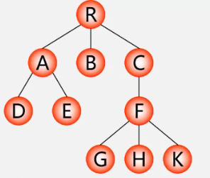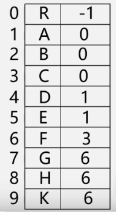

**特点**：找双亲容易，找孩子难

```c
typedef struct PTNode
{
    TElemType data;
    int parent;  //双亲位置域
}PTNode;

#define MAX_TREE_SIZE 100
typedef struct
{
    PTNode nodes[MAX_TREE_SIZE];
    int r, n;  //根结点的位置和结点个数
}PTree;
```


**树的存储结构 -- 孩子链表**

把每个结点的孩子结点排列起来，看成是一个线性表，用单链表存储，则n各节点有n个孩子链表（叶子的孩子链表为空表）。而n个头指针又组成一个线性表，用顺序表（含n个元素的结构数组）存储。


```c
//孩子结点结构
typedef struct CTNode
{
    int child;
    struct CTNode *next;
}*ChildPtr;

//双亲结点结构
typedef struct
{
    TElemType data;
    ChildPtr firstchild;
}CTBox;

//树结构
typedef struct {
    CTBox nodes[MAX_TREE_SIZE];
    int n, r;  //结点树和根结点的位置
}CTree;
```

**特点**：找孩子容易，找双亲难


**树的存储结构 -- 孩子兄弟表示法**

实现：

用二叉链表作树的存储结构，链表中每个结点的两个指针域分别指向**第一个孩子结点**和**下一个兄弟结点**。

```c
typedef struct CSNode
{
    ElemType data;
    struct CSNode *firstchild, *nextsibling;
}CSNode, *CSTree;
```

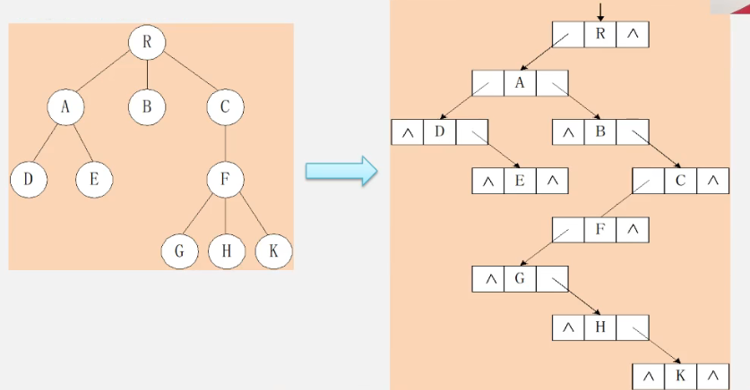


- 将树转换成二叉树进行处理，利用二叉树的算法实现对树的操作
- 由于树和二叉树都可以用二叉链表作存储结构，则**以二叉链表作媒介**可以导出树与二叉树之间的 一个对应关系。
- 给定一棵树，可以找到唯一的一棵二叉树与之对应


**将树转换成二叉树**

1. 加线：在兄弟之间加一条线

2. 抹线：对每个结点，除了其左孩子外，去除其与其余孩子之间的关系

3. 旋转：以树的根结点为中心，将整棵树顺时针转45°

   **兄弟相连留长子**

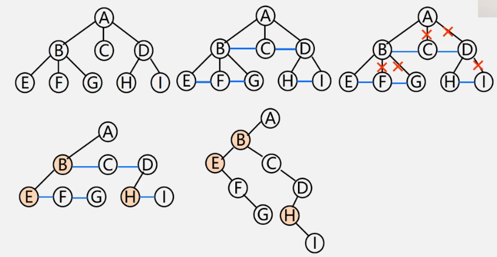


**将二叉树转换成树**

1. 加线：若p结点是双亲结点的左孩子，则将p的右孩子，右孩子的右孩子...沿分支找到所有的右孩子，都与p的双亲用线连起来
2. 抹线：抹掉原二叉树中双亲与右孩子之间的连线
3. 调整：将结点按层次排列，形成树结构


**将森林转换成二叉树**

1. 将各棵树分别转换成二叉树

2. 将每棵树的根结点用线相连

3. 以第一棵树根结点作为二叉树的根，再以根结点为轴心，顺时针旋转，构成二叉树型结构

   **树变二叉根相连**

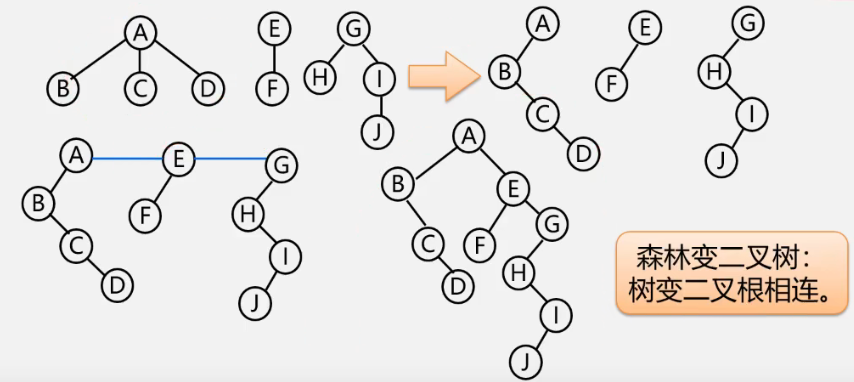


**将二叉树转换成森林**

1. 抹线：将二叉树中根结点与其右孩子连线，及沿右分支搜索到的所有右孩子间连线全部抹掉，使之变成孤立的二叉树

2. 还原：将孤立的二叉树还原成树

   **去掉全部右孩线，孤立二叉再还原**

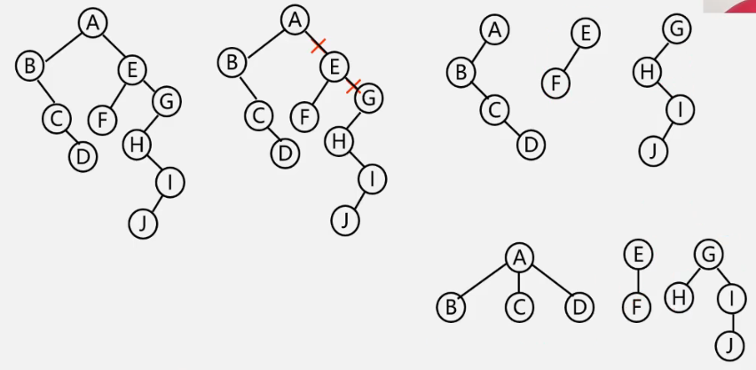


### 5.6.3 树与森林的遍历

**树的遍历**

- 先根遍历：若树不为空，则先访问根结点，然后依次先根遍历各棵子树
- 后根遍历：若树不为空，则先依次后根遍历各棵子树，然后访问根结点
- 按层次遍历：若树不为空，则自上而下自左至右访问树中的每个结点


**森林的遍历 -- 先序遍历**

- 先序遍历：访问森林中第一棵树的根结点
- 先序遍历森林中第一棵树的子树森林
- 先序遍历森林中（除第一棵树外）的其余树构成的森林

**森林的遍历 -- 中序遍历**

- 先序遍历森林中第一棵树的子树森林
- 先序遍历：访问森林中第一棵树的根结点
- 先序遍历森林中（除第一棵树外）的其余树构成的森林


## 5.7 哈夫曼树及其应用

**哈夫曼树的基本概念**

哈夫曼树也叫最优二叉树。

**路径**：从树中的一个结点到另一个结点之间的**分支**构成这两个结点间的路径。

**结点的路径长度**：两结点间路径上的**分支数**

**树的路径长度**：从树根到每一个结点的路径长度之和。记作TL。

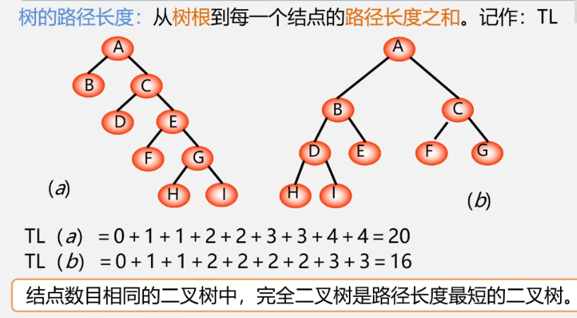


**权**（weight)：将树中结点赋给一个有着某种含义的数值，则这个数值称为该结点的权。

**结点的带权路径长度**：从根结点到该结点之间的路径长度与该结点的权的乘积。

**树的带权路径长度**：树中所有叶子结点的带权路径长度之和。（WPL）

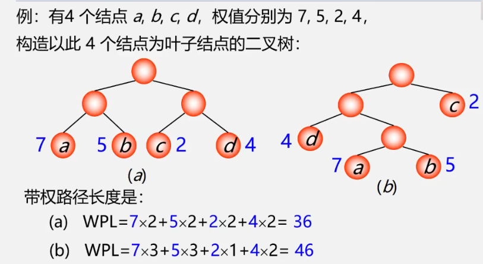

**哈夫曼树**

最优树，带权路径长度（WPL）最短的树。

“带权路径长度最短”是在“度相同”的树中比较而得到的结果，因此有最优二叉树、最优三叉树之称等等。

最优二叉树：带权路径长度（WPL)最短的二叉树。

- 满二叉树不一定是哈夫曼树
- 哈夫曼树中权越大的叶子离根越近
- 具有相同带权结点的哈夫曼树不唯一


### 5.7.2 哈夫曼树的构建

1. 在哈夫曼算法中，初始时有n棵二叉树，要经过n-1此合并最终形成哈夫曼树
2. 经过n-1此合并产生n-1个新结点，且这n-1个新节点都是具有两个孩子的分支结点
3. 哈夫曼树中公有n + (n - 1) = 2n - 1个结点，且其所有的分支结点的度均不为1.

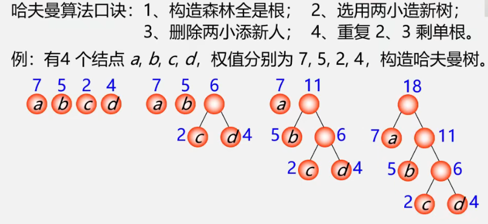

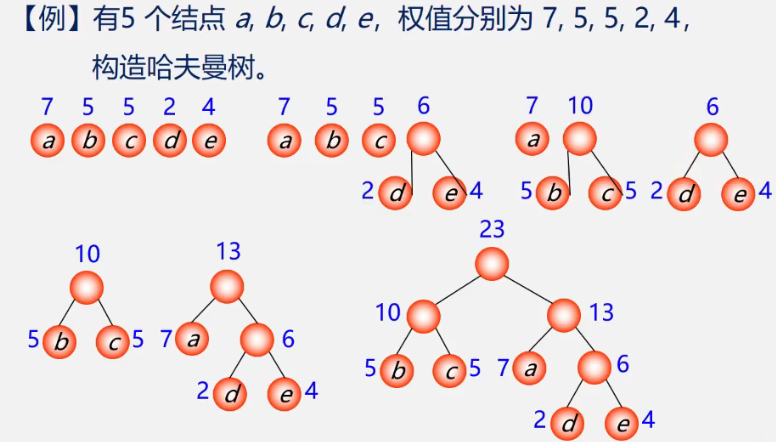


**哈夫曼树构建算法实现**

采用顺序存储结构 --- 一维结构数组HuffmanTree H;

```c
typedef struct {
    int weight;
    int parent, lch, rch;
} HTNode, *HuffmanTree;
```

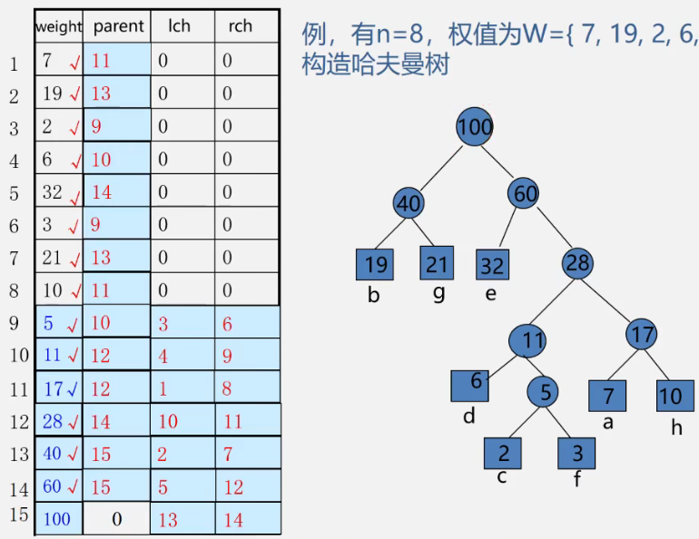


```c++
void CreateHuffmanTree(HuffmanTree HT, int n)
{
    if (n <= 1) return;
    int m = 2 * n - 1;
    HT = new HTNode[m + 1];  //0号单元未用，H[m]表示根结点
    for (int i = 1; i <= m; ++i) {
        HT[i].lch = 0;
        HT[i].rch = 0;
        HT[i].parent = 0;  //都是下标
    }
    for (i = 1; i <= n; ++i) {
        cin >> HT[i].wieght;  //输入前n个元素的weight值
    }
    //初始化结束，开始建立哈夫曼树树
    for (i = n+1; i <= m; ++i) {
        Select(HT, i-1, s1, s2);  //在HT[k](1 <= k <= i-1)中选择两个其双亲域为0且权值最小的结点，并返回序号到s1和s2
        HT[i].lch = s1;
        HT[i].rch = s2;
        HT[i].weight = HT[s1].weight + HT[s2].weight;  //i的权值为左右孩子权值之和
    }
}
```


### 5.7.3 哈夫曼编码

远程通信传输字符串，给灭个字符进行编码:相较于等长编码，若将编码设计为长度不等的二进制编码，即让待传字符串中出现的次数较多的字符采用尽可能短的编码，则转换的二进制字位串便可能较少。

**关键**：要设计长度不等的编码，则必须使任一字符的编码**都不是**另一个字符编码的编码的前缀，不然会出现重码。如0代表A, 00代表B，那么000是三个A还是一个A一个B无法确定。这种方法叫做**前缀编码**

**哈夫曼编码**

1. 统计字符集中每个字符在电文中出现的平均概率（概率越大，要求编码越短）
2. 利用哈夫曼树的特点，将每个字符概率值作为权值，构建哈夫曼树。则概率越大的结点，路径越短
3. 在哈夫曼树的每个分支上标0或1：结点的做分支标0，右分支标1。把从根到每个叶子的路径上的标号连接起来，作为该叶子代表的字符的编码

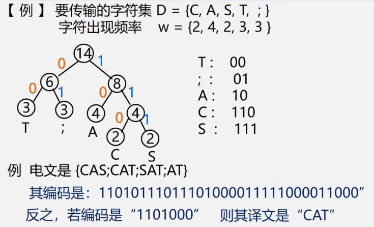

**为什么哈夫曼编码能够保证是前缀编码？**

因为没有一片树叶是另一片树叶的祖先，所以每个叶结点的编码就不可能是其他叶节点编码的前缀。

**为什么哈夫曼编码能够保证字符编码总长最短**

因为哈夫曼树的带权路径长度最短，故字符编码的总长最短。


**哈夫曼编码的算法实现**

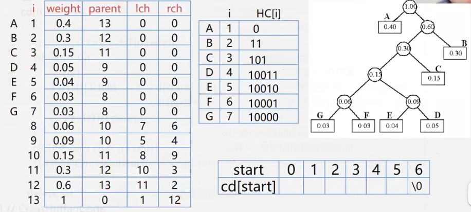


```c++ 
void CreateHuffmanCode(HuffmanTree HT, HuffmanCode &HC, int n)
{
    //从叶子结点到根你想求每个字符的哈夫曼编码，存储在编码表HC中
    HC = new char*[n+1]; //分配n个字符编码的头指针矢量
    cd = new char[n];  //分配临时存放编码的动态数组空间
    cd[n-1] = '0';  //编码结束符
    for (int i = 1; i <= n; ++i) {
        start = n - 1;
        c = i;
        f = HT[i].parent;
        while(f != 0) {
            --start;
            if (HT[f].lchild == c) cd[start] = '0';
            else cd[start] = '1';
            c = f;
            f = HT[f].parent;
        }
        HC[i] = new char[n-start];
        strcpy(HC[i], &cd[start]);
    }
    delete cd;
}
```


**哈夫曼编码**

1. 输入各字符及其权值
2. 构造哈夫曼树  -- HT[i]
3. 进行哈夫曼编码 -- HC[i]
4. 查HC[i]，得到各字符的哈夫曼编码

**哈夫曼解码**

1. 构造哈夫曼树
2. 依次读入二进制码
3. 读入0，则走向左孩子；读入1，则走向右孩子
4. 一旦到达某叶子时，即可译出字符
5. 然后再从根出发继续译码，直至结束

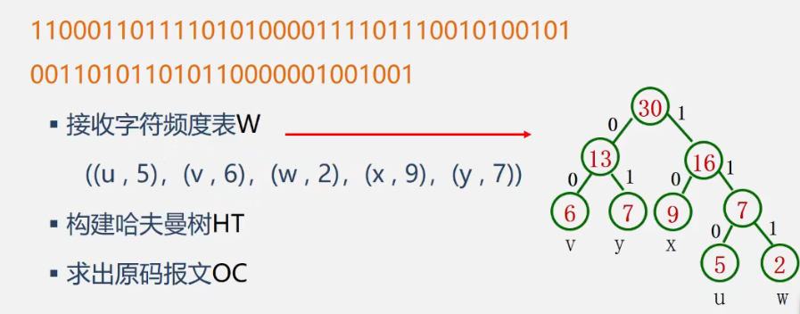


