**数据结构回顾**

- **集合**：数据元素间除“同属于一个集合”外，无其它关系
- **线性结构**：一个对一个，如线性表、栈、队列
- **树形结构**：一个对多个，如树
- **图形结构**：多个对多个，如图


# 第6章 图

## 6.1 图的定义与基本术语

**图**

G=（V,E)   Graph=(Vertex, Edge)

V：顶点（数据元素）的有穷非空集合

E：边的有穷集合

**无向图**：每条边都是无方向的

**有向图**：每条边都是有方向的

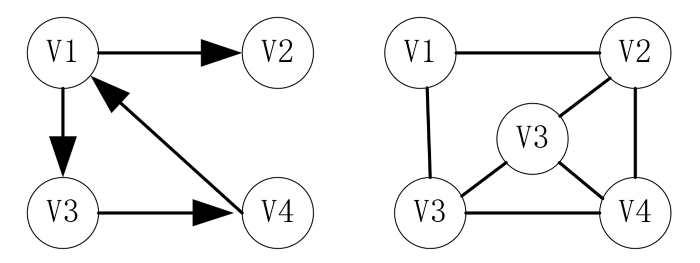

**完全图**：任意两个点都有一条边相连，无向n(n-1)/2条边，有向n(n-1)条边

**稀疏图**：有很少边或弧的图（e < nlogn)

**稠密图**：有较多边或弧的图

**网**：边/弧带权的图

**邻接**：有边/弧相连的两个顶点之间的关系。（vi,vj）称vi和vj互为邻接点。<vi,vj>称vi邻接到vj，vj邻接于vi

**关联（依附）**：边/弧与顶点之间的关系。存在（vi,vj）/<vi,vj>则称该边/弧关联于vi和vj

**顶点的度**：与该顶点相关联的边的数目，记作TD(v)。**入度**记作ID(v)，**出度**记作OD(v)

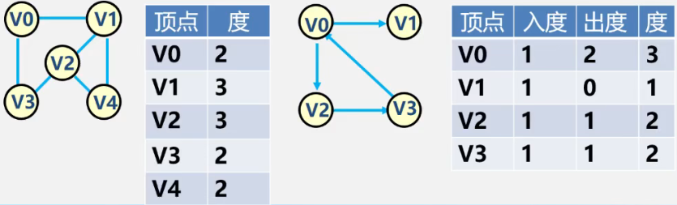


**有向树**

当有向图仅1个顶点的入度为0，其余顶点的入度均为1，此时是有向树。

**路径**：接续的边构成的顶点序列

**路径长度**：路径上边或弧的数目/权值之和

**回路（环）**：第一个顶点和最后一个顶点相同的路径

**简单路径**：除路径起点和终点可以相同外，其余顶点均不相同的路径

**简单回路（环）**：除路径起点和终点相同外，其余顶点均不相同的路径

**连通图（强连通图）**：任何两个顶点v、u都存在从v到u的路径，则称G是连通图（强连通图）

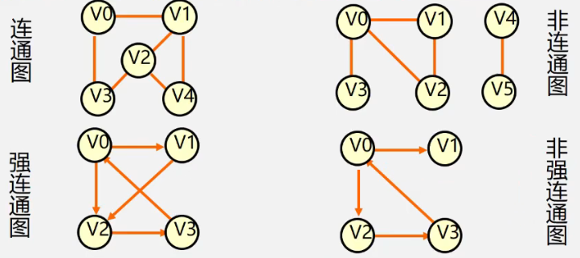

**权与网**：图中边或弧所具有的相关数称为权，表明从一个顶点到另一个顶点的距离或耗费

**子图**：设有两个图G=(V, {E})、G2=(V1, {E1})，若V1属于V，E1属于E，则称G1是G的子图

**连通分量（强连通分量）**：

- 无向图G的极大连通子图称为G的连通分量。极大连通子图的意思是：该子图是G的连通子图，将G的任何不在该子图中的顶点加入，子图不再连通

  

- 有向图G的极大连通子图称为G的强连通分量

  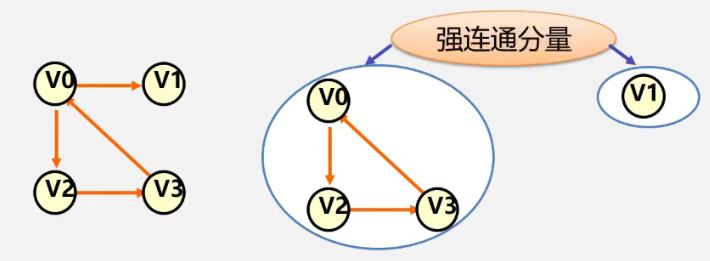

**极小连通子图**：该子图是G的连通子图，在该子图中删除任何一条边子图都不再连通

**生成树**：包含无向图G的所有顶点的极小连通子图

**生成森林**：对非连通图，由各个连通分量的生成树的集合

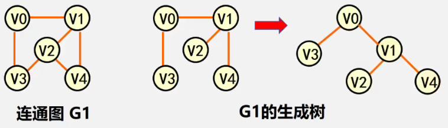


## 6.2 案例引入

- 六度空间理论

## 6.3 图的类型定义

```
ADT Graph {
	数据对象V:具有相同特性的数据元素的集合，称为顶点集
	数据关系R:R={VR}
	VR = {
		<v,w>|<v,w>|v,w∈V^p(v,w).
		<v,w>表示从v到w的弧，P(v,w)定义了弧<v,w>的信息
	}
	基本操作P:
	Create_Graph();
	GetVex(G,v);//求图中顶点v的值
	DFSTraverse(G); //对图进行深度优先遍历
	BFSTraverse(G); //对图进行广度优先遍历
} ADT Graph
```


## 6.4 图的存储结构

**图没有顺序存储结构**

可使用数组表示法（**邻接矩阵**）

**链式存储结构**

多重链表，包括**邻接表**、邻接多重表、十字链表


重点：**邻接矩阵（数组）**表示法、**邻接表（链式）**表示法


### 6.4.1 邻接矩阵

**数组（邻接矩阵）表示法**

建立一个顶点表（记录各个顶点信息）和一个邻接矩阵（表示各个顶点之间关系）

设图A有n个顶点，定点表为A.Vexs[n]，邻接矩阵为A.arcs\[n][n]

**无向图邻接矩阵**

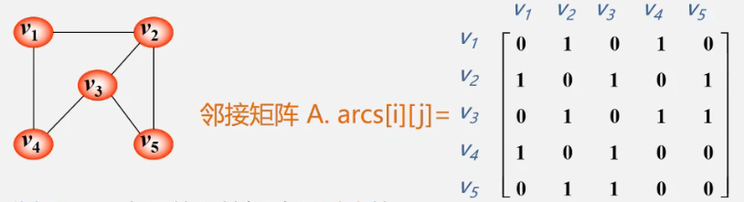

无向图的邻接矩阵是对称的

顶点I的度 = 第i行（列）中1的个数


**有向图邻接矩阵**


第i行含义：以结点vi为尾的弧（即出度边）

第i列含义：以结点vi为头的弧（即入度边）

有向图的邻接矩阵可能是不对称的

顶点的出度 = 第i行元素之和

顶点的入度 = 第i列元素之和


**网的邻接矩阵**

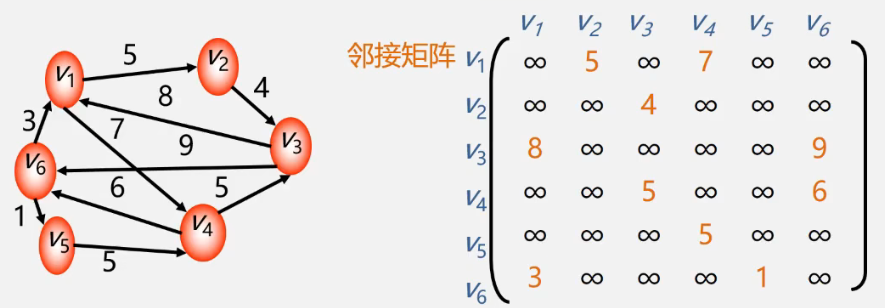


**邻接矩阵的存储表示**

用两个数组分别存储顶点表和邻接矩阵

```c
typedef MaxInt 32767	//表示极大值，即∞
#define MVNum 100		//最大顶点数
typedef char VerTexType;	//设顶点的数据类型为字符型
typedef int ArcType;	//假设边的权值类型为整型

typedef struct {
    VerTexType vexs[MVNum];  //顶点表
    ArcType arcs[MVNum][MVNum];	//邻接矩阵
    int vexnum, arcnum;	//图的当前点数和边数
} AMGraph;	//Adjacency Matrix Graph
```


**邻接矩阵表示法创建无向网**

1. 输入总顶点数和总边数
2. 依次输入点的信息存入顶点表
3. 初始化邻接矩阵，使每个权值初始化为极大值

```c
Status CreateUDN(AMGraph &G)
{
    cin >> G.vexnum >> G.arcnum;
    for (i = 0; i < G.vexnum; ++i) {
        cin >> G.vexs[i];
    }
    for (i = 0; i < G.vexnum; ++i) {
        for (j = 0; j < G.vexnum; ++j) {
            G.arcs[i][j] = MaxInt;
        }
    }
    for (k = 0; k < G.arcnum; ++k) {
        cin >> v1 >> v2 >> w;
        i = LocateVec(G, v1);
        j = LocateVex(G, v2);
        G.arcs[i][j] = w;
        G.arcs[j][i] = G.arcs[i][j];
    }
    return OK;
}

int LocateVex(AMGraph G, VertexType u)
{
    int i;
    for (i = 0; i < G.vesnum; ++i) {
        if (u == G.vexs[i]) return i;
    }
    return -1;
}
```


**邻接矩阵表示法创建无向图**

- 初始化邻接矩阵时，w均为0
- 构造邻接矩阵时，w为1


**邻接矩阵表示法创建有向网**

- 非对称矩阵，仅为G.arcs\[i][j]赋值，无需为G.arcs\[j][i]赋值


**邻接矩阵优点**

- 方便检查任意一对顶点之间是否存在边
- 方便找任一顶点的所有“邻接点”
- 方便计算任一顶点的度

**邻接矩阵缺点**

- 不便于增加和删除顶点
- 浪费空间
- 浪费时间
- 复杂度O(n^2)


### 6.4.2 邻接表

**邻接表表示法（链式）**

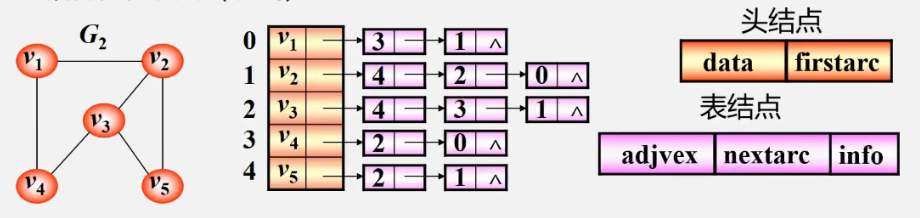

**顶点**

按编号顺序将顶点数据存储在一维数组中

**关联同一顶点的边（以顶点为尾的弧）**

用线性链表存储


**无向图**

- 邻接表不唯一
- 若无向图中有n个顶点、e条边，则其邻接表需要n个头结点和2e个表结点。适宜存储稀疏图。

**有向图**

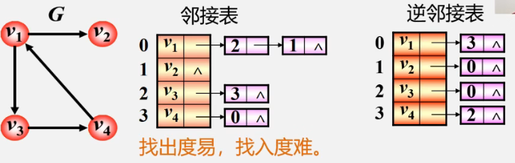

- 顶点vi的**出度**为第i个单链表中的结点个数
- 顶点vi的**入度**为整个单链表中邻接点域值是i-1的结点个数

**逆邻接表**

- 顶点vi的**入度**为第i个单链表中的结点个数
- 顶点vI的**出度**为整个单链表中邻接点域值是i-1的结点的个数

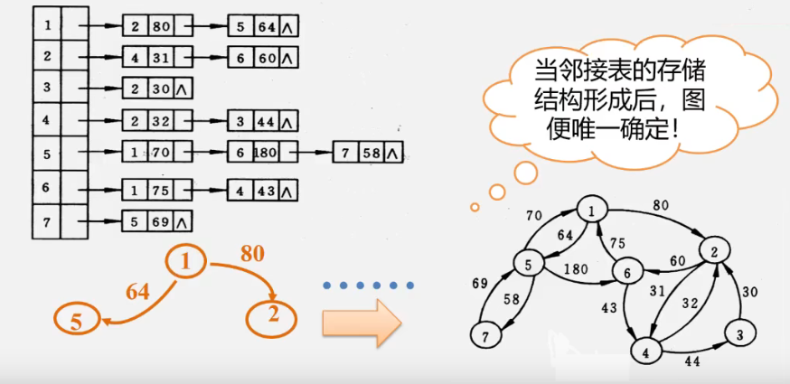


**图的邻接表存储表示**

```c
#define MVNum 100
typedef struct ArcNode {
    int adjvex;
    struct ArcNode *nextarc;
    OtherInfo info;
} ArcNode;

typedef struct VNode {
    VerTexType data;	//顶点信息
    ArcNode *firstarc;	//指向第一条依附该顶点的边的指针
}VNode, AdjList[MVNum];	//AdjList表示邻接表类型

//图的结构定义
typedef struct {
    AdjList vertices;	//vertices--vertex的复数
    int vexnum, arcnum;	//图的当前顶点数和弧数
}ALGraph;
```

**邻接表表示法创建无向网**

1. 输入总点数和总边数
2. 建立顶点表
   - 依次输入点的信息存在顶点表中，使每个表头结点的指针域初始化为NULL
3. 创建邻接表
   - 依次输入每条边依附的两个顶点
   - 确定两个顶点的序号i和j，建立边结点
   - 将此边结点分别插入到vi和vj对应的两个边链表的头部

```c
Status CreateUDG(ALGraph &G)
{
    cin >> G.vexnum >> G.arcnum;	//输入总顶点数，总边数
    for (i = 0; i < G.vexnum; ++i) {
        cin >> G.vertices[i].data;	//输入顶点值
        G.vertices[i].firstarc = NULL;	//初始化表头结点的指针域
    }
    for (k = 0; k < G.arcnum; ++num) {
        cin >> v1 >> v2;	//输入一条边依附的两个顶点
        i = LocateVex(G, v1);
        j = LocateVex(G, v2);
        p1 = new ArcNode;	//生成一个新的边界点p1
        p1->adjvex = j;
        p1->nextarc = G.vertices[i].firstarc;
        G.vertices[i].firstarc = p1;	//将新结点p1插入到顶点vi的边表头部
        p2 = new ArcNode;
        p2->adjvex = i;
        p2->nextarc = G.vertices[j].firstarc;
        G.vertices[j].firstarc = p2;
    }
    return OK;
}
```


**邻接表特点**

- 方便找任一顶点的所有邻接点

- 节约稀疏图的空间

  需要N个头指针+2E个结点（每个结点至少2个域）

- 方便计算任一顶点的度？

  - 对无向图：是的
  - 对有向图：只能计算出度，需要构造逆邻接表来方便计算入度


**邻接矩阵与邻接表表示法的关系**

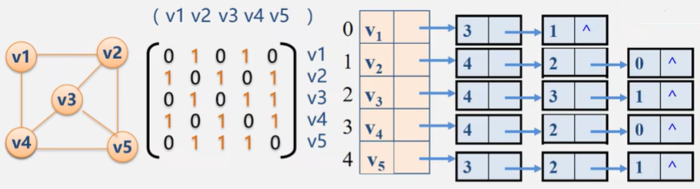

1. 联系

   邻接表中每个链表对应于邻接矩阵中的一行，链表中结点个数等于一行中非零元素的个数

2. 区别

   - 对于任一确定的无向图，邻接矩阵是唯一的（行列号与顶点编号一致），但邻接表不唯一（链接次序与顶点编号无关）
   - 邻接矩阵的空间复杂度是O(n^2)，而邻接表的空间复杂度为O（n + e)

3. 用途

   邻接矩阵多用于稠密图，邻接表多用于稀疏图


## 6.5 图的遍历


## 6.6 图的应用


## 6.7 案例分析与实现

