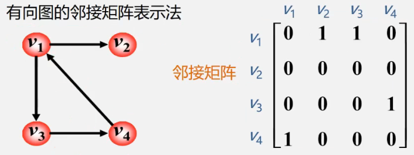
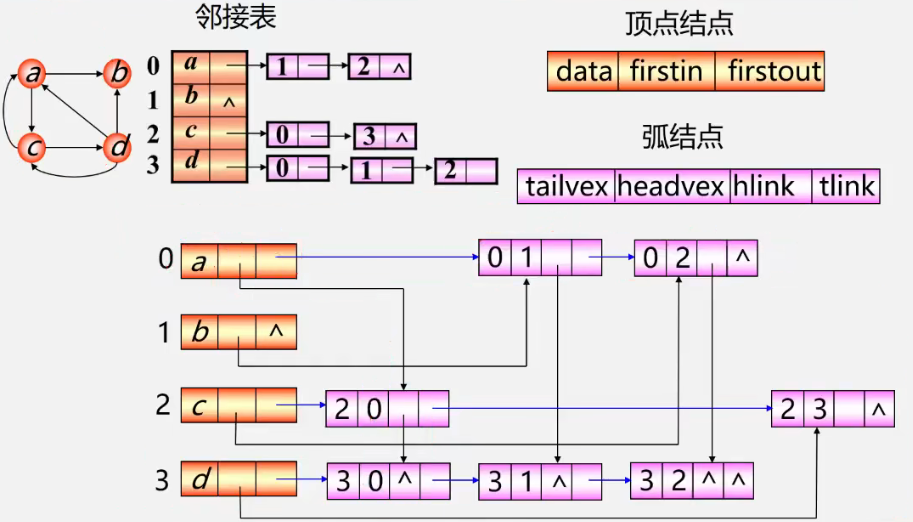
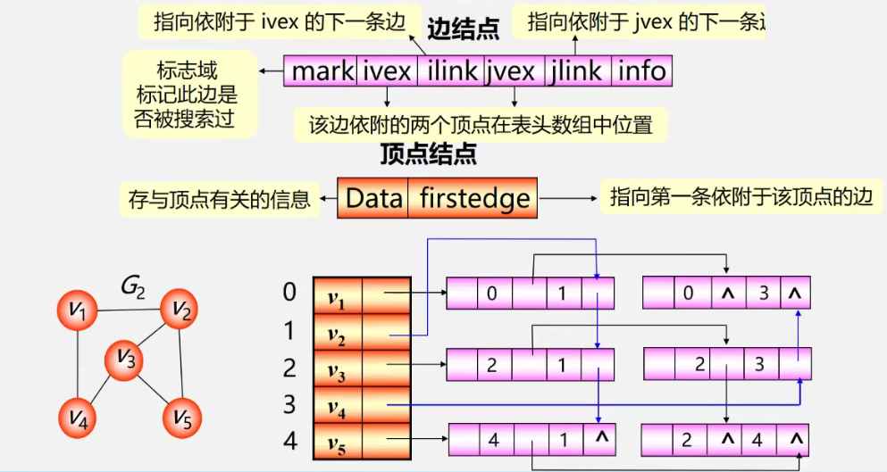
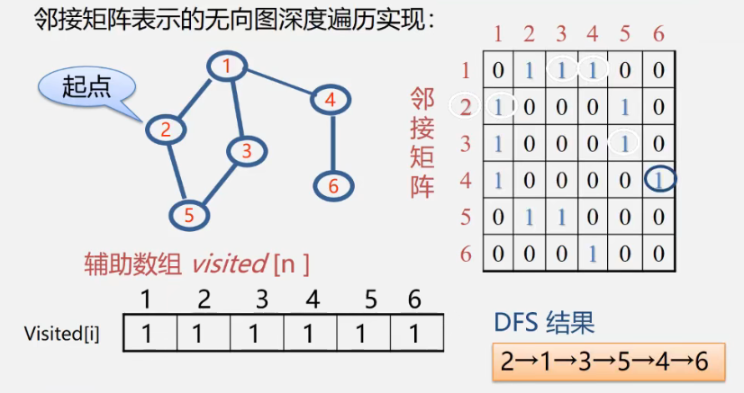
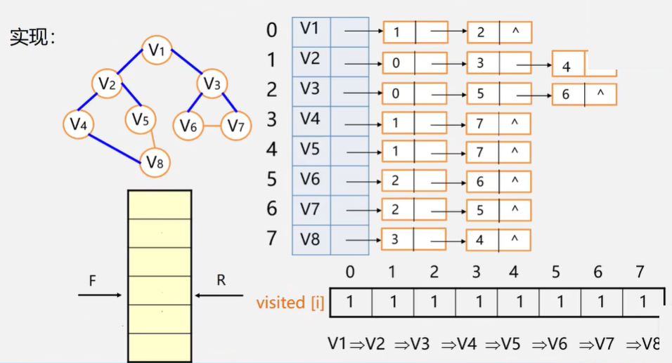

**数据结构回顾**

- **集合**：数据元素间除“同属于一个集合”外，无其它关系
- **线性结构**：一个对一个，如线性表、栈、队列
- **树形结构**：一个对多个，如树
- **图形结构**：多个对多个，如图


# 第6章 图

## 6.1 图的定义与基本术语

**图**

G=（V,E)   Graph=(Vertex, Edge)

V：顶点（数据元素）的有穷非空集合

E：边的有穷集合

**无向图**：每条边都是无方向的

**有向图**：每条边都是有方向的


**完全图**：任意两个点都有一条边相连，无向n(n-1)/2条边，有向n(n-1)条边

**稀疏图**：有很少边或弧的图（e < nlogn)

**稠密图**：有较多边或弧的图

**网**：边/弧带权的图

**邻接**：有边/弧相连的两个顶点之间的关系。（vi,vj）称vi和vj互为邻接点。<vi,vj>称vi邻接到vj，vj邻接于vi

**关联（依附）**：边/弧与顶点之间的关系。存在（vi,vj）/<vi,vj>则称该边/弧关联于vi和vj

**顶点的度**：与该顶点相关联的边的数目，记作TD(v)。**入度**记作ID(v)，**出度**记作OD(v)


**有向树**

当有向图仅1个顶点的入度为0，其余顶点的入度均为1，此时是有向树。

**路径**：接续的边构成的顶点序列

**路径长度**：路径上边或弧的数目/权值之和

**回路（环）**：第一个顶点和最后一个顶点相同的路径

**简单路径**：除路径起点和终点可以相同外，其余顶点均不相同的路径

**简单回路（环）**：除路径起点和终点相同外，其余顶点均不相同的路径

**连通图（强连通图）**：任何两个顶点v、u都存在从v到u的路径，则称G是连通图（强连通图）


**权与网**：图中边或弧所具有的相关数称为权，表明从一个顶点到另一个顶点的距离或耗费

**子图**：设有两个图G=(V, {E})、G2=(V1, {E1})，若V1属于V，E1属于E，则称G1是G的子图

**连通分量（强连通分量）**：

- 无向图G的极大连通子图称为G的连通分量。极大连通子图的意思是：该子图是G的连通子图，将G的任何不在该子图中的顶点加入，子图不再连通

  

- 有向图G的极大连通子图称为G的强连通分量

  

**极小连通子图**：该子图是G的连通子图，在该子图中删除任何一条边子图都不再连通

**生成树**：包含无向图G的所有顶点的极小连通子图

**生成森林**：对非连通图，由各个连通分量的生成树的集合


## 6.2 案例引入

- 六度空间理论

## 6.3 图的类型定义

```
ADT Graph {
	数据对象V:具有相同特性的数据元素的集合，称为顶点集
	数据关系R:R={VR}
	VR = {
		<v,w>|<v,w>|v,w∈V^p(v,w).
		<v,w>表示从v到w的弧，P(v,w)定义了弧<v,w>的信息
	}
	基本操作P:
	Create_Graph();
	GetVex(G,v);//求图中顶点v的值
	DFSTraverse(G); //对图进行深度优先遍历
	BFSTraverse(G); //对图进行广度优先遍历
} ADT Graph
```


## 6.4 图的存储结构

**图没有顺序存储结构**

可使用数组表示法（**邻接矩阵**）

**链式存储结构**

多重链表，包括**邻接表**、邻接多重表、十字链表


重点：**邻接矩阵（数组）**表示法、**邻接表（链式）**表示法


### 6.4.1 邻接矩阵

**数组（邻接矩阵）表示法**

建立一个顶点表（记录各个顶点信息）和一个邻接矩阵（表示各个顶点之间关系）

设图A有n个顶点，定点表为A.Vexs[n]，邻接矩阵为A.arcs\[n][n]

**无向图邻接矩阵**


无向图的邻接矩阵是对称的

顶点I的度 = 第i行（列）中1的个数


**有向图邻接矩阵**



第i行含义：以结点vi为尾的弧（即出度边）

第i列含义：以结点vi为头的弧（即入度边）

有向图的邻接矩阵可能是不对称的

顶点的出度 = 第i行元素之和

顶点的入度 = 第i列元素之和


**网的邻接矩阵**


**邻接矩阵的存储表示**

用两个数组分别存储顶点表和邻接矩阵

```c
typedef MaxInt 32767	//表示极大值，即∞
#define MVNum 100		//最大顶点数
typedef char VerTexType;	//设顶点的数据类型为字符型
typedef int ArcType;	//假设边的权值类型为整型

typedef struct {
    VerTexType vexs[MVNum];  //顶点表
    ArcType arcs[MVNum][MVNum];	//邻接矩阵
    int vexnum, arcnum;	//图的当前点数和边数
} AMGraph;	//Adjacency Matrix Graph
```


**邻接矩阵表示法创建无向网**

1. 输入总顶点数和总边数
2. 依次输入点的信息存入顶点表
3. 初始化邻接矩阵，使每个权值初始化为极大值

```c
Status CreateUDN(AMGraph &G)
{
    cin >> G.vexnum >> G.arcnum;
    for (i = 0; i < G.vexnum; ++i) {
        cin >> G.vexs[i];
    }
    for (i = 0; i < G.vexnum; ++i) {
        for (j = 0; j < G.vexnum; ++j) {
            G.arcs[i][j] = MaxInt;
        }
    }
    for (k = 0; k < G.arcnum; ++k) {
        cin >> v1 >> v2 >> w;
        i = LocateVec(G, v1);
        j = LocateVex(G, v2);
        G.arcs[i][j] = w;
        G.arcs[j][i] = G.arcs[i][j];
    }
    return OK;
}

int LocateVex(AMGraph G, VertexType u)
{
    int i;
    for (i = 0; i < G.vesnum; ++i) {
        if (u == G.vexs[i]) return i;
    }
    return -1;
}
```


**邻接矩阵表示法创建无向图**

- 初始化邻接矩阵时，w均为0
- 构造邻接矩阵时，w为1


**邻接矩阵表示法创建有向网**

- 非对称矩阵，仅为G.arcs\[i][j]赋值，无需为G.arcs\[j][i]赋值


**邻接矩阵优点**

- 方便检查任意一对顶点之间是否存在边
- 方便找任一顶点的所有“邻接点”
- 方便计算任一顶点的度

**邻接矩阵缺点**

- 不便于增加和删除顶点
- 浪费空间
- 浪费时间
- 复杂度O(n^2)


### 6.4.2 邻接表

**邻接表表示法（链式）**


**顶点**

按编号顺序将顶点数据存储在一维数组中

**关联同一顶点的边（以顶点为尾的弧）**

用线性链表存储


**无向图**

- 邻接表不唯一
- 若无向图中有n个顶点、e条边，则其邻接表需要n个头结点和2e个表结点。适宜存储稀疏图。

**有向图**


- 顶点vi的**出度**为第i个单链表中的结点个数
- 顶点vi的**入度**为整个单链表中邻接点域值是i-1的结点个数

**逆邻接表**

- 顶点vi的**入度**为第i个单链表中的结点个数
- 顶点vI的**出度**为整个单链表中邻接点域值是i-1的结点的个数


**图的邻接表存储表示**

```c
#define MVNum 100
typedef struct ArcNode {
    int adjvex;
    struct ArcNode *nextarc;
    OtherInfo info;
} ArcNode;

typedef struct VNode {
    VerTexType data;	//顶点信息
    ArcNode *firstarc;	//指向第一条依附该顶点的边的指针
}VNode, AdjList[MVNum];	//AdjList表示邻接表类型

//图的结构定义
typedef struct {
    AdjList vertices;	//vertices--vertex的复数
    int vexnum, arcnum;	//图的当前顶点数和弧数
}ALGraph;
```

**邻接表表示法创建无向网**

1. 输入总点数和总边数
2. 建立顶点表
   - 依次输入点的信息存在顶点表中，使每个表头结点的指针域初始化为NULL
3. 创建邻接表
   - 依次输入每条边依附的两个顶点
   - 确定两个顶点的序号i和j，建立边结点
   - 将此边结点分别插入到vi和vj对应的两个边链表的头部

```c
Status CreateUDG(ALGraph &G)
{
    cin >> G.vexnum >> G.arcnum;	//输入总顶点数，总边数
    for (i = 0; i < G.vexnum; ++i) {
        cin >> G.vertices[i].data;	//输入顶点值
        G.vertices[i].firstarc = NULL;	//初始化表头结点的指针域
    }
    for (k = 0; k < G.arcnum; ++num) {
        cin >> v1 >> v2;	//输入一条边依附的两个顶点
        i = LocateVex(G, v1);
        j = LocateVex(G, v2);
        p1 = new ArcNode;	//生成一个新的边界点p1
        p1->adjvex = j;
        p1->nextarc = G.vertices[i].firstarc;
        G.vertices[i].firstarc = p1;	//将新结点p1插入到顶点vi的边表头部
        p2 = new ArcNode;
        p2->adjvex = i;
        p2->nextarc = G.vertices[j].firstarc;
        G.vertices[j].firstarc = p2;
    }
    return OK;
}
```


**邻接表特点**

- 方便找任一顶点的所有邻接点

- 节约稀疏图的空间

  需要N个头指针+2E个结点（每个结点至少2个域）

- 方便计算任一顶点的度？

  - 对无向图：是的
  - 对有向图：只能计算出度，需要构造逆邻接表来方便计算入度


**邻接矩阵与邻接表表示法的关系**


1. 联系

   邻接表中每个链表对应于邻接矩阵中的一行，链表中结点个数等于一行中非零元素的个数

2. 区别

   - 对于任一确定的无向图，邻接矩阵是唯一的（行列号与顶点编号一致），但邻接表不唯一（链接次序与顶点编号无关）
   - 邻接矩阵的空间复杂度是O(n^2)，而邻接表的空间复杂度为O（n + e)

3. 用途

   邻接矩阵多用于稠密图，邻接表多用于稀疏图


## 6.5 图的遍历

**十字链表**：弥补有向图的邻接表求结点的度的困难性




**邻接多重表**：弥补无向图的邻接表每条边都要存储两遍的不足




**图的遍历**

从已给的连通图中某一顶点出发，沿着一些边访遍图中所有的顶点，且使每个顶点仅被访问依次，就叫做**图的遍历**，它是图的基本运算。

**遍历实质**：找每个顶点的邻接点的过程


**深度优先遍历（DFS）**

- 在访问图中某一起始顶点v后，由v出发，访问它的任一邻接顶点w1
- 再从w1出发，访问与w1邻接但还未被访问过的顶点w2
- 然后再从w2出发，进行类似的访问，。。。
- 如此进行下去，直至到达所有的邻接顶点都被访问过的顶点u为止
- 接着回退一步，退到前一次刚访问过的顶点，看是否还有其他没有被访问的邻接顶点
- 如果有，则访问此顶点，之后再从此顶点出发，进行与前述类似的访问
- 如果没有，就再退回一步进行搜索。重复上述过程，直到连通图中所有的顶点都被访问过为止



```c
void DFS(AMGraph G, int v)
{
    cout << v;
    visited[v] = true;
    for (w = 0; w < G.vexnum; w++) {
        if ((G.arcs[v][w] != 0) && (!visited[w])) {
            DFS(G, w);	//w是v的邻接点，如果w未访问，则递归调用DFS
        }
    }
}
```

**DFS效率**

- 邻接矩阵表示图，DFS时间复杂度O(n^2)
- 用邻接表表示图，时间复杂度O(n + e)

**结论**

- 稠密图适于在邻接矩阵上进行深度遍历
- 稀疏图适于在邻接表上进行深度遍历


**广度优先搜索（BFS，Breadth first search)**

从图的某一结点出发，首先依次访问该结点的所有邻接顶点，再按这些顶点被访问的先后顺序依次访问与他们邻接的所有未被访问的顶点。重复此过程，直至所有顶点均被访问为止。



```c
void BFS(Graph G, int v) 
{
    cout << v;
    vivisted[v] = true;
    InitQueue(Q); //辅助队列Q初始化，置空
    EnQueue(Q, v);  //进队
    while (!QueueEmpty(Q)) {
        DeQueue(Q, u);  //对头元素出队并置u
        for (w = FirstAdjVec(G, u); w >= 0; w = NextAdjVex(G, u, w)) { //找所有邻接点
            if (!visited[w]) {
                cout << w;
                visited[w] = true;
                EnQueue(Q, w); //w进队
            }
        }
    }
}
```

**BFS算法效率分析**

- 如果使用邻接矩阵，则BFS对于每一个被访问到的顶点，都要循环检测矩阵中的整整一行，总的时间代价为O(n^2)
- 如果用邻接表表示图，虽然表有2e个表结点，但是只需要扫描e个结点即可完成遍历，加上访问n个头结点的时间，时间复杂度为O(b + 2)

**DFS和BFS算法效率比较**

- 空间复杂度相同，都是O(n)(借用了堆栈或队列)
- 时间复杂度只与存储结构（邻接矩阵或邻接表）有关，而与搜索路径无关


## 6.6 图的应用


## 6.7 案例分析与实现


