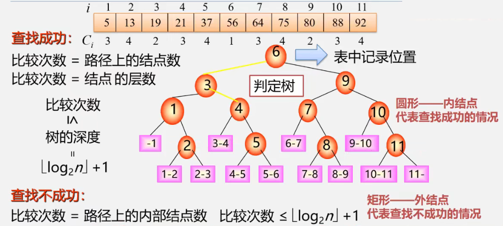
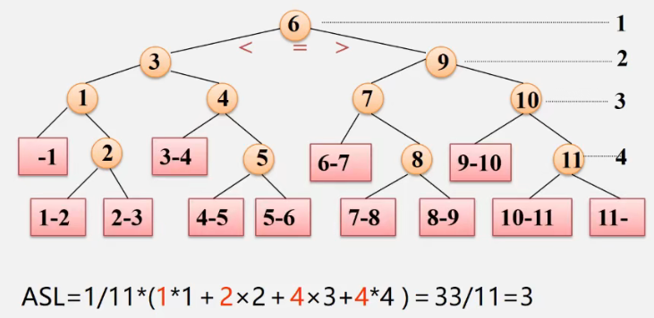
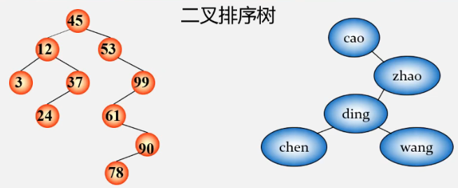
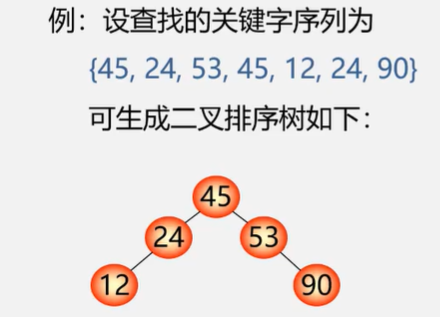
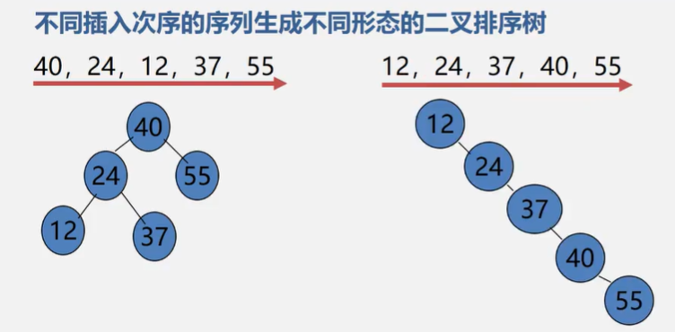

**数据结构**

- 数据的逻辑结构
  - 线性结构
    - 线性表
    - 栈（特殊线性表）
    - 队列（特殊线性表）
    - 字符串、数组、广义表
  - 非线性结构
    - 树形结构
    - 图形结构
- 数据的存储结构
  - 顺序存储
  - 链式存储
- 数据的运算：查找、排序、插入、删除、修改等


# 第7章 查找


## 7.1 查找的基本概念

**问题：在哪里找？**

查找表：查找表是由同一类型的数据元素（或记录）构成的集合。由于“集合”中的数据元素之间存在着松散的关系，因此查找表是一种应用灵便的结构。


**问题：找什么**

根据给定的某个值，在查找表中确定一个其关键字等于给定值的数据元素或记录。

关键字：用来标识一个数据元素或记录的某个数据项的值。

- 主关键字 可唯一地标识一个记录的关键字是主关键字
- 次关键字 反之，用以识别若干记录的关键字是次关键字


**问题：查找成功了没？**

若查找表中存在一个这样的记录，则称”查找成功“，查找结果给出整个记录的信息，或指示该记录在查找表中的位置；否则称为”查找不成功“，查找结果给出空记录或空指针。


**问题：查找的目的是什么？**

对查找表经常进行的操作：

- 查询某个”特定的“数据元素是否在查找表中
- 检索某个”特定的“数据元素的各种属性
- 在查找表中插入一个数据元素
- 删除查找表中的某个数据元素


**问题：查找表怎么分类？**

- 静态查找表

  仅作查询（检索）操作的查找表

- 动态查找表

  作插入和删除操作的查找表


**问题：如何评价查找算法？**

评价指标：关键字的平均比较次数，也称**平均查找长度**


**问题：查找过程要研究的是什么**

研究查找表的各种组织方法及其查找过程的措施。

设法提高查找表的查找效率。为了提高查找效率，一个办法就是在构造查找表时，在集合中的数据元素之间人为地加上某种确定地约束关系


## 7.2 线性表的查找

### 7.2.1 顺序查找（线性查找）

**应用范围**

- 顺序表或线性链表表示的静态查找表
- 表内元素之间无序

**顺序表的表示**

```c++
typedef struct {
    KeyType key;  //关键字域
    ... //其他域
}ElemType;

typedef struct {
    ElemType *R; //表基址
    int length; //表长
}SSTable;

SSTable ST; //定义顺序表
```

```c++
int Search_Seq(SSTable ST, KeyType key)
{
    for (int i = ST.length; 9 >= 1; --i) { //头不存储信息
        if (ST.R[i].key == key) return i;
    }
    return 0;
}
```

**改进**

把待查关键字key存入表头（“哨兵”、“监视哨”），从后往前挨个比较，可免去查找过程中每一步都要检测是否查找完毕，加快速度。

```c++
int Search_Seq(SSTable ST, KeyType type) 
{
    ST.R[0].key = key;
    for (int i = ST.length; ST.R[i].key != key; --i);
    return i;
}
```

当ST.length较大时，此改进能使进行一次查找所需的平均时间几乎减少一半。


**性能分析**

- 时间复杂度：O(n)
- 空间复杂度：O(1)


**记录的查找概率不相等时如何提高查找效率？**

查找表存储记录原则 --- 按查找概率高低存储

- 查找概率越高，比较次数越少
- 查找概率越低，比较次数较多


**记录的查找概率无法测定时如何提高查找效率？**

按查找概率动态调整记录顺序

- 在每个记录中设一个访问频度域
- 始终保持记录按非递增有序的次序排列
- 每次查找后均将刚查到的记录直接移至表头


**顺序查找的特点**

优点：

- 算法简单，逻辑次序无要求，且不同存储结构均适用

缺点：

- ASL太长，时间效率太低


### 7.2.2 折半查找

**折半查找**：每次将待查记录所在区间缩小一半

mid = (low + high) / 2

key < mid 则：high = mid - 1

key > mid 则：low = mid + 1

key == mid，找到

high < low 结束

```c++
int Search_Bin(SSTable ST, KeyType key)
{
    low = 1;
    high = ST.length;
    while (low <= high) {
        mid = (low + high) / 2;
        if (ST.R[mid].key == key) return mid;  //找到待查元素
        else if (key < ST.R[mid].key) high = mid - 1;
        else low = mid + 1;
    }
    return 0; //顺序表不存在待查元素
}
```

**判定树**






**性能分析**：

**成功时**：ASL = log~2~（n + 1） - 1

**优点**：效率比顺序查找高

**缺点**：只适用于有序表，且限于顺序存储结构（对线性链表无效）


### 7.2.3 分块查找

**条件**

1. 将表分成几块，且表或者有序，或者**分块有序**

   若i < j，则第j块中所有记录的关键字均大于第i块中的最大关键字

2. 建立“索引表”（每个结点含有最大关键字域和指向本块第一个结点的指针，且按关键字有序）

**查找过程**

先确定待查记录所在块（顺序或折半查找），再在块内查找（顺序查找）

**性能**

ASL = L~b~ + L~w~  (对索引表查找的ASL加上对块内查找的ASL)

ASL~bs~ = log~2~(n/s + 1) + s/2  (介于log~2~n和（n+1）/2之间)

s为每块内部的记录个数，n/s即块的数目

**分块查找优缺点**

优点：插入和删除比较容易，无需进行大量移动

缺点：要增加一个索引表的存储空间并对初始索引表进行排序运算

适用情况：如果线性表既要快速查找又经常动态变化，则可采用分块查找

|          | 顺序查找         | 折半查找 | 分块查找         |
| -------- | ---------------- | -------- | ---------------- |
| ASL      | 最大             | 最小     | 中间             |
| 表结构   | 有序表、无序表   | 有序表   | 分块有序         |
| 存储结构 | 顺序表、线性链表 | 顺序表   | 顺序表、线性链表 |


## 7.3 树表的查找

引入树表查找的原因：

当表插入、删除操作频繁时，为维护表的有序性，需要移动表中很多记录。所有可改用动态查找表--几种特殊的树。


**动态查找表**

表结构在查找过程中动态生成。对于给定值key，若表中存在，则成功返回；否则插入关键字等于key的记录。动态查找表包括：

- 二叉排序树
- 平衡二叉树
- 红黑树
- B-树
- B+树
- 键树


**二叉排序树（Binary Sort Tree）**

又称二叉搜索树、二叉查找树。定义如下：二叉排序树或是空树，或是满足以下性质的二叉树：

- 若其左子树非空，则左子树上所有结点的值均小于根结点的值
- 若其右子树非空，则右子树上所有结点的值均大于等于根结点的值
- 其左右子树本身又各是一棵二叉排序树



**二叉排序树的性质**：

中序遍历非空的二叉排序树，所得到的数据元素序列是一个按关键字排列的递增有序序列。


**二叉排序树  查找**

```c++
typedef struct {
    KeyType key;  //关键字项
    InfoType otherinfo;  //其他数据域
} ElemType;

typedef struct BSTNode {
    ElemType data;  //数据域
    struct BSTNode *lchild, *rchild;  //左右孩子指针
} BSTNode, *BSTree;

BSTree T;  //定义二叉排序树T
```

- 若查找的关键字等于根结点，成功
- 否则
  - 若小于根结点，查其左子树
  - 若大于根结点，查其右子树
- 在左右子树上的操作类似

**算法思想**

1. 若二叉排序树为空，则查找失败，返回空指针
2. 若二叉排序树非空，将给定值key与根结点的关键字T->data.key进行比较：
   - 若key等于T->data.key，则查找成功，返回根结点地址
   - 若key小于T->data.key，则进一步查找左子树
   - 若key大于T->data.key，则进一步查找右子树

```c++
BSTree SearchBST(BSTree T, KeyType key)
{
    if ((!T) || (key == T->data.key)){
         return T;
    } else if (key < T->data.key) {
        return Search(T->lchild, key);
    } else {
        return Search(T->rchild, key);
    }
}
```


**二叉排序树查找分析**


含有n个结点的二叉排序树的平均查找长度和树的形态有关。

最好情况：与折半查找的判定树相同，形态比较均匀，O(log~2~n)

最坏情况：单支树的形态，树深为n，ASL=(n+1)/2，O(n)


**如何提高形态不均衡的二叉排序树的查找效率？**

作平衡化处理，即尽量让二叉树的形态均衡。


**二叉排序树的操作 -- 插入**

- 若二叉排序树为空，则插入结点作为根结点插入到空树中
- 否则，继续在其左、右子树上查找
  - 树中已有，不再插入
  - 树中没有
    - 查找直至某个叶子结点的左子树或右子树为空为止，则插入结点应为该叶子结点的左孩子或右孩子

插入的元素一定在叶节点上


**二叉排序树的操作 -- 生成**

从空树出发，经过一系列的查找、插入操作之后，可生成一棵二叉排序树



一个无序序列可通过构造二叉排序树而变成一个有序序列，构造树的过程就是对无序序列进行排序的过程。

插入的结点均为叶子结点，故无需移动其他结点。相当于在有序序列上插入记录而无需移动其他记录。

但是，**关键字的输入顺序不同，建立的二叉排序树则不同**




**二叉排序树的操作 -- 删除**

- 若被删除的结点是叶子结点，直接删除即可

- 若被删除的结点只有左子树或只有右子树，用其左子树或者右子树替换它（结点替换）

- 若被删除的结点既有左子树，又有右子树

  - 以其中序前驱进行值替换，然后再删除该前驱结点，前驱是左子树中最大的结点
  - 也可以用其后继替代之，然后删除该后继结点。后继是右子树中最小的结点。

  

  

  


## 7.4 哈希表的查找


