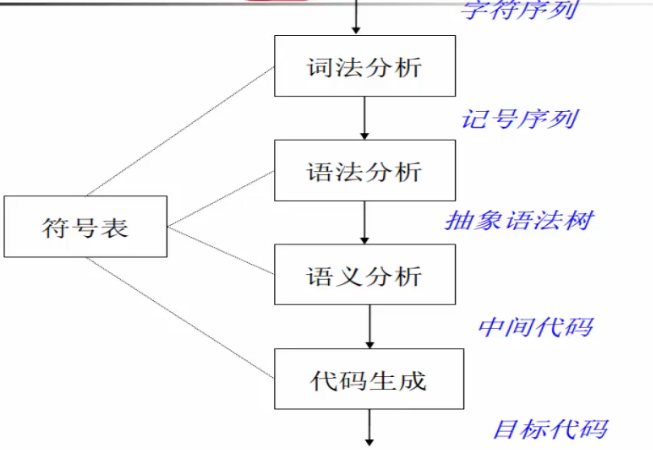
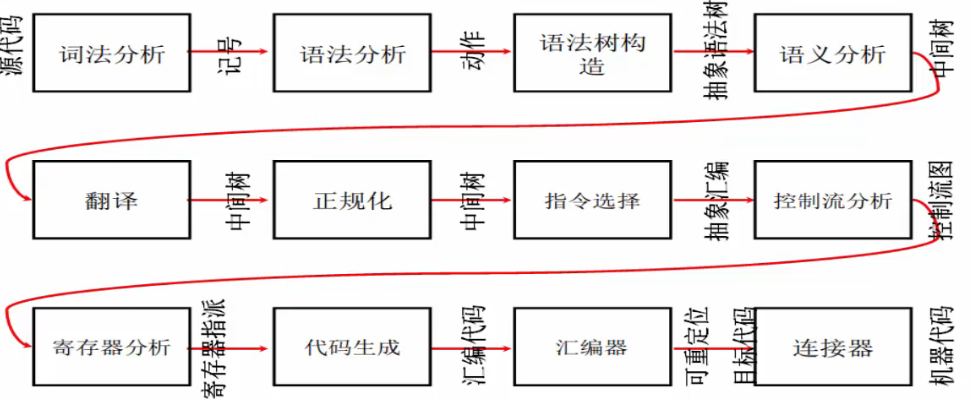
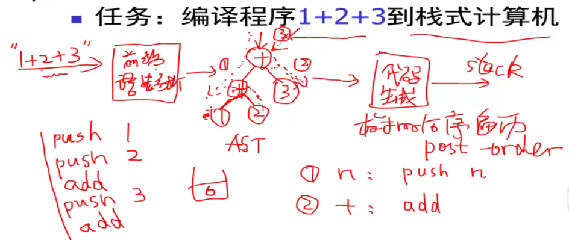

**什么是编译器？**

- 编译器是一个程序
- 核心功能是把源代码翻译为目标代码
  - 源代码：C/C++、Java、C#、html、SQL，...
  - 目标代码：x86、IA64、ARM、MIPS，...

**区别于解释器**

- 解释器也是处理程序的一种程序

编译器的输入为源程序，输出为可执行程序，是*离线*（off-line)模式

解释器的输入为源程序，但输出执行结果，是*在线*（on-line)模式

**编译器的结构**

编译器可看成多个阶段构成的流水线结构

复杂的编译器结构：

**编译器实现**

解释说明：已知栈式计算机有指令push压栈指令和add求和(连续取栈顶两个元素求和再将和压栈)指令

首先源程序为字符串“1+2+3”作为输入，经过前端（语法分析）生成抽象语法树AST，AST是一个树状的数据结构。将AST进行代码生成，使用后续遍历，并规定遇到+节点翻译为add指令，遇到数字节点，翻译为push指令，所以最终生成了5条指令，就是目标代码

