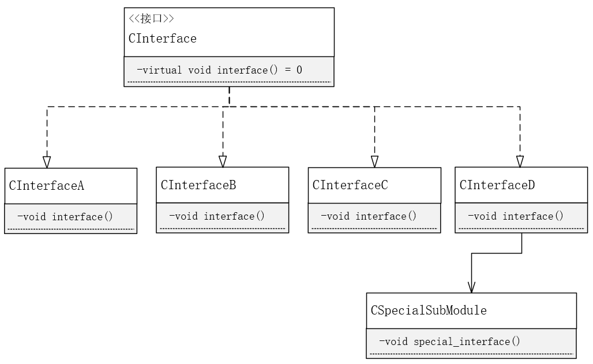

# 适配器模式

**适配器模式**（Adapter)

将一个类的接口转换成客户希望的另外一个接口。适配器模式使得原本由于接口不兼容而不能一起工作的那些类可以一起工作。

**使用场景**

适配器模式主要应用于希望复用一些现存的类，但是接口又与复用环境要求不一致的情况。

两个类所做的事情相同或相似，但是具有不同的接口时需要使用适配器模式。由于类都共享同一个接口，使得客户端可以统一调用统一接口，使得代码更简单、更直接、更紧凑。

**注意**

类和方法的命名应该有规范，最好前期就设计好，接口不相同时，首先不应该考虑使用适配器模式，而应该考虑通过重构统一接口。

而使用第三方组件时，组件的接口与自身系统的接口不相同时，可以考虑使用适配器模式来解决接口不同的问题。

**自我思考**

适配器模式应用于统一接口，那么什么时候需要统一接口？什么场景下需要统一的接口？

统一的接口，对应基类的虚函数，可以说基类的所有子类接口都是统一的。设想一个系统包含多个组件，系统的某个接口的实现依赖各组件的接口。比如，系统有一个update接口，依赖各组件的同名update接口，那么各组件可继承同一个接口来实现自身。现在要求引入一个第三方的组件，它与其他组件不是继承于相同的接口。怎么办呢？再次子类化共同的接口，类内实例化一个第三方组件对象，统一的接口内调用第三方组件的特异性接口即可。

**UML**

