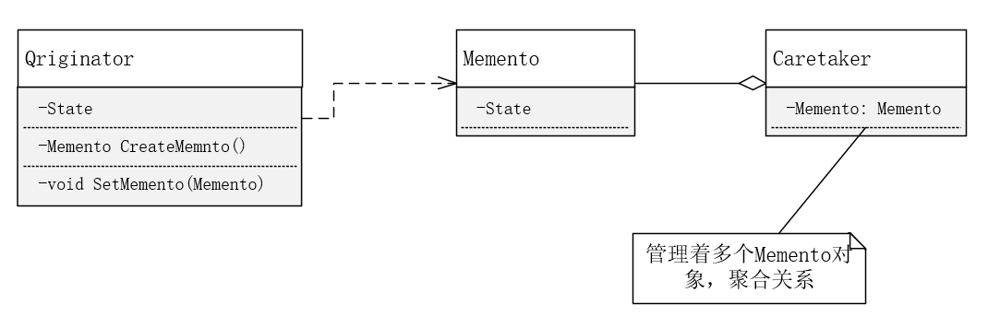

# 备忘录模式

**备忘录模式**（Memento)

在不破坏封装的前提下，捕获一个对象的内部状态，并在该对象之外保存这个状态。这样以后就可以将该对象恢复到原先保存的状态。


**UML**




**个人理解**

备忘录模式下，Memento对象可以保存Originator对象内部的状态（可以简单理解成类的成员变量）。Originator可以创建一个Memento对象并在其中保存自身的状态；Originator也可通过一个Memento对象恢复自身的状态。Caretaker是用于管理Memento对象的，并不能修改Memento中存储的数据。Caretaker可以保存若干个Memento对象。


**实例代码**

此处模拟VMware的快照功能，快照功能可以保存多个虚拟机在某时刻的状态，并可以任意恢复到此状态。

```c++
#include "status.h"
#include <iostream>
#include <string>
#include <map>
using namespace std;

class CMemento {
public:
	CMemento(string state = "") :m_state(state) {};
	string get_state() { return m_state; }
private:
	string m_state;
};

class CMementoManager {
public:
	CMementoManager() :m_map_memento({}) {};
	void add_state(string discription, CMemento state) {
		m_map_memento[discription] = state;
	}
	bool get_state(string discription, CMemento& state) {
		if (m_map_memento.find(discription) != m_map_memento.end()) {
			state = m_map_memento[discription];
			return true;
		}
		return false;
	}
	void remove_state(string discription) {
		if (m_map_memento.find(discription) != m_map_memento.end()) {
			m_map_memento.erase(discription);
		}
	}
private:
	map<string, CMemento> m_map_memento;
};

class CVirtualMachine
{
public:
	CVirtualMachine() {};
	CMemento snapshot() {
		return CMemento(m_state);
	}
	void set_state(string state) {
		m_state = state;
	}
	void recover(CMemento state) {
		m_state = state.get_state();
	}
	void show_state() {
		cout << "virtual machine state: " << m_state << endl;
	}

private:
	string m_state;
};

void test_memento()
{
	CVirtualMachine machine;
	CMementoManager state_manager;
	CMemento state;

	machine.set_state("state A");
	machine.show_state();
	state_manager.add_state("A", machine.snapshot());
	machine.set_state("state B");
	machine.show_state();
	state_manager.add_state("B", machine.snapshot());
	machine.set_state("state C");
	machine.show_state();
	state_manager.add_state("C", machine.snapshot());

	if (state_manager.get_state("A", state)) {
		cout << "recover..." << endl;
		machine.recover(state);
		machine.show_state();
	}
}
```

