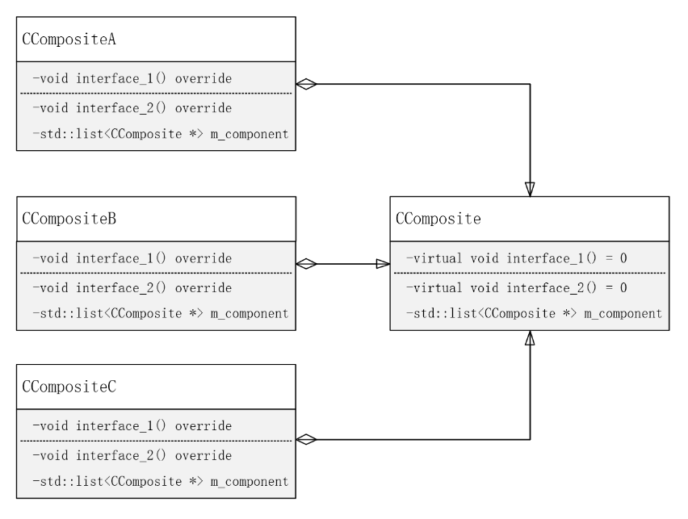

# 组合模式

**组合模式**（Composite):将对象组合成树形结构以表示“部分-整体”的层次结构。组合模式使得用户对单个对象和组合对象的使用具有一致性。


**UML**




**自我理解**

组合模式和数据结构中的树非常相似，具有自身是自身的组合对象的特点。如同下面这棵树一样：

```c++
struct Node {
    ElemType data;
    std::vector<Node>;
}
```

Node包含Node的聚合。不同之处在于组合模式中，类型不是简单的结构体，而是赋予了多态特性的类类型。这就导致一个聚合对象内包含的众多对象通过多态表现出不同的行为。正是因为如此，它既有如同纯数据结构中的树结构体对象与其包含的子对象之间的聚合特性，又有通过多态使聚合对象与其包含的子对象之间的相同接口表现出不同行为的特性。所有对于整体由各部分组成（聚合属性）、整体与各部分行为相似但又具有差异（接口一致、多态属性）的场景中，使用组合模式非常合适。

具体到上面的UML图中，CComposite是自身的聚合对象，意味着，任意从CComposite子类化的对象CCompositeA\B\C等对象，可以是自身以及任意从CComposite子类化的对象的聚合。


**组合模式优点**

组合模式可以让客户一致地使用组合结构和单个对象。


**实例**

情景1：描述政府机构如公安局的职能。不同级别的公安局职责有相同部分，如县级及以上的公安部门除了办案、维护社会治安等，还具有管理下级公安部门的职责。对于镇级公安部门，可以认为是级别最低的公安部门，只具有维护社会治安的职能。

情景2：总公司、子公司