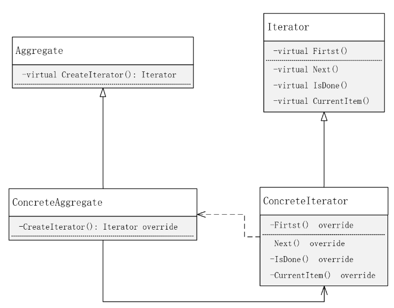

# 迭代器模式

**迭代器模式（Iterator）**：提供一种方法顺序访问一个聚合对象中各个元素，而又不暴露该对象的内部表示。

**UML**

**自我理解**

现在的很多语言已经实现了迭代器模式，如C++，针对map等对象都通过模板提供对应的迭代器类型。该模式只是简单的对一个聚合对象提供了一个迭代器的类类型用来遍历访问聚合对象内的各成员。所有的迭代器都是通过实现迭代基类定义的若干个接口实现的。

首先明确一下C++中聚合对象的形式。聚合对象，顾名思义是某一类型的集合，在聚合对象类内部的表现形式可以有多种，如存储在数组内，容器内，map内等等，甚至是一个一个的成员变量也未尝不可（虽然很笨）。聚合对象是能够通过下标或其他方式精准的访问每一个对象的。这种情况下为什么还要引入迭代器模式？原因在于，在需要遍历聚合对象内的所有对象时，并不关心这些对象是如何聚合的，也不关系数量，就一个从头访问到尾的要求。如果只是通过聚合对象来访问所有对象，就需要知道有多少对象，每个对象需要通过什么样的方式访问，这些细节就暴露了聚合对象的内部表示。

上面的UML图中，每一个具体的聚合对象对应的迭代器类型都是唯一的，不同类型的聚合对象的迭代器同样属于不同类型。看UML中的依赖关系，可以说聚合对象的类型是迭代类型的一部分，没有这一部分，迭代器都无法实现具体的类型（和模板完全一样，模板表示类型，结合某一类型能够构造一个崭新的类型）。

**重新理解一下依赖、直接关联**

A依赖B，可以简单理解为没有B，A就无法正常工作，没有绝对不行。本例中迭代器必须依赖具体聚合对象的类型才能遍历聚合对象，没有聚合对象，迭代器都不知道能够遍历谁。聚合对象类型是迭代器类型组成部分，否则迭代器类型无法定义。

A关联到B，可以简单理解类A类有一个成员B，A没有B是功能上的缺失，但不影响B的定义。本例中，聚合对象内含有迭代器成员，因此具有了遍历该聚合对象分功能，没有迭代器，聚合对象顶多丢失遍历功能而已，不影响聚合对象的核心功能。

当然，如果一个类的核心功能依靠在内部实例化另一个类来实现，也可以认为是依赖关系，突出被依赖对象的重要性。