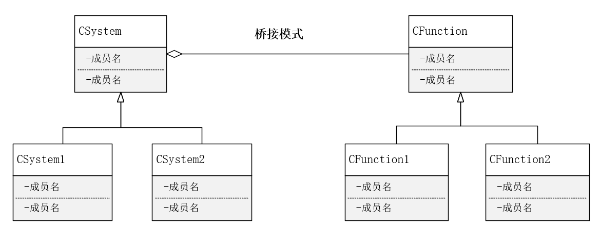
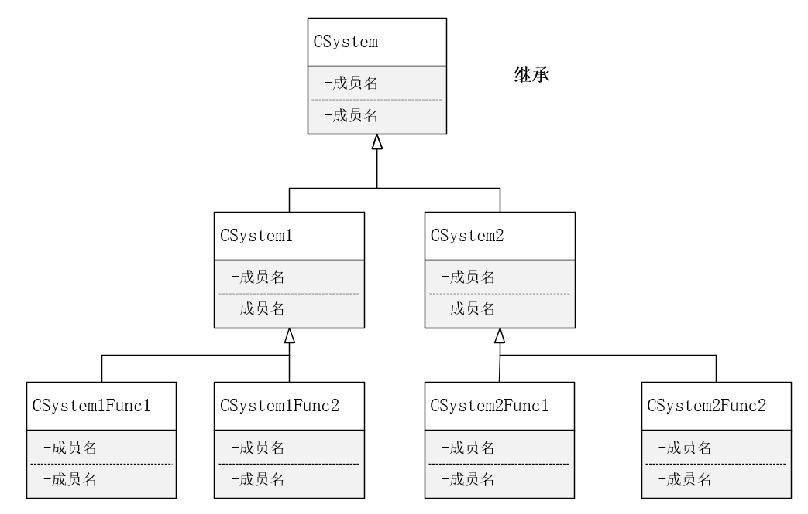

# 桥接模式

**合成/聚合复用原则（CARP)**

尽量使用合成/聚合，尽量不要使用类继承。

原因：对象的继承关系是在编译时就定义好了，所以无法在运行时改变从父类继承的实现。子类的实现与它的父类有非常紧密的依赖关系，以至于父类实现中的任何变化必然会导致子类发生变化。当需要复用子类时，如果继承下来的实现不适合解决新的问题，则父类必须重写或被其他更适合的类替换，这种依赖关系限制了灵活性并最终限制了复用性。

**桥接模式（Brage)**

将抽象部分与它的实现部分分离，使他们可以独立地变化。

通俗讲，实现系统可能有多角度分类，每一种分类都有可能变化，那么就把这种多角度分离出来让他们独立变化，减少他们之间的耦合。

**UML**

从UML可以清除看到，使用继承构建系统或对系统进行功能扩展，类的继承层次会越来越深，越来越复杂，耦合性极高。

**自我理解**

在对类功能进程扩展时，可以使用继承，但随着需求的变化子类不能满足要求时需要修改自身，父类也有可能需要一同修改，导致耦合性太高。桥接模式实际上是将新增的功能单独成类，在需要扩展的类内部包含该功能类即可。

需要注意的是，桥接的典型应用场景是**系统多角度分类且每种分类都有可能变化**。

