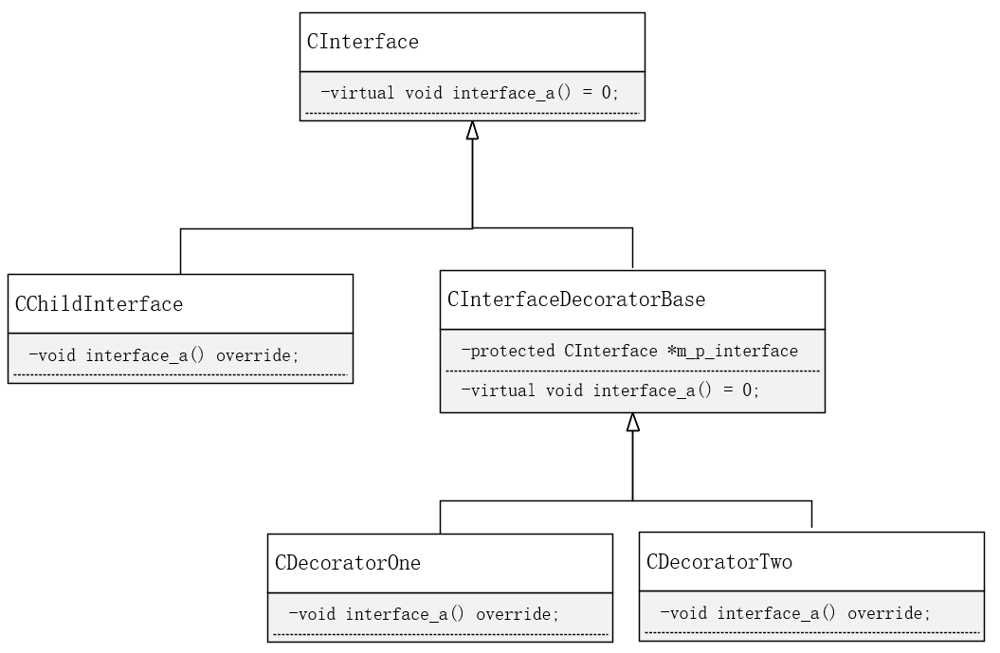

# 装饰模式

**定义**：装饰模式（Decorator)，动态地给一个对象添加额外的职责，就增加功能来说，装饰模式比生成子类更加灵活。

**特点**：把所需的功能按正确的顺序串联起来进行控制。

**思路**：

- 现在有一个接口A，在流程控制上要求执行A后执行另一部分功能，相当于对接口A进行扩展。所以考虑使用一个功能扩展类，称为装饰类，内部包含一个A接口成员（通过set_interface设置）以及接口C，接口C实现执行A后额外的功能并调用A接口成员的接口A。此时对A接口就达到了功能扩展的目的。
- 但是上述会存在一个问题，没办法对装饰类进行进一步扩展。因为set_interface的形参类型是接口A的类型，而要对装饰类再扩展的话，set_interface的形参类型是装饰类型。
- 为了达到动态地、无限制地对接口A装饰后，继续装饰，就要求装饰类类型与接口A的类类型一致。所以装饰类也继承自接口A的基类。


**UML**




**接口基类**

```c++
class CInterface {
public:
    CInterface(){}
    virtual void interface_a() = 0;
};
```

**接口A实现**

```c++
class CChildInterface : public CInterface {
public:
    CChildInterface(){};
    void interface_a() override {
        printf("interface a realize\n");
    }
};
```

**对CInterface的接口A进行装饰的基类**

```c++
class CDecorate : public CInterface {
public:
    CDecorate() : m_interface(nullptr) {}
    void set_interface(CInterface *interface) {
        m_interface = interface;
    }
    virtual void interface_a() = 0;
protected:
    CInterface* m_interface;
};
```

**特性性装饰1**

```c++
class CDecoratorOne : public CDecorate {
public:
    void interface_a() {
        m_interface->interface_a();
        //特异性装饰代码
        printf("decorate one\n");
    }
};
```

**特异性装饰2**

```c++
class CDecoratorTwo : public CDecorate {
public:
    void interface_a() {
        m_interface->interface_a();
        //特异性装饰代码
        printf("decorate two\n");
    }
};
```

**特异性装饰n...**


**客户端调用**

```c++
int main(int argc, char* argv[]){
    CChildInterface interface;
    CDecoratorOne de_one;
    CDecoratorTwo de_two;

    //de_one装饰interface
    de_one.set_interface(&interface);
    //de_two装饰de_one
    de_two.set_interface(&de_one);
    //执行接口
    de_two.interface_a();

    return 0;
}
```

**总结**

- 装饰模式是为已有功能动态地添加更多功能地一种方式
- 新加地代码通常装饰了原有类地核心职责或主要行为
- 装饰模式提供了一个非常好的解决方案，把每个要装饰的功能需要有选择地、按顺序地使用装饰功能来包装对象
- **装饰模式有效地把类地核心职责和装饰功能区分开了，并且可以去除相关类中重复地逻辑**。