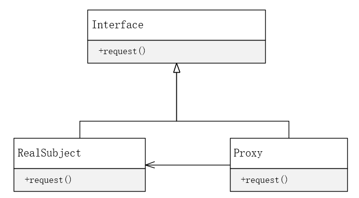

# 代理模式（Proxy)

**代理模式**

代理模式（proxy)，为其他对象提供一种代理以控制对这个对象的访问。


**UML**




```c++
#include <iostream>

class CInterface {
public:
    CInterface() {}
    virtual void request() = 0;
};

class CRealSubject : public CInterface
{
public:
    CRealSubject() {}
    void request() override {
        std::cout << "This is real subject" << std::endl;
    }
};

class CProxy : public CInterface
{
public:
    CProxy() :m_p_real_subject(nullptr) {
        m_p_real_subject = new CRealSubject; //此处被代理对象直接类内实例化，也可通过接口获取外部对象指针
    }
    void request() override {
        if (m_p_real_subject != nullptr) {
            //根据实际情况，此处增加额外功能代码
            std::cout << "Proxy begin proxy real subject." << std::endl;
            //调用被代理对象的具体方法
            m_p_real_subject->request();
        }
    }
private:
    CInterface* m_p_real_subject;
};

int main(int argc, char* argv[])
{
    CProxy proxy;
    proxy.request();
    return 0;
}
```


**应用场景**

- **远程代理** 为一个对象在不同的地址空间提供局部代表，隐藏一个对象存在于不同地址空间的事实
- **虚拟代理** 根据需要创建开销很大的对象，通过它来存放实例化需要很长时间的真实对象
- **安全代理** 控制真实对象的访问权限
- **智能指引** 当调用真实的对象时，代理处理另外一些事


**代理模式本质**

在访问对象时引入一定程度的**间接性**，利用这种间接性附加多种用途。

