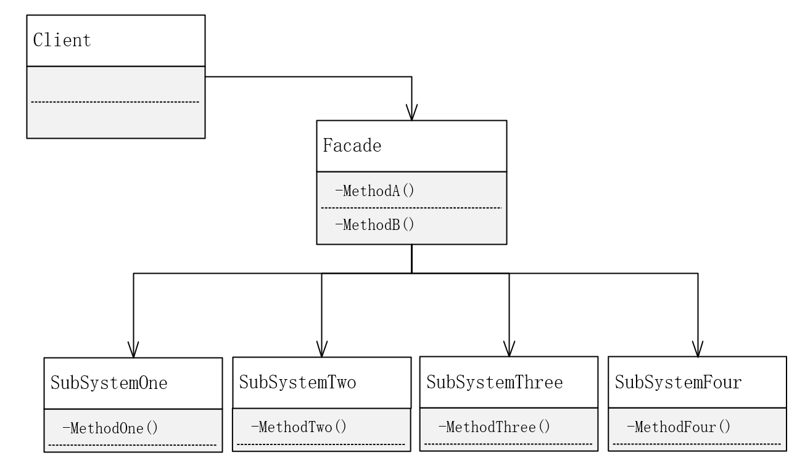

# 外观模式

**外观模式**：为子系统中的一组接口提供一个一致的界面，此模式定义了一个高层接口，这个接口使得这一子系统更加容易使用。

通俗讲，用户端直接面对众多的子系统并调用子系统接口，耦合性太高。使用外观模式，在客户端与子系统之间封一层高级接口，与子系统复杂地交互交由高级接口负责，客户端简单调用高级接口即可。

**UML**

**使用外观模式的场景**

第一，在设计初期阶段，应该有意识地将不同的层分离，如经典的三层结构，就需要考虑在数据访问层和业务逻辑层、业务逻辑层和表示层的层与层之间建立外观Facade。这样可以为复杂的子系统提供统一的接口，使得耦合性大大降低。

第二，在维护一个遗留的大型系统时，如果系统已经非常难以扩展和维护，但新需求又不得不依赖于它，此时Facde就非常合适。Facde提供设计粗糙或高度复杂的遗留代码的比较清晰简单的接口。