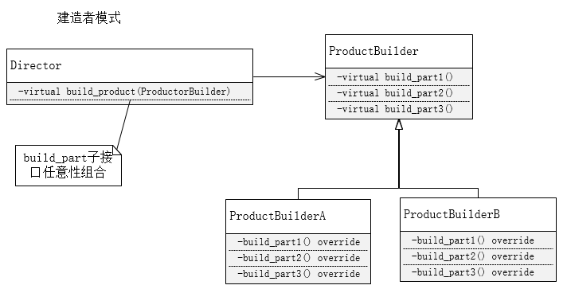
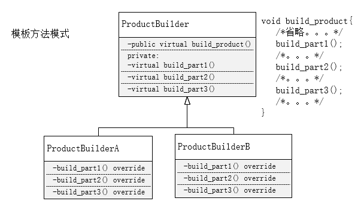

# 建造者模式（生成器模式）

**建造者模式**

建造者模式（Builder)，也叫生成器模式。将一个复杂对象的构建与它的表示方法分离，使得同样的构建过程可以创建不同的表示。在建造者模式下，客户端只需要指定需要建造的类型，不需要知道具体的建造过程和细节。

**个人理解**

建造者模式与模板方法模式感觉很像，只是实现形式上有差异，但我还是试着去理解两者之间存在的差异。

模板方法描述的是一个算法接口的骨架是固定的，通过构成骨架的若干个子接口的多态来实现算法接口的多态。

建造者模式强调一个复杂对象的构建过程是固定的，构建过程的若干步骤的多态实现差异化的对象。只不过固定的构建过程由单独的指挥者负责。

我理解的模板方法的接口骨架与建造者模式的固定构建过程是一个概念，都是通过子接口的多态实现上层接口的多态。但建造者模式既然单独引入了一个”指挥者“来决定固定的构建过程，这就意味着指挥者的多态能够产生多种固定的构建过程，能够进一步使构造的对象多样化。这一点和模板方法差异比较明显（纯属个人理解，《大话设计模式》中并没有这样的描述）。

