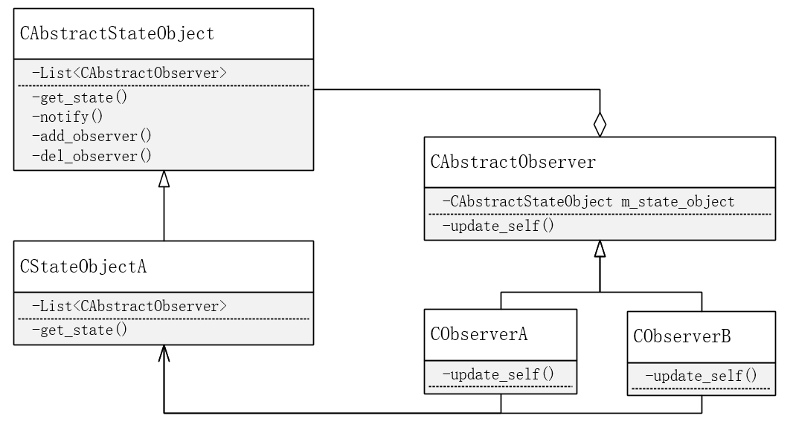

# 观察者模式

观察者模式定义了一种一对多的依赖关系，让多个观察者同时监听某一个主题对象。这个主题对象在状态发生变化时，会通知所有观察者对象，使他们能够自动更新自己。

**自我理解**

观察者模式的使用场景可以描述为，某一个具有不同状态的对象，在其状态发生改变时，其可以选择性地主动通知所有或部分的观察者，让观察者更新自己。具体实现时，状态对象包含观察者们的聚合。状态更新时，依次调用观察者的更新方法。观察者更新时会获取状态对象的状态，以决定如何更新自己。

也就是说，状态对象在状态改变时循环遍历所有观察者并调用更新方法，观察者的更新方法内需要获取状态对象的状态以决定更新自己的方式。这是两者相互耦合的根本原因。

**UML**

**观察者模式特点**

将一个系统分割成一系列相互协作的类有一个很不好的副作用，那就是需要维护相关对象间的一致性。我们不希望为了维护一致性而使各类紧密耦合，这样会给维护、扩展和重用都带来不便。

观察者模式的关键对象是主题对象Subject和观察者Observer，一个Subject可以有任意数量的依赖它的Observer，一旦Subject状态发生改变，所有的Observer都可以得到通知。观察者之间完全可以风马牛不相及，且他们之间相互不知道其他观察者的存在。

**观察者模式的缺点**

每一个观察者对象都需要实现同样的接口update来更新自己，但实际情况中，观察者更新自己的方法完全不叫update，各观察者的更新方法也各不相同。试想一下，如果把状态对象状态改变时循环遍历所有观察者并调用update方法，改变为循环调用函数，这样就实现了观察者与状态对象的解耦，且各被调用的函数名完全可以不一样。（相当于状态对象内包含的不再是观察者的聚合，而是函数对象的聚合。Qt的信号槽完美地实现了这一点）。