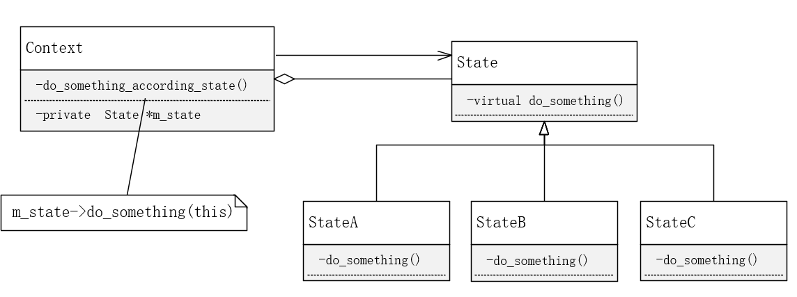

# 状态模式

**状态模式**：当一个对象的内在状态改变时允许改变其行为，这个对象看起来像是改变了其类。

状态模式主要解决的是当控制一个对象状态转换的条件表达式过于复杂时的情况。把状态的判断逻辑转移到表示不同状态的一系列类当中，可以把复杂的判断逻辑简化。


**好处**

将于特定状态相关的行为局部化，并且将不同状态的行为分割开来。可以消除庞大的条件分支语句。

将特定状态相关的行为都放入一个对象中，通过定义新的子类可以很容易地增加新的状态和转换。


**使用场景**

当一个对象的行为取决于它的状态，并且它必须在运行时刻根据状态改变它的行为时，可以考虑使用状态模式。


**UML**




**个人思考**

假如一个类内有一个很长的if语句，具有多个条件判断分支。每一个分支的条件就是一个状态。现在考虑将对应的状态下的行为封装到一个类中。在类内执行对应状态的对应操作之前，应该对状态进行校验，如果检验不通过（即状态不符合)，应该将状态切换并再次检验执行。为什么状态要校验并切换呢？如果不校验，则需要执行的操作与对应状态不匹配，如果不切换并再次尝试执行，则无法完成if语句的else if或else具有的功能。


**例子**

假设一个类内有bool型的两个变量A和B，A和B的组合共4种情况，每一种情况可视为一种状态，每一种状态下有一个对应的操作。一般情况下的if语句实现如下：

```c++
if (A && B) {
    do_thing1();
} else if (!A && B) {
    do_thing2();
} else if (A && !B) {
    do_thing3();
} else{
    do_thing4();
}
```

使用状态模式：

头文件：

```c++
#pragma once
class CAB;
class CABStatus;

class CABStatus {
public:
	CABStatus();
	virtual void do_something(CAB* ab) = 0;
};

class CABStatus_0 : public CABStatus {
public:
	CABStatus_0();
	void do_something(CAB* ab) override;
};

class CABStatus_1 : public CABStatus {
public:
	CABStatus_1();
	void do_something(CAB* ab) override;
};

class CABStatus_2 : public CABStatus {
public:
	CABStatus_2();
	void do_something(CAB* ab) override;
};

class CABStatus_3 : public CABStatus {
public:
	CABStatus_3();
	void do_something(CAB* ab) override;
};

class CAB {
public:
	CAB();
	void do_someting();
	void set_status(CABStatus* st) { m_p_status = st; }
	void set_A(bool st) { m_A = st; }
	void set_B(bool st) { m_B = st; }
	bool get_A() { return m_A; }
	bool get_B() { return m_B; }
private:
	bool m_A;
	bool m_B;
	CABStatus* m_p_status;
};
```

源文件：

```c++
#include "status.h"
#include <iostream>
#include <string>
using namespace std;

CABStatus::CABStatus() {}
CABStatus_0::CABStatus_0() {}

void CABStatus_0::do_something(CAB* ab)
{
	if (ab != nullptr) {
		if (ab->get_A() && ab->get_B()) {
			//做一些A B都是true才做的事情
			cout << "Both A and B are true." << endl;
		} else {
			//状态不匹配，对应状态下需要做的事情还没做，所以转换状态，继续判断并执行
			ab->set_status(new CABStatus_1);
			ab->do_someting();
			delete this;
		}
	}
}

CABStatus_1::CABStatus_1() {}

void CABStatus_1::do_something(CAB* ab) {
	if (ab != nullptr) {
		if (!ab->get_A() && ab->get_B()) {
			//做一些A=flase B=true才做的事情
			cout << "A is false, B is true." << endl;
		}
		else {
			//状态不匹配，对应状态下需要做的事情还没做，所以转换状态，继续判断并执行
			ab->set_status(new CABStatus_2);
			ab->do_someting();
			delete this;
		}
	}
}

CABStatus_2::CABStatus_2() {}

void CABStatus_2::do_something(CAB* ab)
{
	if (ab != nullptr) {
		if (ab->get_A() && !ab->get_B()) {
			//做一些A=true B=false才做的事情
			cout << "A is true, B is false." << endl;
		}
		else {
			//状态不匹配，对应状态下需要做的事情还没做，所以转换状态，继续判断并执行
			ab->set_status(new CABStatus_3);
			ab->do_someting();
			delete this;
		}
	}
}

CABStatus_3::CABStatus_3() {}


void CABStatus_3::do_something(CAB* ab)
{
	if (ab != nullptr) {
		if (!ab->get_A() && !ab->get_B()) {
			//做一些A=false B=false才做的事情
			cout << "A is false, B is false." << endl;
		}
		else {
			//状态不匹配，对应状态下需要做的事情还没做，所以转换状态，继续判断并执行
			//状态0不匹配，则转换到了状态1
			//状态1不匹配，则转换到了状态2
			//状态2不匹配，则转换到了状态3
			//状态3不匹配，则转换到了状态0
			//这里要保证从任意状态起始，都能找到一个匹配的状态，所以形成状态转换环
			ab->set_status(new CABStatus_0);
			ab->do_someting();
			delete this;
		}
	}
}

CAB::CAB()
	:m_A(false)
	,m_B(false)
	,m_p_status(new CABStatus_0)
{
}

void CAB::do_someting()
{
	if (m_p_status != nullptr) {
		m_p_status->do_something(this);
	}
}

void test() {
	CAB ab;
	ab.set_A(false); ab.set_B(true);
	ab.do_someting();

	ab.set_A(true); ab.set_B(false);
	ab.do_someting();

	ab.set_A(true); ab.set_B(true);
	ab.do_someting();

	ab.set_A(false); ab.set_B(false);
	ab.do_someting();
}


int main(int argc, char* argv[])
{
	test();
	return 0;
}

```


