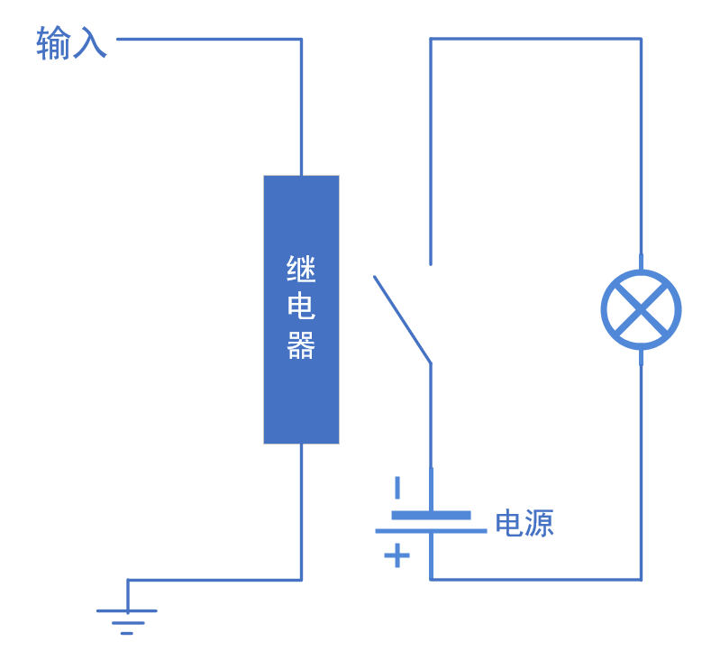
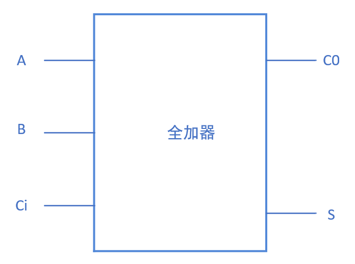

**门电路**

与、或、非、异或电路，都是***有源电路***，可以理解为两个电路的组合，即输入端电路和输出端电路。

由继电器实现的门电路：有源的输出端电路中布满了开关，每个开关的闭合由输入端电路中的继电器控制。输入端有电流，继电器产生吸合作用控制输出端电路中的开关闭合，从而达到控制输出端电路输出的作用。

**全加器**

S = A 异或 B 异或 C~i~

C~0~ = C~i~（A异或B) + AB

(S为结果，C~0~为进位)

